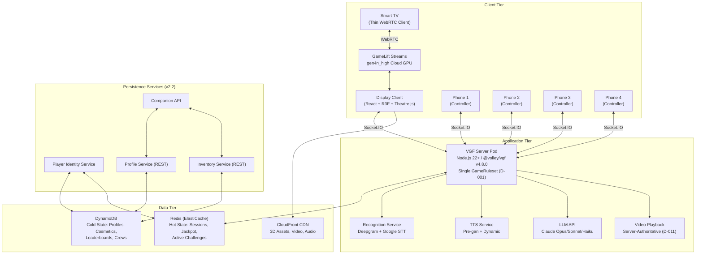
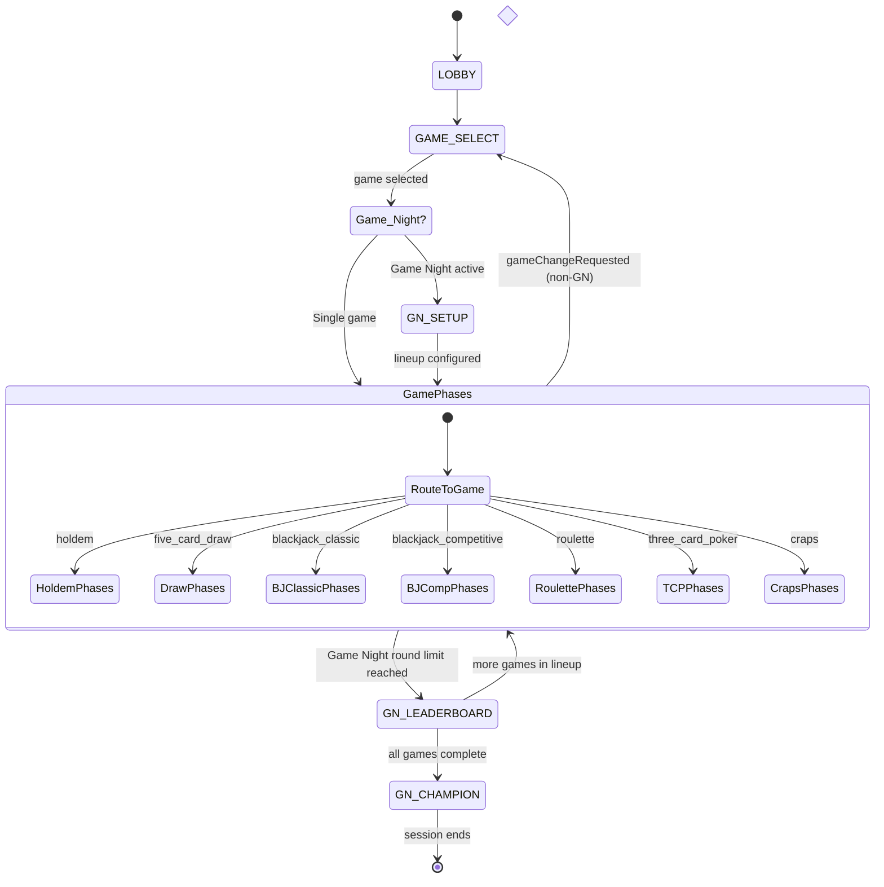
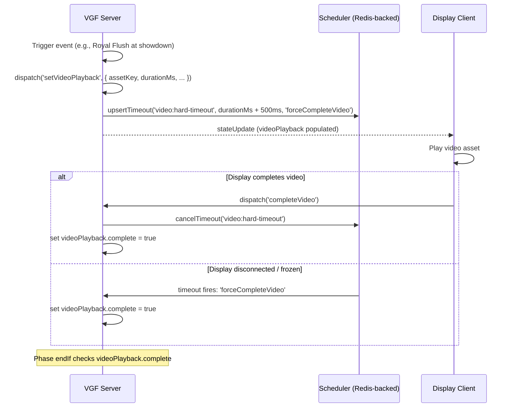
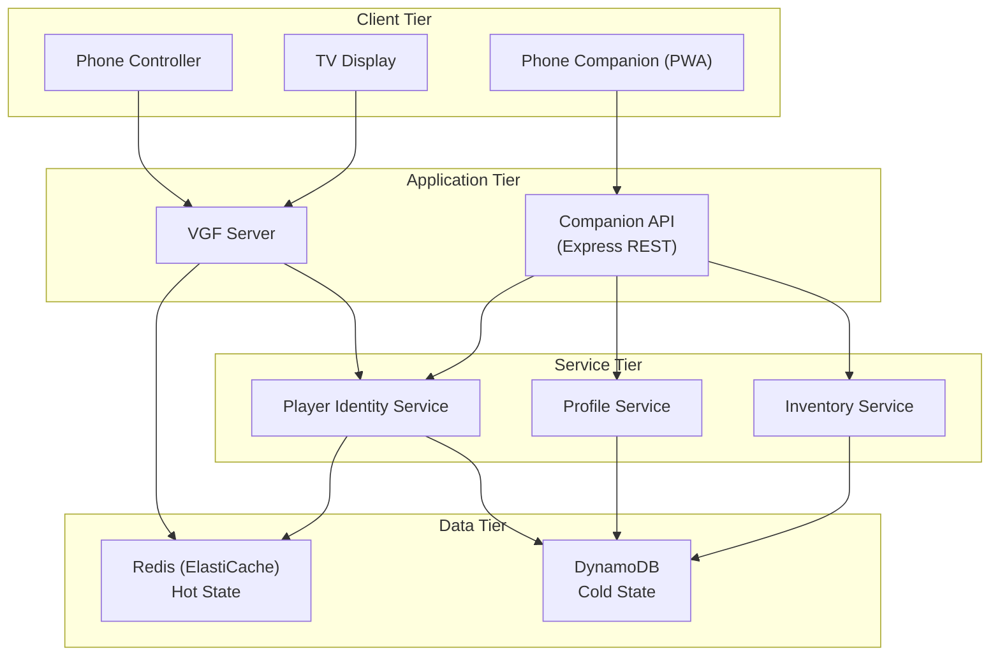
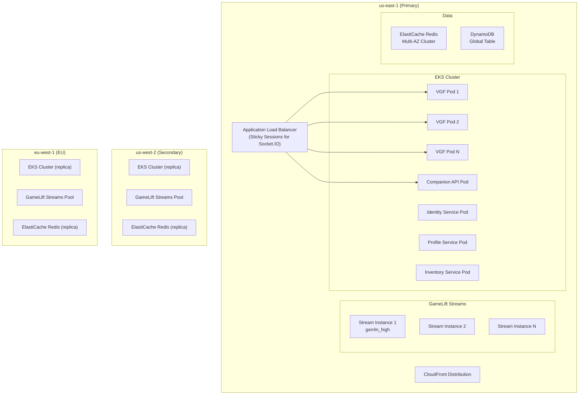
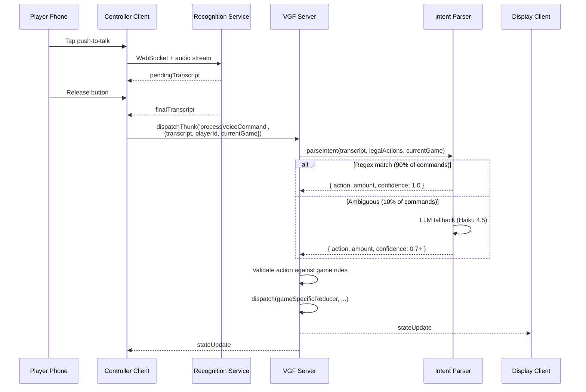
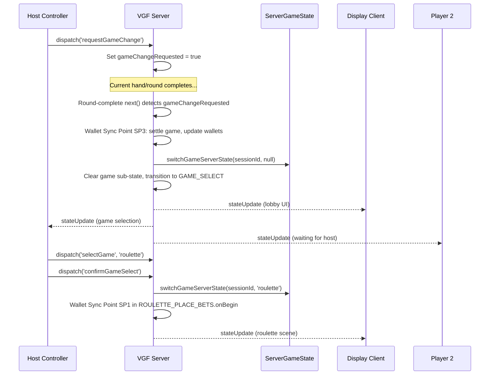
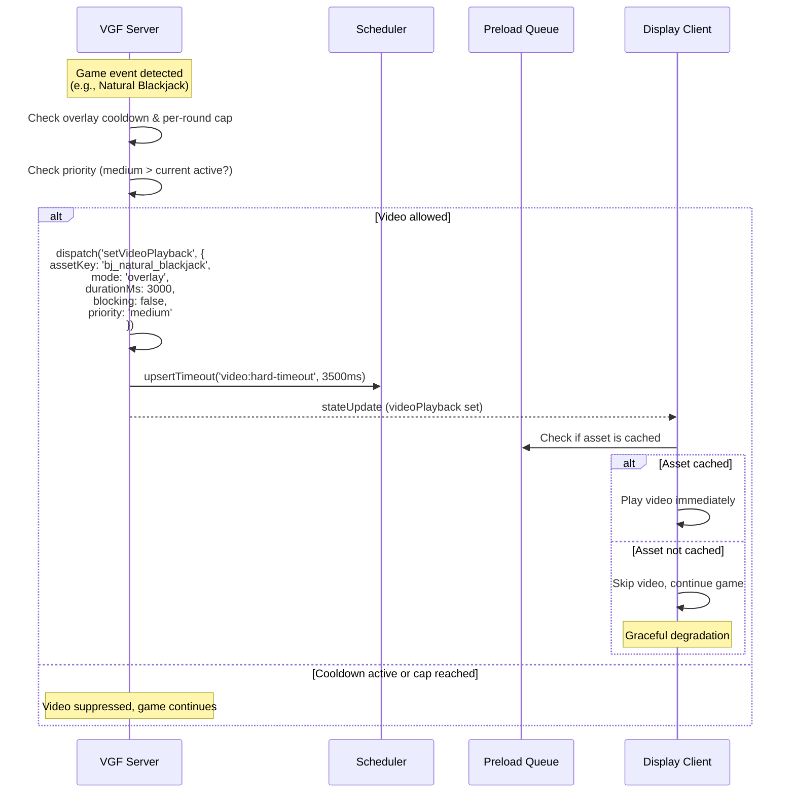
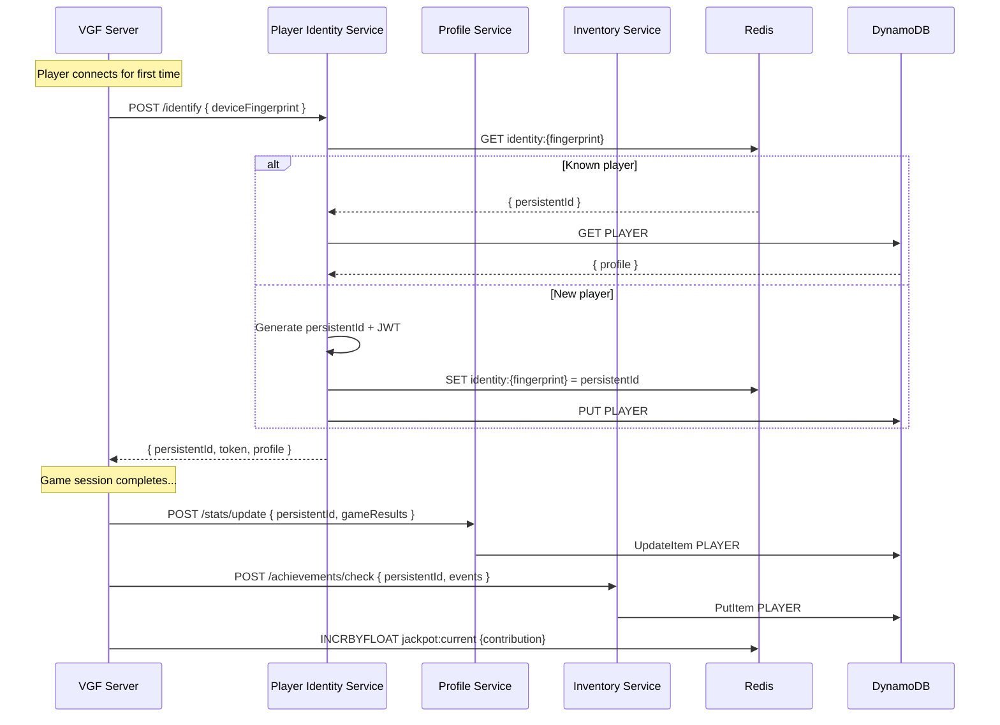

# Weekend Casino — Architecture Technical Design Document

> **Version:** 1.0
> **Date:** 2026-02-27
> **Author:** Principal Software Engineer
> **Status:** Final (reviewed 2026-02-27, all critical/major issues resolved)
> **Scope:** Full-platform architecture covering v1 Casino (Hold'em, 5-Card Draw, Blackjack Classic, Blackjack Competitive, Lobby, Wallet, Video) and v2 (Roulette, Three Card Poker, Craps, Game Night Mode, Retention Systems, Persistence Layer).
> **Canonical Decisions:** See `docs/CANONICAL-DECISIONS.md` — this TDD conforms to all decisions D-001 through D-019.
> **Extends:** `docs/TDD-architecture.md` (v1 Hold'em architecture TDD) — that document remains authoritative for ADRs 001-008 and poker-specific cross-cutting concerns. This TDD supersedes it for multi-game architecture scope.

---

## Table of Contents

1. [System Overview](#1-system-overview)
2. [Architecture Decision Records (ADRs)](#2-architecture-decision-records-adrs)
3. [Tech Stack](#3-tech-stack)
4. [State Schema Design](#4-state-schema-design)
5. [Phase Architecture](#5-phase-architecture)
6. [Video System Architecture](#6-video-system-architecture)
7. [Persistence Layer](#7-persistence-layer)
8. [Cross-Game Systems](#8-cross-game-systems)
9. [Infrastructure](#9-infrastructure)
10. [Data Flow Diagrams](#10-data-flow-diagrams)
11. [Non-Functional Requirements](#11-non-functional-requirements)
12. [Security](#12-security)
13. [Testing Strategy](#13-testing-strategy)
14. [Risk Assessment](#14-risk-assessment)

---

## 1. System Overview

Weekend Casino is a multi-game casino platform for Smart TV and Fire TV. Players speak their actions to AI dealer characters, use phones as private controllers, and enjoy 3D visuals rendered on cloud GPUs via Amazon GameLift Streams. The platform spans seven games across two major releases, with a persistence layer and retention systems running as a parallel workstream.

### 1.1 High-Level Architecture



### 1.2 Release Scope Summary

| Release | Timeline | Games Added | Key Systems |
|---------|----------|-------------|-------------|
| **v1** | Shipped | Hold'em, 5-Card Draw, BJ Classic, BJ Competitive | Lobby, Wallet, Video, Voice Pipeline |
| **v2.0** | Weeks 0-8 | Roulette, Three Card Poker (D-015) | Speed modes, Quick Play, Tutorials, Reactions |
| **v2.1** | Weeks 8-16 | Craps (D-016) | Game Night Mode (D-014), Spectator, BJ Tournament |
| **v2.2** | Weeks 16-24 | — | Persistence (D-019), Companion Mode (D-018), Daily Bonuses, Challenges, Profiles, Cosmetics, Achievements, Progressive Jackpot |

### 1.3 Design Principles

1. **Single Session, Multi-Game** — One VGF session spans an entire casino night. Games are phase namespaces within a single `GameRuleset` (D-001).
2. **Flat State, Optional Sub-Objects** — `CasinoGameState` does NOT extend `PokerGameState`. Game-specific data lives in optional sub-objects (D-002).
3. **Server-Authoritative Everything** — All game logic, video scheduling, and wallet management run server-side. Clients are renderers and input collectors.
4. **Per-Game Lazy Loading** — Video assets load on demand with a priority queue, not bulk preloading (D-013).
5. **Persistence Starts Now** — The persistence layer is designed in parallel from week 1 (D-019), even though it ships with v2.2.

---

## 2. Architecture Decision Records (ADRs)

ADRs 001-008 from `docs/TDD-architecture.md` remain in force. The following ADRs extend the register for multi-game and v2 scope.

### ADR-009: Single GameRuleset with Phase Namespaces (D-001)

**Context:**
The platform must support 7 games within a single VGF session. VGF sessions are tied 1:1 to a `GameRuleset`. Switching rulesets would require creating new sessions, disconnecting all clients, and building a persistence layer just for wallet transfer.

**Decision:** A single expanded `GameRuleset` with phase namespaces. All games register their phases, reducers, and thunks into one ruleset. Phase names use UPPER_SNAKE_CASE with game-specific prefixes (D-003).

**Consequences:**
- No session disruption on game switch. Players, wallets, and connections persist seamlessly.
- The ruleset grows large. A build-time test must verify no reducer name collisions across game modules.
- Shared reducers (addPlayer, removePlayer, wallet management, video) are registered at the root scope.
- Per-game reducers are scoped to their phase definitions and only active during those phases.

---

### ADR-010: CasinoGameState — Flat Union with Optional Sub-Objects (D-002)

**Context:**
The original design had `CasinoGameState extends PokerGameState`. This forced every game to carry poker-specific fields (`communityCards`, `sidePots`, `minRaiseIncrement`) that are meaningless in blackjack, craps, or roulette.

**Decision:** `CasinoGameState` is a flat shared base with optional game-specific sub-objects. Each game's state is initialised when entering that game and cleared when leaving.

**Consequences:**
- State shape is clean. Only the active game's sub-object is populated at any time.
- Existing `PokerGameState` fields are wrapped inside `holdem?: HoldemState`.
- The `toHoldemState(pokerGameState)` adapter provides backwards compatibility during migration.
- State size stays reasonable even with 7 game sub-state interfaces defined.

---

### ADR-011: Video Playback — Server-Authoritative with Scheduler Timeouts (D-011)

**Context:**
Video playback state must be synchronised across Display and Controllers. The original design had `endIf` calling `Date.now()` to determine video completion, which is impure and causes state divergence between server and client clocks.

**Decision:** Video playback is server-authoritative. The server-side scheduled thunk (`VIDEO_HARD_TIMEOUT`) is the primary timeout mechanism. The Display's `completeVideo` dispatch is an optimisation, not the authority. `endIf` never calls `Date.now()`.

**Consequences:**
- The server schedules a hard timeout via `ctx.scheduler.upsertTimeout()` when a video starts.
- The Display plays the video and dispatches `completeVideo` when the animation finishes.
- If the Display never dispatches (disconnect, freeze), the server timeout fires and forces completion.
- All video state transitions are driven by explicit boolean flags (`videoPlayback.complete`), not time-based checks.

---

### ADR-012: Video Preloading — Per-Game Lazy Loading (D-013)

**Context:**
There are 51 video assets in v1, growing to 72+ in v2. Bulk preloading all assets at session start is impractical on Fire TV Stick hardware (limited memory, constrained bandwidth).

**Decision:** Per-game lazy loading with a priority queue (max 3 concurrent downloads), sprite sheets for short overlays, and graceful degradation.

**Consequences:**
- When a game is selected, its video assets are queued for download by priority.
- Previously loaded game's assets are eligible for eviction (LRU) if memory pressure is high.
- Short overlay videos (< 2s) use sprite sheet animations instead of full video files.
- If a video is not ready when triggered, the game continues without it (no blocking).
- The `GN_LEADERBOARD` phase between games serves as a preloading buffer for the next game's assets.

---

### ADR-013: Persistence Layer — Redis Hot State, DynamoDB Cold State (D-019)

**Context:**
All retention features (daily bonuses, challenges, profiles, cosmetics, achievements, jackpot, Crews) require persistent player data. VGF's `MemoryStorage` is volatile. The persistence layer must support both real-time in-session data and long-term player records.

**Decision:** Dual-store architecture: Redis (ElastiCache) for hot state, DynamoDB for cold state.

**Consequences:**
- **Redis hot state:** Active session state (VGF persistence), progressive jackpot ticker, active challenge progress, session-scoped identity tokens. TTL: session duration (4 hours) for session data; indefinite for jackpot/identity.
- **DynamoDB cold state:** Player profiles, cosmetic inventory, achievement records, leaderboard entries, Crew data, historical session stats, streak records. Access pattern: single-table design with GSIs for query flexibility.
- **VGF `IPersistence` implementation:** Concrete backing store using Redis. Replaces `MemoryStorage` in production. Session state survives pod restarts.
- Architecture design starts immediately (D-019). Services ship with v2.2.

---

### ADR-014: Game Night Scoring — Rank-Based System (D-014)

**Context:**
Comparing chip results across games with different payout structures (poker pots vs blackjack 3:2 vs craps 35:1) is mathematically unsound. The chip-multiplier normalisation system proposed in `CASINO-V2-NEW-GAMES.md` was deprecated in favour of a rank-based system.

**Decision:** Game Night Mode uses rank-based scoring: 1st = 100 pts, 2nd = 70, 3rd = 45, 4th = 25, plus bonus points for spectacular plays. The `GAME_NIGHT_NORMALISERS` constant and `normaliseChipResult` function MUST NOT be implemented.

**Consequences:**
- Scoring is fair, simple to explain, and impossible to game by choosing high-variance games.
- Margin bonus (up to 30 extra points for dominant wins) rewards decisive play.
- Bonus points for rare achievements (Royal Flush, Hot Shooter, etc.) add excitement.
- Implementation is straightforward: rank players by net chip result per game, assign points.

---

### ADR-015: Phone Companion Mode Architecture (D-018)

**Context:**
Daily engagement mechanics (bonuses, challenges, streaks) require players to interact without a TV. The current architecture requires a TV for any interaction.

**Decision:** Phone Companion Mode is a standalone web application (same tech stack as the Controller) that connects to the Persistence Services directly, bypassing VGF entirely.

**Consequences:**
- Companion app is a PWA (Progressive Web App) deployable to phone home screens.
- It communicates with Profile Service, Inventory Service, and Companion API via REST/HTTPS.
- No VGF session required — this is purely a data-viewing and bonus-claiming interface.
- Push notifications via Web Push API (service worker registration).
- Hard dependency on the persistence layer being live.

---

### ADR-016: Progressive Jackpot Cross-Session State

**Context:**
The progressive jackpot must persist across sessions, grow with every bet placed by every player, and be visible on every TV during every game. This requires state that lives outside any single VGF session.

**Decision:** Jackpot state lives in Redis as a dedicated key with no TTL. Every VGF session reads and increments the jackpot via atomic Redis operations (`INCRBYFLOAT`). The Display polls the jackpot value periodically (every 5 seconds) for the persistent ticker.

**Consequences:**
- `INCRBYFLOAT` is atomic — no race conditions between concurrent sessions.
- Jackpot trigger detection runs server-side within each game's settlement phase.
- Jackpot wins dispatch a `JACKPOT_WON` event that triggers a full-screen celebration video.
- Jackpot reseeds to `JACKPOT_SEED_AMOUNT` (10,000 chips) after a Grand tier win.
- Redis persistence ensures jackpot survives infrastructure restarts.

---

## 3. Tech Stack

### 3.1 Core Framework

| Component | Technology | Version | Notes |
|-----------|-----------|---------|-------|
| Game Framework | `@volley/vgf` | **v4.8.0** | Server-authoritative, Redux-like, phase-based |
| Voice SDK | `@volley/recognition-client-sdk` | 0.1.424+ | Deepgram primary, Google STT fallback |
| Logging | `@volley/logger` | Latest | Pino-based structured logging |
| Runtime | Node.js | 22+ | VGF server runtime |
| Package Manager | pnpm | Latest | Workspace monorepo |

### 3.2 Package Names (Post-Rebrand)

| Package | Scope |
|---------|-------|
| `@weekend-casino/shared` | Shared types, constants, game logic |
| `@weekend-casino/server` | VGF server, reducers, thunks |
| `@weekend-casino/display` | TV Display client (React + R3F) |
| `@weekend-casino/controller` | Phone Controller client (React) |

### 3.3 Frontend

| Technology | Purpose |
|-----------|---------|
| React 19.x | UI framework (Display + Controller) |
| React Three Fiber (R3F) | 3D rendering on Display |
| Three.js | WebGL renderer |
| @react-three/drei | R3F helpers |
| @react-three/postprocessing | Post-processing (bloom, vignette) |
| Theatre.js (@theatre/core, @theatre/r3f) | Animation engine |
| Socket.IO Client | WebSocket transport |
| @noriginmedia/norigin-spatial-navigation | TV remote focus management |

### 3.4 Backend & Infrastructure

| Technology | Purpose |
|-----------|---------|
| Amazon EKS | Kubernetes orchestration for VGF pods |
| Amazon GameLift Streams | Cloud GPU rendering (`gen4n_high`) |
| Amazon ElastiCache (Redis) | Hot state: sessions, jackpot, identity |
| Amazon DynamoDB | Cold state: profiles, inventory, leaderboards |
| Amazon CloudFront | CDN for 3D assets, video, audio |
| Electron | Windows packaging for GameLift Streams |
| Datadog | System monitoring: APM, infrastructure metrics, log management, distributed tracing, alerting |
| Amplitude | Business analytics: user behaviour, funnels, retention, A/B testing, cohort analysis |
| Tracking Library | Event instrumentation layer (details TBD — see §11A) |

### 3.5 AI & Voice

| Service | Purpose | Model |
|---------|---------|-------|
| Deepgram | Primary STT | nova-2 |
| Google STT | Fallback STT | — |
| Claude Opus 4.6 | Hard bot decisions | Temperature 0.3 |
| Claude Sonnet 4.5 | Medium bot decisions | Temperature 0.4-0.6 |
| Claude Haiku 4.5 | Easy bot chat, intent fallback | Temperature 0.9-1.0 |
| TTS (ElevenLabs / Polly) | Dealer/bot speech | Per-character voices |

---

## 4. State Schema Design

### 4.1 Root State: CasinoGameState (D-002)

This is the canonical state shape. All game sub-states are optional and only populated when that game is active.

```typescript
/**
 * Root game state — flat shared base with optional game sub-objects.
 * Does NOT extend PokerGameState (D-002).
 * Uses CasinoGame enum with snake_case values (D-004).
 */
interface CasinoGameState {
  // ─── VGF Required ───
  [key: string]: unknown
  phase: CasinoPhase
  previousPhase?: CasinoPhase

  // ─── Multi-Game Control ───
  selectedGame: CasinoGame | null
  gameSelectConfirmed: boolean
  gameChangeRequested: boolean               // v1: host-only (D-008)
  gameChangeVotes: Record<string, CasinoGame> // v2: vote-based (D-008)

  // ─── Shared Wallet (D-005) ───
  wallet: Record<string, number>             // playerId -> balance

  // ─── Player Roster ───
  players: CasinoPlayer[]

  // ─── Table Config ───
  dealerCharacterId: string
  blindLevel: BlindLevel
  handNumber: number
  dealerIndex: number

  // ─── Lobby ───
  lobbyReady: boolean

  // ─── Dealer / TTS ───
  dealerMessage: string | null
  ttsQueue: TTSMessage[]

  // ─── Session Stats ───
  sessionStats: SessionStats

  // ─── Video Playback (D-011) ───
  videoPlayback?: VideoPlayback
  backgroundVideo?: BackgroundVideo

  // ─── Game Night (v2.1) ───
  gameNight?: GameNightState

  // ─── Progressive Jackpot (v2.2) ───
  jackpot?: JackpotDisplayState

  // ─── v1 Game Sub-States ───
  holdem?: HoldemState
  fiveCardDraw?: FiveCardDrawState
  blackjack?: BlackjackState
  blackjackCompetitive?: BlackjackCompetitiveState

  // ─── v2 Game Sub-States ───
  roulette?: RouletteState
  threeCardPoker?: ThreeCardPokerState
  craps?: CrapsState
}

/** Game identifier enum — snake_case values (D-004) */
type CasinoGame =
  | 'holdem'
  | 'five_card_draw'
  | 'blackjack_classic'
  | 'blackjack_competitive'
  | 'roulette'               // v2.0
  | 'three_card_poker'       // v2.0
  | 'craps'                  // v2.1
```

### 4.2 CasinoPlayer

```typescript
interface CasinoPlayer {
  id: string
  name: string
  seatIndex: number
  isBot: boolean
  botConfig?: BotConfig
  isHost: boolean
  isConnected: boolean
  isReady: boolean
  currentGameStatus: 'active' | 'sitting-out' | 'spectating'
  sittingOutHandCount: number
  avatarId: string
  // v2.2 — persistence-backed
  persistentId?: string       // from Player Identity Service
  cosmeticLoadout?: CosmeticLoadout
}
```

### 4.3 Wallet Design (D-005)

```typescript
/**
 * Wallet lives at root state level: wallet: Record<string, number>
 *
 * Starting balance: 10,000 chips (D-005).
 * Wallet is the SINGLE source of truth between games.
 * During active gameplay, game sub-state balances are live values.
 * Root wallet is updated only at sync points (M1).
 *
 * Sync Points:
 *   SP1 — Game Start: fund game-local from wallet
 *   SP2 — Hand/Round End: apply delta to wallet
 *   SP3 — Game Switch: settle in-progress game, clear sub-state
 */

// Wallet reducers (root-scoped, always available)
type WalletReducers = {
  updateWallet: (state: CasinoGameState, playerId: string, delta: number) => CasinoGameState
  setWalletBalance: (state: CasinoGameState, playerId: string, amount: number) => CasinoGameState
}

const STARTING_WALLET = 10_000  // D-005
```

### 4.4 Video Playback State (D-011, D-013)

```typescript
/**
 * VideoPlayback — foreground video state.
 * backgroundVideo — ambient loops (separate interface, NOT a mode).
 *
 * Known Issue: Section 21 vs 27 of game design doc listed "background" as
 * a VideoPlayback.mode. This is WRONG. Background is a separate interface
 * (V-MAJOR-3 fix). VideoPlayback.mode covers foreground playback only.
 */
interface VideoPlayback {
  assetKey: string
  mode: 'full_screen' | 'overlay' | 'transition'  // NO 'background' mode
  startedAt: number                                 // server timestamp
  durationMs: number
  blocking: boolean                                 // halts game progression
  skippable: boolean
  skipDelayMs: number                               // ms before skip allowed
  priority: 'low' | 'medium' | 'high' | 'critical'
  complete: boolean                                 // set by completeVideo or timeout
}

interface BackgroundVideo {
  assetKey: string
  looping: boolean
  active: boolean
}

// Video asset counts (D-012)
// v1:  51 assets (7 shared + 9 Hold'em + 10 5-Card Draw + 16 BJ Classic + 9 BJ Competitive)
// v2.0: 72 assets (51 v1 + 11 Roulette + 9 TCP + 1 game-select intro)
// v2.1: 84 assets (72 + 12 Craps)
```

### 4.5 Session Stats

```typescript
interface SessionStats {
  sessionStartedAt: number
  gamesPlayed: Record<CasinoGame, number>
  handsPlayed: number
  totalChipsWon: number
  totalChipsLost: number
  biggestPot: number
  biggestWin: { playerId: string; amount: number; game: CasinoGame } | null
  playerStats: Record<string, PlayerSessionStats>
}

interface PlayerSessionStats {
  handsPlayed: number
  handsWon: number
  netChipResult: number
  biggestWin: number
  gamesPlayed: CasinoGame[]
}
```

### 4.6 Server-Side State (Private Data)

```typescript
/**
 * Multi-game server-side state — ALL private data that MUST NOT
 * be broadcast via VGF state sync.
 * Stored in-memory Map<sessionId, ServerGameState>.
 * Production: backed by Redis for persistence across restarts.
 */
interface ServerGameState {
  activeGame: CasinoGame | null

  // v1 games
  holdem?: ServerHoldemState
  draw?: ServerDrawState
  blackjack?: ServerBlackjackState
  blackjackCompetitive?: ServerBlackjackCompetitiveState

  // v2 games
  roulette?: ServerRouletteState
  threeCardPoker?: ServerTCPState
  craps?: ServerCrapsState
}

interface ServerHoldemState {
  deck: Card[]
  holeCards: Map<string, [Card, Card]>
}

interface ServerDrawState {
  deck: Card[]
  holeCards: Map<string, Card[]>
  discardPile: Card[]
}

interface ServerBlackjackState {
  shoe: Card[]
  dealerHoleCard: Card | null
}

interface ServerBlackjackCompetitiveState {
  shoe: Card[]
  playerHoleCards: Map<string, Card[]>
}

interface ServerRouletteState {
  winningNumber: number | null       // generated before spin animation
}

interface ServerTCPState {
  deck: Card[]
  dealerCards: [Card, Card, Card]
  playerCards: Map<string, [Card, Card, Card]>
}

interface ServerCrapsState {
  nextRoll: [number, number] | null  // pre-generated dice result
  rngSeed: Uint8Array               // CSPRNG seed for replay/audit
}
```

---

## 5. Phase Architecture

### 5.1 Phase Naming Convention (D-003)

All phases use UPPER_SNAKE_CASE with game-specific underscore prefixes. Hold'em phases are unprefixed for backwards compatibility.

| Game | Prefix | Example Phases |
|------|--------|----------------|
| Shared | *(none)* | `LOBBY`, `GAME_SELECT` |
| Hold'em | *(none)* | `POSTING_BLINDS`, `PRE_FLOP_BETTING`, `SHOWDOWN` |
| 5-Card Draw | `DRAW_` | `DRAW_POSTING_BLINDS`, `DRAW_DRAW_PHASE`, `DRAW_SHOWDOWN` |
| BJ Classic | `BJ_` | `BJ_PLACE_BETS`, `BJ_PLAYER_TURNS`, `BJ_SETTLEMENT` |
| BJ Competitive | `BJC_` | `BJC_PLACE_BETS`, `BJC_SHOWDOWN` |
| Roulette | `ROULETTE_` | `ROULETTE_PLACE_BETS`, `ROULETTE_SPIN`, `ROULETTE_PAYOUT` |
| Three Card Poker | `TCP_` | `TCP_PLACE_BETS`, `TCP_DEAL_CARDS`, `TCP_PLAYER_DECISIONS` |
| Craps | `CRAPS_` | `CRAPS_COME_OUT_ROLL`, `CRAPS_POINT_RESOLUTION` |
| Game Night | `GN_` | `GN_SETUP`, `GN_LEADERBOARD`, `GN_CHAMPION` |

### 5.2 Phase Routing Architecture



### 5.3 Phase Routing Table

The `GAME_SELECT` phase's `next` function dynamically routes to the first phase of the selected game:

```typescript
function gameSelectNext(state: CasinoGameState): CasinoPhase {
  switch (state.selectedGame) {
    case 'holdem':               return CasinoPhase.PostingBlinds
    case 'five_card_draw':       return CasinoPhase.DrawPostingBlinds
    case 'blackjack_classic':    return CasinoPhase.BjPlaceBets
    case 'blackjack_competitive': return CasinoPhase.BjcPlaceBets
    case 'roulette':             return CasinoPhase.RoulettePlaceBets
    case 'three_card_poker':     return CasinoPhase.TcpPlaceBets
    case 'craps':                return CasinoPhase.CrapsNewShooter
    default:                     return CasinoPhase.GameSelect
  }
}
```

### 5.4 Game Night Phase Integration

Every game's round-complete phase uses a `wrapWithGameNightCheck` utility (built as a no-op in v2.0, activated in v2.1):

```typescript
function wrapWithGameNightCheck(
  innerNext: (state: CasinoGameState) => CasinoPhase
): (state: CasinoGameState) => CasinoPhase {
  return (state) => {
    if (state.gameNight?.isActive) {
      const gn = state.gameNight
      const currentGame = gn.gameLineup[gn.currentGameIndex]
      const roundsPlayed = state.sessionStats.gamesPlayed[currentGame!] ?? 0
      const roundLimit = gn.roundsPerGame[currentGame!] ?? 10

      if (roundsPlayed >= roundLimit) {
        // Game's round limit reached — go to leaderboard or champion
        if (gn.currentGameIndex >= gn.gameLineup.length - 1) {
          return CasinoPhase.GnChampion
        }
        return CasinoPhase.GnLeaderboard
      }
    }

    if (state.gameChangeRequested) {
      return CasinoPhase.GameSelect
    }

    return innerNext(state)
  }
}
```

### 5.5 Per-Game Phase Counts

| Game | Phase Count | Key Complexity |
|------|------------|----------------|
| Hold'em | 13 | Betting rounds, side pots, all-in runouts |
| 5-Card Draw | 8 | Draw phase with sequential player turns |
| BJ Classic | 7 | Split hands, sequential player turns, dealer automation |
| BJ Competitive | 6 | Private cards, showdown reveal |
| Roulette | 6 | Client-driven spin completion, complex bet grid |
| Three Card Poker | 6 | Simultaneous decisions, pair-plus side bet |
| Craps | 8 | Come bet persistence across rounds, 6+ bet types |
| Game Night | 3 | Meta-phases wrapping game phases |
| **Total** | **57** | Plus 2 shared (LOBBY, GAME_SELECT) + 1 QP_AUTO_ROTATE = 60 including all phases |

### 5.6 Phase Lifecycle Invariants

Every phase in the system follows these rules:

1. **`endIf` is pure.** It reads state and returns a boolean. It never calls `Date.now()`, never has side effects, never dispatches. (D-011, V-CRITICAL-2)
2. **Transition flags are explicit.** Every `endIf` checks a boolean flag set by `onBegin` or a reducer/thunk. No `() => true` immediate transitions. (C1 fix)
3. **Game-specific routing functions are self-contained.** Hold'em routing functions are NOT reused by other games. Each game has its own `*NextPhase` functions. (C2 fix)
4. **Reducer/thunk scope is declared.** Every reducer and thunk is explicitly marked as root-scoped (available in all phases) or phase-scoped (only available in specific phases). (C3 fix)

---

## 6. Video System Architecture

### 6.1 Playback Modes

| Mode | Description | Blocks Game? | Skippable? | Example |
|------|-------------|-------------|------------|---------|
| `full_screen` | Takes over the entire Display | Yes | Yes (after `skipDelayMs`) | Craps point hit celebration |
| `overlay` | Renders on top of the game scene | No | No | "WINNER!" chip cascade |
| `transition` | Plays during scene changes | Yes | No | Game switch cinematic |
| Background (separate `BackgroundVideo` interface) | Ambient loop behind game UI | No | N/A | Craps table energy ambience |

**CRITICAL NOTE:** `background` is NOT a `VideoPlayback.mode`. It is a separate `BackgroundVideo` interface. This resolves the Section 21 vs 27 contradiction in the game design doc (V-MAJOR-3 fix).

### 6.2 Three-Layer Rendering

```
┌──────────────────────────────────────┐
│  Layer 3: Full-Screen Video          │  ← VideoPlayback (mode: full_screen)
│  (blocks game, z-index highest)      │
├──────────────────────────────────────┤
│  Layer 2: Overlay Video              │  ← VideoPlayback (mode: overlay)
│  (renders above game, transparent bg)│
├──────────────────────────────────────┤
│  Layer 1: Game Scene + Background    │  ← R3F scene + BackgroundVideo
│  (3D table, cards, chips, ambience)  │
└──────────────────────────────────────┘
```

### 6.3 Server-Authoritative Scheduling (D-011)



### 6.4 Preloading Strategy (D-013)

```typescript
interface VideoPreloadQueue {
  /** Max concurrent downloads */
  maxConcurrent: 3

  /** Priority levels */
  priorities: {
    critical: 0    // Current game's blocking videos
    high: 1        // Current game's overlay videos
    medium: 2      // Current game's ambient/background
    low: 3         // Next game in Game Night lineup
  }

  /** Eviction: LRU with game affinity */
  evictionPolicy: 'lru_game_affinity'
  // Assets for the current game are never evicted.
  // Oldest-accessed assets from other games are evicted first.

  /** Memory budget (Fire TV Stick constraint) */
  maxCacheSizeMB: 150
}
```

**Preloading lifecycle:**

1. `GAME_SELECT.onEnd` — enqueue current game's critical + high priority assets.
2. During gameplay — enqueue medium/low assets during idle moments.
3. `GN_LEADERBOARD.onBegin` — evict previous game's assets, enqueue next game's assets (ADR-012).
4. On memory pressure — evict LRU assets from non-current games.

### 6.5 Overlay Priority and Cooldown

Blackjack and craps generate many potential overlay triggers per round. Without throttling, the player drowns in animations.

```typescript
interface OverlayConfig {
  /** Priority levels — higher priority overlays interrupt lower ones */
  priorities: 'low' | 'medium' | 'high' | 'critical'

  /** Global cooldown between non-critical overlays */
  cooldownMs: 3_000

  /** Per-round cap (blackjack / craps) */
  maxOverlaysPerRound: 2

  /** Per-round cap exceptions: 'critical' priority bypasses caps */
}
```

---

## 7. Persistence Layer

### 7.1 Architecture Overview (D-019)



### 7.2 Player Identity Service

The identity service solves the "no user accounts" problem for a TV-first casual game.

```typescript
interface PlayerIdentity {
  /** Stable identifier — survives session restarts */
  persistentId: string           // UUID v4

  /** Device fingerprint — primary identification in v2.2 */
  deviceFingerprint: string      // browser localStorage token

  /** Optional account linking — v2.3+ */
  email?: string
  phoneNumber?: string

  /** Session association */
  currentSessionId?: string
  lastActiveAt: string           // ISO datetime

  /** Identity token for API auth */
  token: string                  // JWT, 24-hour TTL, auto-refresh
}
```

**Identification flow:**

1. Player scans QR code and opens Controller.
2. Controller checks localStorage for existing `deviceFingerprint`.
3. If found: send fingerprint to Player Identity Service, receive `persistentId` + JWT token.
4. If not found: generate new fingerprint, register with PIS, store in localStorage.
5. JWT token included in all subsequent API calls (Companion, Profile, Inventory).

**Risk: Identity loss.** If a player clears browser data, their identity is lost. Mitigation: optional account linking (email/phone) in v2.3 if identity loss rate exceeds 10% over 4 weeks.

### 7.3 Profile Service

```typescript
interface PlayerProfile {
  persistentId: string
  displayName: string
  avatarId: string
  createdAt: string

  // Aggregate stats
  totalSessionsPlayed: number
  totalHandsPlayed: number
  totalChipsWon: number
  totalChipsLost: number
  favouriteGame: CasinoGame | null

  // Per-game stats
  gameStats: Record<CasinoGame, GameSpecificStats>

  // Streaks
  gameNightStreak: GameNightStreak
  dailyLoginState: DailyLoginState

  // Social
  crewId?: string
}
```

### 7.4 Inventory Service

```typescript
interface PlayerInventory {
  persistentId: string
  ownedCosmetics: string[]       // cosmetic IDs
  equippedLoadout: CosmeticLoadout
  achievements: AchievementRecord[]
  challengeState: WeeklyChallengeState
}

interface CosmeticLoadout {
  cardBack: string | null
  tableFelt: string | null
  chipDesign: string | null
  avatarFrame: string | null
  victoryAnimation: string | null
  cardDealEffect: string | null
}
```

### 7.5 Storage Architecture

#### Redis Key Patterns (Hot State)

| Key Pattern | TTL | Purpose |
|------------|-----|---------|
| `vgf:session:{sessionId}:state` | 4 hours | VGF session state backup |
| `vgf:session:{sessionId}:members` | 4 hours | Connected client records |
| `vgf:scheduler:{sessionId}:*` | 4 hours | Scheduler jobs |
| `identity:{fingerprint}` | 30 days | Device fingerprint -> persistentId |
| `identity:token:{persistentId}` | 24 hours | Active JWT tokens |
| `jackpot:current` | None (persistent) | Progressive jackpot state |
| `jackpot:history` | 90 days | Recent jackpot wins |
| `challenge:active:{persistentId}` | 7 days | Active challenge progress |

#### DynamoDB Table Design (Single-Table)

| PK | SK | Data |
|----|-----|------|
| `PLAYER#{persistentId}` | `PROFILE` | Player profile |
| `PLAYER#{persistentId}` | `INVENTORY` | Cosmetic inventory |
| `PLAYER#{persistentId}` | `ACHIEVEMENT#{achievementId}` | Achievement record |
| `PLAYER#{persistentId}` | `STATS#{game}` | Per-game stats |
| `CREW#{crewId}` | `META` | Crew metadata |
| `CREW#{crewId}` | `MEMBER#{persistentId}` | Crew member record |
| `CREW#{crewId}` | `STATS#WEEKLY#{weekId}` | Weekly crew stats |
| `LEADERBOARD#WEEKLY` | `{weekId}#{score}#{persistentId}` | Weekly leaderboard entry |
| `LEADERBOARD#ALLTIME` | `{score}#{persistentId}` | All-time leaderboard entry |

**GSIs:**
- `GSI1`: `crewCode` -> `CREW#{crewId}` (Crew lookup by code)
- `GSI2`: `persistentId` -> all items (player data access)

### 7.6 VGF IPersistence Implementation

```typescript
/**
 * Concrete IPersistence implementation using Redis.
 * Replaces MemoryStorage in production.
 */
class RedisPersistence implements IPersistence {
  constructor(private redis: Redis) {}

  async getState(sessionId: string): Promise<GameState | null> {
    const raw = await this.redis.get(`vgf:session:${sessionId}:state`)
    return raw ? JSON.parse(raw) : null
  }

  async setState(sessionId: string, state: GameState): Promise<void> {
    await this.redis.set(
      `vgf:session:${sessionId}:state`,
      JSON.stringify(state),
      'EX', 14400  // 4 hour TTL
    )
  }

  async deleteState(sessionId: string): Promise<void> {
    await this.redis.del(`vgf:session:${sessionId}:state`)
  }
}
```

### 7.7 Implementation Timeline (D-019)

| Week | Deliverable |
|------|------------|
| 1-2 | Architecture TDD (this document), schema design, API contracts |
| 3-6 | Player Identity Service (device fingerprint, token generation) |
| 5-8 | VGF `IPersistence` with Redis backing store |
| 7-10 | Profile Service (REST endpoints, stats accumulation) |
| 9-12 | Inventory Service (cosmetics, achievements, challenge state) |
| 11-14 | Companion API (phone-only endpoints, push notifications) |

---

## 8. Cross-Game Systems

### 8.1 Wallet System

The shared wallet is the backbone of cross-game play. See Section 4.3 for schema.

**Rebuy behaviour:**
- Unlimited rebuys in v1 (social game, no monetisation).
- When wallet reaches 0 between games: automatic prompt to rebuy.
- Rebuy amount: `STARTING_WALLET` (10,000 chips).
- During active gameplay with wallet at 0: player cannot bet and is prompted to rebuy between rounds.

### 8.2 Game Night Scoring (D-014)

```typescript
const RANK_POINTS: Record<number, number> = {
  1: 100,  // 1st place
  2: 70,   // 2nd place
  3: 45,   // 3rd place
  4: 25,   // 4th place
}

// Margin bonus: up to 30 extra points for dominant wins
// Bonus points: per-game spectacular play triggers (see retention doc)

interface GameNightState {
  isActive: boolean
  gameLineup: CasinoGame[]
  currentGameIndex: number
  roundsPerGame: Record<CasinoGame, number>
  scores: Record<string, GameNightPlayerTotal>
  gameResults: GameNightGameResult[]
  theme: GameNightTheme | null
  championId: string | null
  startedAt: number
}

interface GameNightPlayerTotal {
  playerId: string
  playerName: string
  totalPoints: number
  gamesPlayed: number
  firstPlaceCount: number
  bonusPointsTotal: number
}
```

### 8.3 Achievement System (v2.2)

Achievements are detected server-side during game settlement phases and recorded via the Inventory Service.

```typescript
interface AchievementRecord {
  achievementId: string
  unlockedAt: string
  game: CasinoGame | 'cross_game'
  cosmeticReward: string | null
}

// Detection runs in each game's settlement/hand-complete phase:
// - Hold'em/Draw: check hand rank, bluff detection, comeback detection
// - Blackjack: check natural BJ, five-card charlie, streak
// - Craps: check hot shooter, hardway, streak
// - Roulette: check straight-up hit, colour streak
// - Cross-game: check total hands, Game Night wins, session length
```

### 8.4 Progressive Jackpot (v2.2)

```typescript
interface ProgressiveJackpot {
  currentAmount: number
  seedAmount: number              // 10,000 chips
  contributionRate: number        // 0.01 (1%)
  lastWonBy: string | null
  lastWonAt: string | null
  lastWonAmount: number | null
  triggersThisSession: number
}

// Jackpot contribution: 1% of every main bet, across ALL games.
// Stored in Redis: INCRBYFLOAT for atomic updates across concurrent sessions.
// Display polls every 5 seconds for the ticker.

// Tiered payouts:
// Mini (5% of jackpot):  Three of a Kind / BJ 21+3 hit / Pass+Odds win
// Major (15% of jackpot): Straight Flush / Natural BJ+PP / Hot Shooter 10+
// Grand (80% of jackpot): Royal Flush / BJ+PP+21+3 / Same number 2x roulette
```

---

## 9. Infrastructure

### 9.1 AWS Deployment Topology



### 9.2 Scaling Model

| Scale | VGF Pods | GameLift Instances | Redis | DynamoDB |
|-------|----------|--------------------|-------|----------|
| Alpha | 5 | 5 (always-on) | Single node | On-demand |
| Beta | 50 | 10 always-on + on-demand | Single node | On-demand |
| Launch | 200 | 20 always-on + on-demand | 3-node cluster | On-demand |
| v2.0 Growth | 500 | 50 always-on + on-demand | 6-node cluster | Provisioned (1000 WCU) |
| v2.2 DAU Target (50-100K) | 2,000+ | 200 always-on + on-demand | 6-node cluster, Multi-AZ | Provisioned (5000 WCU) |

**Session-to-pod ratio:** 1:1 (each VGF pod handles one game session with up to 4 players + bots).

**Memory per pod:** ~50-100 MB (v1), ~80-150 MB (v2 with 7-game state shape). Fire TV Stick profiling required before v2.0 launch.

### 9.3 Failover Strategy

| Component | Failure Mode | Recovery |
|-----------|-------------|----------|
| VGF Server pod | Pod crash/restart | `FailoverVGFServiceFactory` recovers from Redis. Scheduler state restored. Clients auto-reconnect. |
| Redis | Node failure | Multi-AZ ElastiCache automatic failover. |
| Redis | Complete outage | VGF falls back to `MemoryStorage`. Sessions continue in-memory but lose persistence. |
| GameLift Streams | GPU crash | Session lost. TV shows "Reconnecting...". Game state preserved on VGF. |
| DynamoDB | Table throttled | Auto-scaling kicks in. Companion app shows "Loading..." with retry. |
| Player Identity Service | Pod crash | K8s restarts pod. JWT tokens remain valid (stateless verification). |

### 9.4 Fire TV Stick Performance Budget

Fire TV Stick (3rd Gen) is the baseline target hardware. It receives the GameLift Streams WebRTC feed, not raw 3D rendering, but it must still handle WebRTC decoding, UI overlays, and input forwarding.

| Metric | Budget | Degradation Strategy |
|--------|--------|---------------------|
| WebRTC decode frame rate | >= 30 fps | Reduce GameLift stream quality from 1080p to 720p |
| Input latency (remote -> cloud) | < 200ms p95 | Acceptable for turn-based games |
| State broadcast size | < 50 KB per update | Batch craps resolution into single dispatch (RC-1) |
| Video overlay decode | 720p 30fps | Fall back to sprite sheet animation |
| Memory usage | < 1 GB total | Enforce video cache limit (150 MB) |

---

## 10. Data Flow Diagrams

### 10.1 Voice Pipeline (Multi-Game)



**Key difference from v1:** The `processVoiceCommand` thunk receives `currentGame` context to route to the correct game-specific slot map and legal action set. Per-game slot maps boost accuracy for game-specific vocabulary (e.g., "pass line", "hit me", "draw two").

### 10.2 State Update Flow (Game Switch)



### 10.3 Video Trigger Flow



### 10.4 Persistence Flow (v2.2)



---

## 11. Non-Functional Requirements

### 11.1 Latency Targets

| Interaction | Target | Maximum | Notes |
|------------|--------|---------|-------|
| Voice command end-to-end | 460ms | 1,200ms | STT + intent + validation + TTS |
| State broadcast (VGF -> clients) | 50ms | 100ms | Socket.IO, same-region |
| Game switch (lobby -> first phase) | 1,000ms | 3,000ms | Includes 3D scene load |
| Video playback start | 100ms | 500ms | From trigger to first frame |
| Roulette spin animation | 6,000ms | 8,000ms | Client-driven + server timeout |
| Craps dice roll animation | 2,500ms | 3,500ms | Physics simulation on Display |
| Bot decision (Easy) | 500ms | 1,500ms | Rules engine + chat LLM |
| Bot decision (Hard) | 2,000ms | 4,000ms | Full LLM with thinking |
| Companion API response | 200ms | 500ms | REST, DynamoDB single-item |
| Jackpot ticker update | 5,000ms | 10,000ms | Polling interval |

### 11.2 Throughput Targets

| Metric | v2.0 Target | v2.2 Target (50-100K DAU) |
|--------|------------|--------------------------|
| Concurrent sessions | 200 | 2,000+ |
| Concurrent WebSocket connections | 800 (200 x 4) | 8,000+ |
| Redis operations/sec | 1,000 | 10,000+ |
| DynamoDB writes/sec | N/A | 5,000 |
| LLM API calls/sec | 600 (200 x 3 bots) | 6,000 |

### 11.3 Availability Targets

| Component | Target | Measured By |
|-----------|--------|-------------|
| VGF Server | 99.9% | Pod uptime, session recovery success |
| GameLift Streams | 99.9% | Stream quality, session start success |
| Redis | 99.99% | ElastiCache Multi-AZ SLA |
| DynamoDB | 99.99% | AWS SLA |
| Voice pipeline | 99.5% | Successful transcription rate |
| Companion API | 99.9% | Endpoint availability |

---

## 11A. Observability & Analytics

### ADR-017: Datadog for System Monitoring, Amplitude for Business Analytics

**Decision:** Use Datadog for all system health monitoring, infrastructure observability, APM, and alerting. Use Amplitude for all business analytics, user behaviour tracking, retention metrics, and product decisions.

**Rationale:** Separation of concerns — operations teams use Datadog for system health; product teams use Amplitude for user insights. Both are industry-standard SaaS platforms with minimal self-hosting overhead.

### 11A.1 Datadog — System Monitoring

**Scope:** Infrastructure health, application performance, error tracking, alerting.

| Layer | What We Monitor | How |
|-------|----------------|-----|
| **Infrastructure** | EKS pod health, CPU/memory, Redis latency, DynamoDB throughput, GameLift stream quality | Datadog Agent on EKS nodes, AWS integration |
| **APM (Application Performance)** | VGF server request traces, thunk execution time, reducer dispatch latency, LLM API call duration | `dd-trace` Node.js library, auto-instrumentation |
| **Logs** | Structured JSON logs from VGF server, voice pipeline, persistence services | `@volley/logger` → Datadog Log Management |
| **Custom Metrics** | Sessions active, players connected, games in progress, wallet operations/sec, video triggers/sec | `dd-trace` custom metrics API |
| **Distributed Tracing** | End-to-end voice command flow (Controller → STT → VGF → TTS → Display) | Trace context propagation across Socket.IO and HTTP |
| **Alerts** | Error rate spikes, latency threshold breaches, pod restarts, Redis connection failures | Datadog Monitors with PagerDuty integration |

**Key Dashboards:**
- **System Health** — Pod count, CPU/memory per pod, Redis ops/sec, DynamoDB read/write capacity
- **Game Performance** — Active sessions by game type, avg phase duration, bot decision latency by difficulty
- **Voice Pipeline** — STT success rate, intent parse latency (regex vs LLM), TTS queue depth
- **Video System** — Preload hit rate, playback start latency, degradation fallback frequency
- **Persistence** — Identity lookups/sec, profile writes/sec, DynamoDB throttle events

**Trace Context:**
```
Controller (voice) → [traceId] → VGF Server (intent parse) → [traceId] → LLM API (if fallback) → [traceId] → State dispatch → [traceId] → TTS generation → [traceId] → Display (audio play)
```

### 11A.2 Amplitude — Business Analytics

**Scope:** User behaviour, game engagement, retention, monetisation readiness, product decisions.

| Category | Events | Purpose |
|----------|--------|---------|
| **Session Lifecycle** | `session_started`, `session_ended`, `player_joined`, `player_left` | DAU/MAU, session length, player counts |
| **Game Engagement** | `game_selected`, `game_started`, `game_completed`, `game_switched` | Games-per-session, game popularity, switch patterns |
| **Per-Game Actions** | `hand_played`, `bet_placed`, `hand_won`, `hand_lost`, `side_bet_placed` | Win rates, bet distributions, side bet adoption |
| **Retention Triggers** | `daily_bonus_claimed`, `challenge_completed`, `achievement_unlocked`, `jackpot_contributed` | Retention loop effectiveness |
| **Game Night** | `game_night_started`, `game_night_completed`, `champion_crowned` | Game Night adoption, completion rate |
| **Social** | `crew_created`, `crew_joined`, `reaction_sent`, `results_shared` | Social feature adoption |
| **Voice** | `voice_command_used`, `voice_command_failed`, `touch_fallback_used` | Voice vs touch ratio, voice reliability |
| **Video** | `video_triggered`, `video_skipped`, `video_degraded` | Video engagement, skip rates |
| **Companion** | `companion_opened`, `companion_bonus_claimed`, `companion_challenge_viewed` | Companion adoption |

**User Properties (set once, updated on change):**
- `first_seen_date`, `total_sessions`, `favourite_game`, `games_played_set`, `crew_id`, `has_cosmetics`, `device_type`, `platform`

**Key Amplitude Charts:**
- Funnel: QR scan → join session → play first hand → complete session → return next week
- Retention: D1/D7/D30 by acquisition cohort
- Engagement: Games per session, session duration, game type distribution
- Game Night: Start → complete funnel, weekly streak distribution
- Cross-game: Players who try 2+ games vs 1-game players (retention delta)

**Success Metrics (from V2 PRD, tracked in Amplitude):**
- v2.0: ≥1.5 games/session, ≥15% Roulette play rate, ≥10% TCP play rate
- v2.1: ≥50% Game Night completion, ≥40% weekly return rate, ≥20% Craps play rate
- v2.2: ≥22% DAU/MAU, ≥30% companion daily active, ≥40% bonus claim rate

### 11A.3 Tracking Library Integration

> **[PENDING]** The project uses a shared tracking library for event instrumentation. Details to be provided by the team. The architecture should assume:
> - A thin abstraction layer that wraps both Datadog custom events and Amplitude track calls
> - Server-side tracking for game state events (authoritative)
> - Client-side tracking for UI interaction events (Display + Controller)
> - The tracking library will be integrated as a dependency in `@weekend-casino/shared`
> - Event schema definitions will live alongside the tracking library configuration
>
> This section will be updated once the tracking library specification is provided.

### 11A.4 Data Flow

```
┌─────────────┐     ┌─────────────┐     ┌─────────────┐
│  Controller  │     │   Display    │     │  VGF Server  │
│  (Phone)     │     │   (TV)       │     │  (Node.js)   │
├─────────────┤     ├─────────────┤     ├─────────────┤
│ Amplitude SDK│     │ Datadog RUM │     │ dd-trace     │
│ (UI events)  │     │ Amplitude   │     │ Amplitude    │
│              │     │ (UI events) │     │ (game events)│
│ Tracking Lib │     │ Tracking Lib│     │ Tracking Lib │
└──────┬───────┘     └──────┬──────┘     └──────┬───────┘
       │                    │                    │
       ▼                    ▼                    ▼
  ┌─────────┐         ┌─────────┐         ┌─────────┐
  │Amplitude│         │ Datadog │         │ Datadog │
  │  Cloud  │         │  Agent  │         │  Agent  │
  └─────────┘         └─────────┘         └─────────┘
```

**Principle:** Game state events (bets, outcomes, wallet changes) are tracked SERVER-SIDE only — the server is authoritative. UI interaction events (taps, voice attempts, video views) are tracked CLIENT-SIDE where they occur.

---

## 12. Security

### 12.1 Sensitive Data Handling

| Data | Storage | Access Control | Broadcast? |
|------|---------|---------------|-----------|
| **Deck/shoe contents** | `ServerGameState` (in-memory / Redis) | Server-only | NEVER — knowing deck order reveals all future cards |
| **Hold'em hole cards** | `ServerGameState.holdem.holeCards` | Server + owning Controller | Only to owning player via `SessionMember.state` |
| **Draw hole cards** | `ServerGameState.draw.holeCards` | Server + owning Controller | Only to owning player |
| **Competitive BJ cards** | `ServerGameState.blackjackCompetitive.playerHoleCards` | Server + owning Controller until showdown | Revealed at showdown |
| **TCP player cards** | `ServerGameState.threeCardPoker.playerCards` | Server + owning Controller until reveal | Revealed after play/fold |
| **Craps next roll** | `ServerGameState.craps.nextRoll` | Server-only | NEVER before roll animation |
| **Roulette result** | `ServerGameState.roulette.winningNumber` | Server-only | NEVER before spin animation |
| **Wallet balances** | `CasinoGameState.wallet` | All clients | Yes (public information) |
| **JWT identity tokens** | Redis + Controller localStorage | Per-player | NEVER broadcast |

### 12.2 Wallet Integrity

```typescript
// All wallet mutations go through these root-scoped reducers.
// No game-specific reducer may directly modify wallet.
// Wallet reads happen at Sync Points (SP1, SP2, SP3) only.

// Invariants enforced by reducers:
// 1. wallet[playerId] >= 0 (no negative balances)
// 2. Total chips in system = sum(wallets) + sum(game-local balances) + pot (constant per session)
// 3. Rebuy adds STARTING_WALLET to wallet (does not create chips from thin air — unlimited rebuys are a design choice)
```

### 12.3 Input Validation

All bet amounts, game actions, and voice commands are validated server-side. Client-provided values are NEVER trusted. The validation chain:

1. **Thunk validates** — checks wallet balance, table limits, phase legality, bet timing rules.
2. **Invalid? -> `SET_BET_ERROR` dispatch** — per-player transient error message, auto-clears after 3s.
3. **Reducer assumes valid input** — if somehow invalid input reaches a reducer, it throws (fail-fast).

### 12.4 Dice and RNG

```typescript
// Craps dice: CSPRNG (crypto.getRandomValues)
// Seed stored in ServerCrapsState for replay/audit
// Distribution validation: chi-squared test over 1M rolls in test suite

function generateDiceRoll(): [number, number] {
  const bytes = new Uint8Array(2)
  crypto.getRandomValues(bytes)
  const die1 = (bytes[0]! % 6) + 1
  const die2 = (bytes[1]! % 6) + 1
  return [die1, die2]
}

// Roulette: same CSPRNG, 0-36 uniform distribution
function generateRouletteResult(): number {
  const bytes = new Uint32Array(1)
  crypto.getRandomValues(bytes)
  return bytes[0]! % 37  // 0-36 (European single-zero)
}
```

---

## 13. Testing Strategy

### 13.1 Unit Testing

| Module | Framework | Coverage Target | Key Test Cases |
|--------|-----------|-----------------|----------------|
| **Poker Engine (shared)** | Vitest | 95%+ | All 10 hand rankings; 5-card and 7-card inputs; kicker comparison; ace-high/low straights |
| **Blackjack Engine** | Vitest | 95%+ | Hand value calculation; soft/hard 17; split rules; payout calculations; all difficulty presets |
| **Craps Engine** | Vitest | 95%+ | All 6 bet types x all roll outcomes (2-12); come bet persistence; place bet working/not-working; odds payout calculations |
| **Roulette Engine** | Vitest | 95%+ | All bet types (inside + outside); payout calculations; zero handling; near-miss adjacency detection |
| **TCP Engine** | Vitest | 95%+ | Hand ranking (6 ranks); dealer qualification; pair-plus payouts; strength monotonic ordering |
| **Wallet System** | Vitest | 95%+ | Sync points SP1/SP2/SP3; rebuy; zero-balance handling; cross-game persistence |
| **Game Night Scoring** | Vitest | 90%+ | Rank assignment; margin bonus; bonus points; tie-breaking; multi-game accumulation |
| **Video Scheduling** | Vitest | 90%+ | Priority interruption; cooldown; per-round cap; server timeout; client completion |
| **Phase Transitions** | Vitest | 85%+ | All `endIf` conditions per game; chained transitions; Game Night wrap checks |
| **Voice Intent Parser** | Vitest | 90%+ | Per-game slot maps; natural language variations; bet amount parsing; disambiguation |

### 13.2 Integration Testing

| Test Scenario | Key Assertions |
|--------------|----------------|
| **Full hand lifecycle (per game)** | Correct state transitions through all phases; wallet sync at SP1 and SP2; correct winner determination |
| **Game switch mid-session** | Wallet preserved; game sub-state cleared; new game initialised; players remain connected |
| **Game Night full flow** | GN_SETUP -> 3 games -> GN_LEADERBOARD between each -> GN_CHAMPION; scores accumulate correctly |
| **Craps multi-round** | Come bet persistence across rounds; shooter rotation on seven-out; place bet working flag |
| **Roulette spin timing** | Client-driven completion; server hard timeout fallback; Display disconnect scenario |
| **Video playback lifecycle** | Server-authoritative scheduling; Display completion; timeout fallback; priority interruption |
| **Reconnection (per game)** | State recovery; wallet intact; action timer preserved; no duplicate state |
| **Bot integration (multi-game)** | Bots produce valid actions per game type; fallback on LLM timeout; timing budget respected |

### 13.3 Craps-Specific Test Matrix

Craps is the most complex game and requires exhaustive coverage before shipping (D-016).

| Bet Type | x Roll Outcomes | x Player Count | Test Cases |
|----------|----------------|----------------|------------|
| Pass Line | Natural (7,11), Craps (2,3,12), Point (4-10), Seven-out | 1-4 | 48 |
| Don't Pass | Same + bar 12 | 1-4 | 52 |
| Come | All roll outcomes with/without established come point | 1-4 | 40 |
| Don't Come | Same + bar 12 | 1-4 | 40 |
| Place Bets (6 numbers) | Win, Lose (7), No action, Working/Not-working | 1-4 | 96 |
| Field | Win (2,3,4,9,10,11,12), Lose (5,6,7,8), double/triple | 1-4 | 48 |
| Odds | Correct odds payout per point number | 1-4 | 24 |
| **Cross-bet scenarios** | Multiple bet types resolving on same roll | 2-4 | 30+ |
| **Game switch with come bets** | Active come bets returned at face value | 1-4 | 8 |
| **Total** | | | **~386 test cases** |

### 13.4 End-to-End Testing (Playwright)

| Test | Description |
|------|-------------|
| Session lifecycle (per game) | Create session -> join -> select game -> play 3 rounds -> end |
| Game Night E2E | Full Game Night: 3 games, leaderboard between each, champion ceremony |
| Voice commands (per game) | Push-to-talk -> game-specific command -> state updated |
| Game switch | Play Hold'em -> switch to Blackjack -> wallet preserved |
| Companion mode (v2.2) | Open companion -> view profile -> claim daily bonus -> check challenges |

### 13.5 Performance Testing

| Scenario | Tool | Target |
|----------|------|--------|
| Concurrent sessions | k6 | 500 concurrent sessions; pod auto-scaling verified |
| State broadcast size | Custom | Full 7-game state shape < 50 KB serialised |
| Craps batched resolution | Vitest + profiling | Single `setCrapsRollResults` dispatch < 5ms |
| Video preload queue | Custom | 3 concurrent downloads; eviction under memory pressure |
| Fire TV Stick WebRTC | Manual QA | >= 30 fps; < 200ms input latency |

---

## 14. Risk Assessment

### 14.1 Technical Risks

| Risk | Severity | Likelihood | Mitigation |
|------|----------|-----------|------------|
| **State broadcast size with 7 games** | High | Medium | Only active game sub-state is populated. Profile state size on Fire TV Stick during v2.0 development. Batch craps resolution (RC-1). If critical: implement delta-based VGF updates (framework change). |
| **Persistence layer takes > 14 weeks** | Critical | Medium | Start architecture immediately (D-019). Use managed services (DynamoDB, ElastiCache). Scope v2.2 features to what is ready. |
| **Craps test coverage insufficient** | High | Medium | Block v2.1 release on test coverage threshold. Write test scenario document during v2.0 development. 386+ test cases identified. |
| **Fire TV Stick cannot handle 7-game state** | High | Low | Profile early. State is < 50 KB. Graceful degradation: disable non-critical video overlays on low-end hardware. |
| **Video asset production delays v2.1** | Medium | High | Ship with placeholder animations for non-critical moments. Premium video for: craps dice roll, Game Night ceremony, roulette spin. |
| **Identity persistence loss > 10%** | High | High | Track from v2.2 launch. Expedite optional account linking (email/phone) to v2.3 if threshold breached. |
| **Reducer name collisions across 7 games** | Low | Low | Build-time test verifying no duplicate reducer names at same scope level. Caught at CI, not runtime. |
| **Craps overwhelms casual players** | Medium | Medium | Simple Mode is default (D-016 rationale). Only Pass Line and Don't Pass visible. A/B test adoption. |
| **Play-money economy makes retention hollow** | Medium | Medium | Monitor jackpot opt-in rate and streak continuation. If below thresholds: add chip sinks (limit rebuys). |
| **Game Night scoring feels unfair** | Medium | Medium | Playtest with internal team. Monitor repeat rate by scoring margin. Adjust scoring bands if losers churn. |

### 14.2 Dependency Risks

| Dependency | Risk | Mitigation |
|-----------|------|------------|
| GameLift Streams availability | Service outage kills TV display | VGF server + phones continue independently. TV shows reconnection prompt. |
| LLM API (Claude) rate limits | Bot decisions stall under load | Rules-based fallback for all difficulties. Pre-flop lookup tables eliminate 30% of LLM calls. |
| Redis outage | Session state lost | `MemoryStorage` fallback for in-flight sessions. New sessions created without persistence. |
| DynamoDB throttling | Companion app slowdown | Auto-scaling + exponential backoff. Companion shows loading state with retry. |

### 14.3 Operational Risks

| Risk | Mitigation |
|------|------------|
| Jackpot grows too large (economy imbalance) | Tiered payouts (Mini/Major/Grand) ensure regular smaller wins. Grand tier is rare by design. |
| Daily bonus inflation | Streak multiplier caps at 2.0x. Total weekly value is bounded. Monitor chip economy health. |
| Companion app abuse (bot bonus claiming) | Rate limit bonus claims per device. Require active session within 7 days for streak to count. |

---

## Appendix A: CasinoPhase Enum (Complete)

```typescript
enum CasinoPhase {
  // ─── Shared ───
  Lobby = 'LOBBY',
  GameSelect = 'GAME_SELECT',

  // ─── Hold'em (unprefixed for backwards compat) ───
  PostingBlinds = 'POSTING_BLINDS',
  Dealing = 'DEALING',
  PreFlopBetting = 'PRE_FLOP_BETTING',
  Flop = 'FLOP',
  FlopBetting = 'FLOP_BETTING',
  Turn = 'TURN',
  TurnBetting = 'TURN_BETTING',
  River = 'RIVER',
  RiverBetting = 'RIVER_BETTING',
  Showdown = 'SHOWDOWN',
  PotDistribution = 'POT_DISTRIBUTION',
  HandComplete = 'HAND_COMPLETE',

  // ─── 5-Card Draw (DRAW_ prefix) ───
  DrawPostingBlinds = 'DRAW_POSTING_BLINDS',
  DrawDealing = 'DRAW_DEALING',
  DrawBetting1 = 'DRAW_BETTING_1',
  DrawDrawPhase = 'DRAW_DRAW_PHASE',
  DrawBetting2 = 'DRAW_BETTING_2',
  DrawShowdown = 'DRAW_SHOWDOWN',
  DrawPotDistribution = 'DRAW_POT_DISTRIBUTION',
  DrawHandComplete = 'DRAW_HAND_COMPLETE',

  // ─── Blackjack Classic (BJ_ prefix) ───
  BjPlaceBets = 'BJ_PLACE_BETS',
  BjDealInitial = 'BJ_DEAL_INITIAL',
  BjInsurance = 'BJ_INSURANCE',
  BjPlayerTurns = 'BJ_PLAYER_TURNS',
  BjDealerTurn = 'BJ_DEALER_TURN',
  BjSettlement = 'BJ_SETTLEMENT',
  BjHandComplete = 'BJ_HAND_COMPLETE',

  // ─── Blackjack Competitive (BJC_ prefix) ───
  BjcPlaceBets = 'BJC_PLACE_BETS',
  BjcDealInitial = 'BJC_DEAL_INITIAL',
  BjcPlayerTurns = 'BJC_PLAYER_TURNS',
  BjcShowdown = 'BJC_SHOWDOWN',
  BjcSettlement = 'BJC_SETTLEMENT',
  BjcHandComplete = 'BJC_HAND_COMPLETE',

  // ─── Roulette (ROULETTE_ prefix) — v2.0 ───
  RoulettePlaceBets = 'ROULETTE_PLACE_BETS',
  RouletteNoMoreBets = 'ROULETTE_NO_MORE_BETS',
  RouletteSpin = 'ROULETTE_SPIN',
  RouletteResult = 'ROULETTE_RESULT',
  RoulettePayout = 'ROULETTE_PAYOUT',
  RouletteRoundComplete = 'ROULETTE_ROUND_COMPLETE',

  // ─── Three Card Poker (TCP_ prefix) — v2.0 ───
  TcpPlaceBets = 'TCP_PLACE_BETS',
  TcpDealCards = 'TCP_DEAL_CARDS',
  TcpPlayerDecisions = 'TCP_PLAYER_DECISIONS',
  TcpDealerReveal = 'TCP_DEALER_REVEAL',
  TcpSettlement = 'TCP_SETTLEMENT',
  TcpRoundComplete = 'TCP_ROUND_COMPLETE',

  // ─── Craps (CRAPS_ prefix) — v2.1 ───
  CrapsNewShooter = 'CRAPS_NEW_SHOOTER',
  CrapsComeOutBetting = 'CRAPS_COME_OUT_BETTING',
  CrapsComeOutRoll = 'CRAPS_COME_OUT_ROLL',
  CrapsComeOutResolution = 'CRAPS_COME_OUT_RESOLUTION',
  CrapsPointBetting = 'CRAPS_POINT_BETTING',
  CrapsPointRoll = 'CRAPS_POINT_ROLL',
  CrapsPointResolution = 'CRAPS_POINT_RESOLUTION',
  CrapsRoundComplete = 'CRAPS_ROUND_COMPLETE',

  // ─── Game Night (GN_ prefix) — v2.1 ───
  GnSetup = 'GN_SETUP',
  GnLeaderboard = 'GN_LEADERBOARD',
  GnChampion = 'GN_CHAMPION',
}
```

---

## Appendix B: Canonical Decision Cross-Reference

| Decision | Section(s) in This TDD |
|----------|----------------------|
| D-001: Single GameRuleset | ADR-009, Section 5 |
| D-002: Flat union state | ADR-010, Section 4.1 |
| D-003: Phase naming convention | Section 5.1 |
| D-004: CasinoGame snake_case | Section 4.1 |
| D-005: Starting wallet 10,000 | Section 4.3 |
| D-008: Host-only game switching (v1) | Section 4.1 |
| D-011: Server-authoritative video | ADR-011, Section 6.3 |
| D-012: 51 video assets (v1) | Section 4.4 |
| D-013: Per-game lazy loading | ADR-012, Section 6.4 |
| D-014: Rank-based scoring | ADR-014, Section 8.2 |
| D-015: TCP in v2.0 | Section 1.2 |
| D-016: Craps in v2.1 | Section 1.2, Section 13.3 |
| D-017: DAU 200-500K is v2 target | Section 9.2 |
| D-018: Phone Companion P0 for v2.2 | ADR-015 |
| D-019: Persistence starts week 1 | ADR-013, Section 7 |

---

## Appendix C: Glossary

| Term | Definition |
|------|-----------|
| **VGF** | Volley Game Framework — server-authoritative, Redux-like game state management framework |
| **Display** | The TV-rendered client (runs on GameLift Streams cloud GPU) |
| **Controller** | The phone-rendered client (runs in mobile browser) |
| **Phase** | A named game state with lifecycle hooks (`onBegin`, `endIf`, `next`, `onEnd`) |
| **Reducer** | A pure function that produces a new state from the current state + action payload |
| **Thunk** | An async function that can read state, perform side effects, and dispatch reducers |
| **Sync Point** | A defined moment where game-local balances are reconciled with the root wallet |
| **Hot State** | Data requiring sub-second access (Redis) |
| **Cold State** | Data accessed infrequently, requiring durability (DynamoDB) |

---

*This document is implementation-ready. Engineers should be able to build from the schemas, phase definitions, and data flows described herein. All architectural decisions reference canonical decisions from `docs/CANONICAL-DECISIONS.md`. Questions or conflicts should be raised against the canonical decision register first.*
