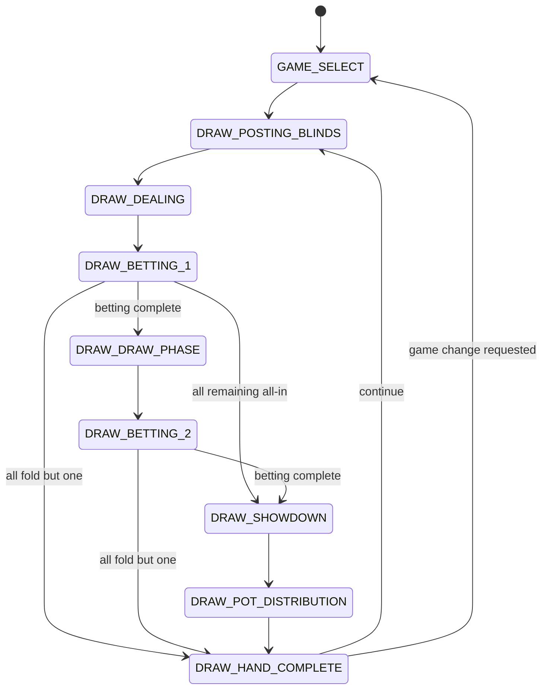
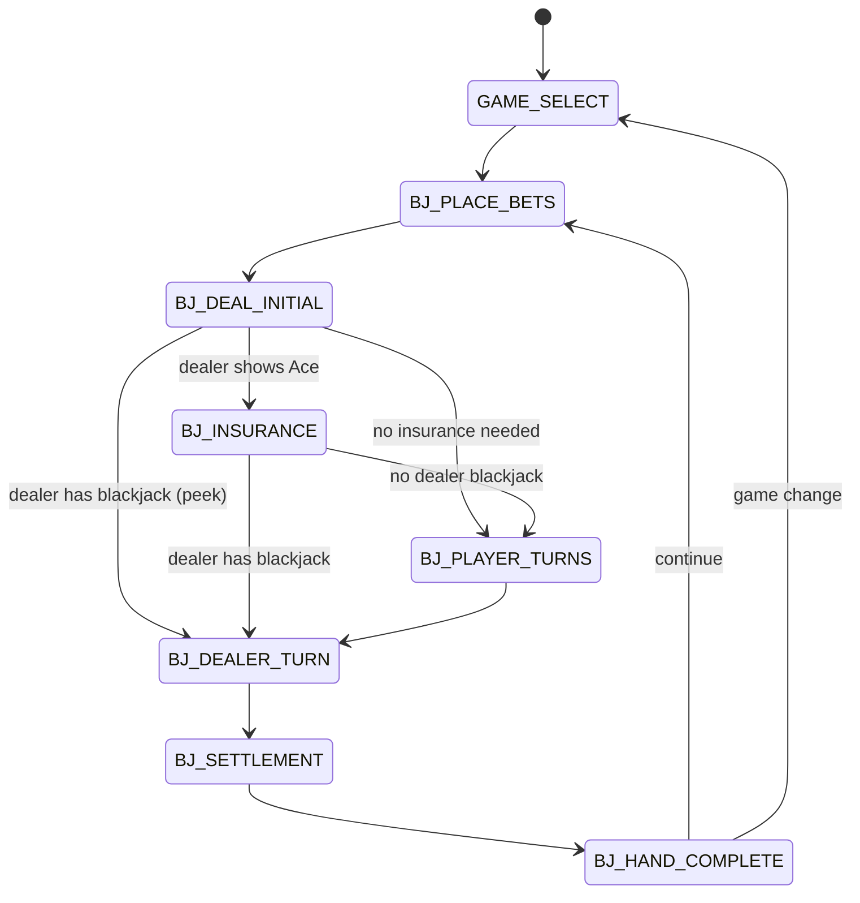
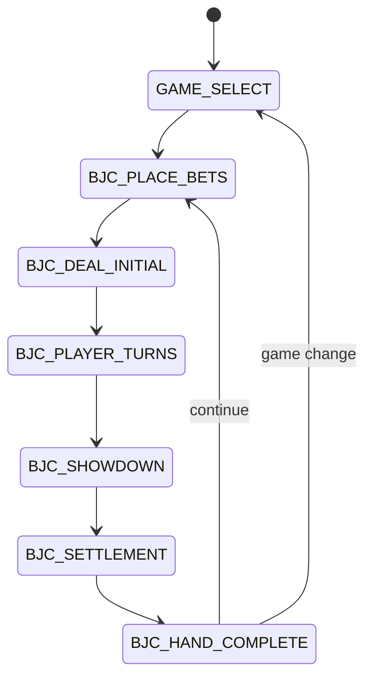
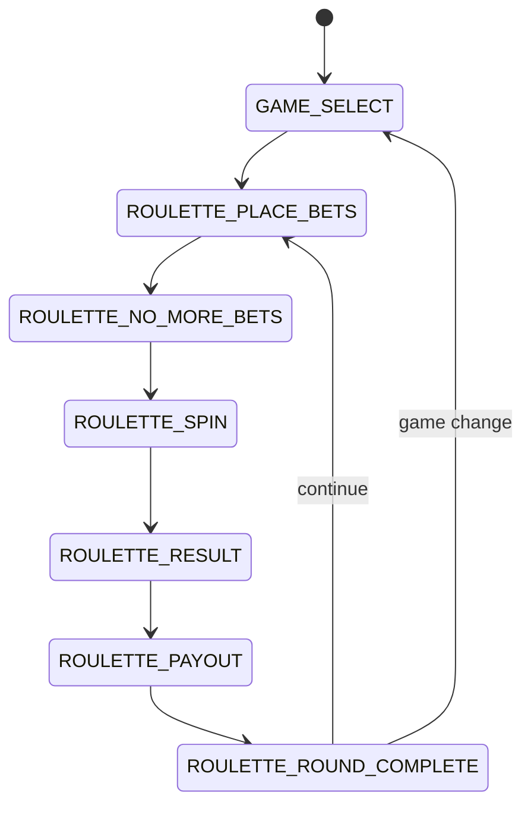
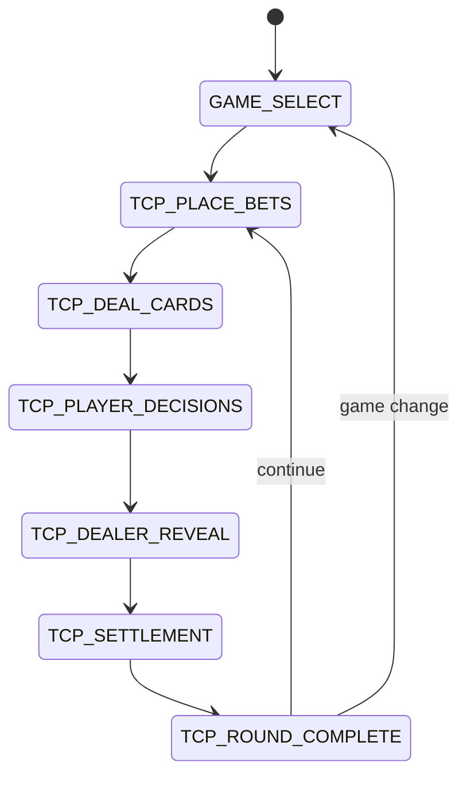
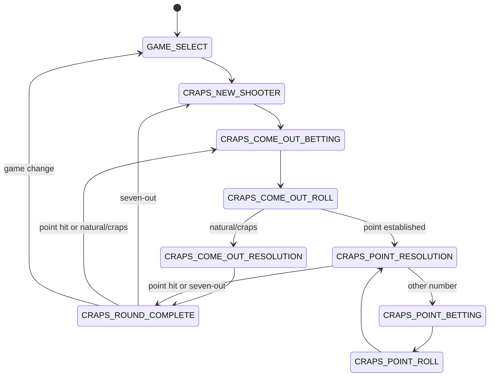
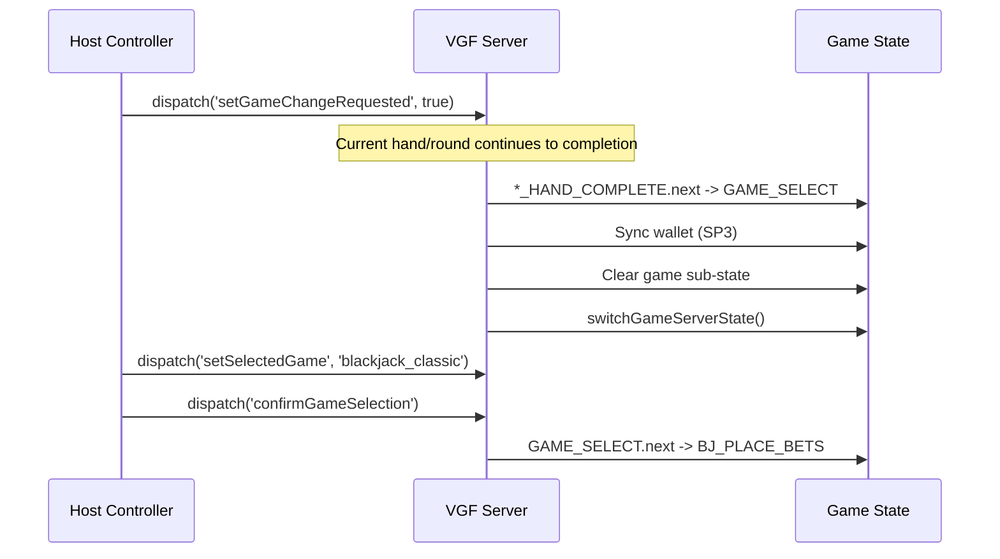

# Weekend Casino — Technical Design Document: Backend Systems (Full Casino)

> **Version:** 1.0
> **Date:** 2026-02-27
> **Author:** Staff SWE 1 (Backend / Infrastructure)
> **Status:** Final (reviewed 2026-02-27, all critical/major issues resolved)
> **Authority:** Implementation-ready backend technical design for Weekend Casino v1 (Hold'em, 5-Card Draw, Blackjack Classic, Blackjack Competitive) and v2 (Roulette, Three Card Poker, Craps, Game Night, retention, persistence).
> **Canonical Decisions:** See `docs/CANONICAL-DECISIONS.md` — this document defers to that register on all conflicts.
> **Extends:** `docs/TDD-backend.md` (v1 Hold'em backend TDD) — that document remains authoritative for Hold'em-specific infrastructure. This document adds multi-game architecture, new games, and cross-game systems.

---

## Table of Contents

### I. Architecture Overview
1. [System Architecture](#1-system-architecture)
2. [Multi-Game VGF Ruleset](#2-multi-game-vgf-ruleset)
3. [State Management Strategy](#3-state-management-strategy)

### II. Per-Game Server Design
4. [Texas Hold'em (Casino Integration)](#4-texas-holdem-casino-integration)
5. [5-Card Draw Poker](#5-5-card-draw-poker)
6. [Blackjack Classic](#6-blackjack-classic)
7. [Blackjack Competitive](#7-blackjack-competitive)
8. [Roulette (v2.0)](#8-roulette-v20)
9. [Three Card Poker (v2.0)](#9-three-card-poker-v20)
10. [Craps (v2.1)](#10-craps-v21)

### III. Cross-Game Systems
11. [Casino Lobby & Game Routing](#11-casino-lobby--game-routing)
12. [Shared Wallet](#12-shared-wallet)
13. [Game Switching](#13-game-switching)
14. [Video Scheduling](#14-video-scheduling)
15. [Session Statistics](#15-session-statistics)

### IV. V2 Meta-Game Systems
16. [Speed Variants](#16-speed-variants)
17. [Game Night Mode (v2.1)](#17-game-night-mode-v21)
18. [Quick Play / Casino Crawl (v2.0)](#18-quick-play--casino-crawl-v20)
19. [Blackjack Tournament (v2.1)](#19-blackjack-tournament-v21)
20. [Progressive Jackpot (v2.2)](#20-progressive-jackpot-v22)
21. [Daily Bonuses & Weekly Challenges (v2.2)](#21-daily-bonuses--weekly-challenges-v22)
22. [Achievement System (v2.2)](#22-achievement-system-v22)
23. [Player Profiles (v2.2)](#23-player-profiles-v22)
24. [Crews (v2.3+ — Data-Gated)](#24-crews-v23--data-gated)
25. [Spectator Mode (v2.1)](#25-spectator-mode-v21)

### V. Persistence Layer
26. [Player Identity Service](#26-player-identity-service)
27. [Profile & Inventory Services](#27-profile--inventory-services)
28. [Storage Architecture](#28-storage-architecture)
29. [VGF IPersistence Integration](#29-vgf-ipersistence-integration)

### VI. Infrastructure
30. [VGF Server Configuration](#30-vgf-server-configuration)
31. [Redis Configuration](#31-redis-configuration)
32. [API Endpoints](#32-api-endpoints)
33. [Voice Pipeline Extensions](#33-voice-pipeline-extensions)

---

# I. Architecture Overview

## 1. System Architecture

The system architecture from `docs/TDD-backend.md` Section 1 remains unchanged. The VGF server, GameLift Streams, Redis, Recognition Service, TTS Service, LLM API, and CDN all operate identically. The only changes are:

- VGF upgraded to **v4.8.0** with `FailoverVGFServiceFactory` (D-011)
- The single `pokerRuleset` is replaced with an expanded `casinoRuleset` containing phase namespaces for all games (D-001)
- `ServerHandState` is replaced by `ServerGameState` with per-game private data (C5 fix)
- New voice intents for all new games are added to the Intent Parser

### 1.1 VGF Version

```typescript
// package.json dependency
"@volley/vgf": "^4.8.0"
```

VGF v4.8.0 provides:
- `FailoverVGFServiceFactory` for Redis-backed session persistence
- `IPersistence` interface for custom persistence implementations (used by v2.2)
- Thunk-level broadcast batching (critical for Craps bet resolution — RC-1)
- Scheduler `upsertTimeout` with `mode: 'hold'`

---

## 2. Multi-Game VGF Ruleset

> **[D-001]** Single GameRuleset with phase namespaces. No separate rulesets per game.

### 2.1 Phase Enum

```typescript
enum CasinoPhase {
  // Shared
  Lobby = 'LOBBY',
  GameSelect = 'GAME_SELECT',

  // Hold'em (unprefixed for backwards compatibility — D-003)
  PostingBlinds = 'POSTING_BLINDS',
  DealingHoleCards = 'DEALING_HOLE_CARDS',
  PreFlopBetting = 'PRE_FLOP_BETTING',
  DealingFlop = 'DEALING_FLOP',
  FlopBetting = 'FLOP_BETTING',
  DealingTurn = 'DEALING_TURN',
  TurnBetting = 'TURN_BETTING',
  DealingRiver = 'DEALING_RIVER',
  RiverBetting = 'RIVER_BETTING',
  AllInRunout = 'ALL_IN_RUNOUT',
  Showdown = 'SHOWDOWN',
  PotDistribution = 'POT_DISTRIBUTION',
  HandComplete = 'HAND_COMPLETE',

  // 5-Card Draw (DRAW_ prefix — D-003)
  DrawPostingBlinds = 'DRAW_POSTING_BLINDS',
  DrawDealing = 'DRAW_DEALING',
  DrawBetting1 = 'DRAW_BETTING_1',
  DrawDrawPhase = 'DRAW_DRAW_PHASE',
  DrawBetting2 = 'DRAW_BETTING_2',
  DrawShowdown = 'DRAW_SHOWDOWN',
  DrawPotDistribution = 'DRAW_POT_DISTRIBUTION',
  DrawHandComplete = 'DRAW_HAND_COMPLETE',

  // Blackjack Classic (BJ_ prefix — D-003)
  BjPlaceBets = 'BJ_PLACE_BETS',
  BjDealInitial = 'BJ_DEAL_INITIAL',
  BjInsurance = 'BJ_INSURANCE',
  BjPlayerTurns = 'BJ_PLAYER_TURNS',
  BjDealerTurn = 'BJ_DEALER_TURN',
  BjSettlement = 'BJ_SETTLEMENT',
  BjHandComplete = 'BJ_HAND_COMPLETE',

  // Blackjack Competitive (BJC_ prefix — D-003, D-007)
  BjcPlaceBets = 'BJC_PLACE_BETS',
  BjcDealInitial = 'BJC_DEAL_INITIAL',
  BjcPlayerTurns = 'BJC_PLAYER_TURNS',
  BjcShowdown = 'BJC_SHOWDOWN',
  BjcSettlement = 'BJC_SETTLEMENT',
  BjcHandComplete = 'BJC_HAND_COMPLETE',

  // Roulette (ROULETTE_ prefix — v2.0)
  RoulettePlaceBets = 'ROULETTE_PLACE_BETS',
  RouletteNoMoreBets = 'ROULETTE_NO_MORE_BETS',
  RouletteSpin = 'ROULETTE_SPIN',
  RouletteResult = 'ROULETTE_RESULT',
  RoulettePayout = 'ROULETTE_PAYOUT',
  RouletteRoundComplete = 'ROULETTE_ROUND_COMPLETE',

  // Three Card Poker (TCP_ prefix — v2.0, D-015)
  TcpPlaceBets = 'TCP_PLACE_BETS',
  TcpDealCards = 'TCP_DEAL_CARDS',
  TcpPlayerDecisions = 'TCP_PLAYER_DECISIONS',
  TcpDealerReveal = 'TCP_DEALER_REVEAL',
  TcpSettlement = 'TCP_SETTLEMENT',
  TcpRoundComplete = 'TCP_ROUND_COMPLETE',

  // Craps (CRAPS_ prefix — v2.1, D-016)
  CrapsNewShooter = 'CRAPS_NEW_SHOOTER',
  CrapsComeOutBetting = 'CRAPS_COME_OUT_BETTING',
  CrapsComeOutRoll = 'CRAPS_COME_OUT_ROLL',
  CrapsComeOutResolution = 'CRAPS_COME_OUT_RESOLUTION',
  CrapsPointBetting = 'CRAPS_POINT_BETTING',
  CrapsPointRoll = 'CRAPS_POINT_ROLL',
  CrapsPointResolution = 'CRAPS_POINT_RESOLUTION',
  CrapsRoundComplete = 'CRAPS_ROUND_COMPLETE',

  // Game Night (GN_ prefix — v2.1)
  GnSetup = 'GN_SETUP',
  GnLeaderboard = 'GN_LEADERBOARD',
  GnChampion = 'GN_CHAMPION',

  // Quick Play (v2.0)
  QpAutoRotate = 'QP_AUTO_ROTATE',
}
```

### 2.2 Routing Table

```typescript
/** GAME_SELECT -> first phase of selected game */
const GAME_FIRST_PHASE: Record<CasinoGame, CasinoPhase> = {
  holdem: CasinoPhase.PostingBlinds,
  five_card_draw: CasinoPhase.DrawPostingBlinds,
  blackjack_classic: CasinoPhase.BjPlaceBets,
  blackjack_competitive: CasinoPhase.BjcPlaceBets,
  roulette: CasinoPhase.RoulettePlaceBets,
  three_card_poker: CasinoPhase.TcpPlaceBets,
  craps: CasinoPhase.CrapsNewShooter,
}
```

### 2.3 Ruleset Structure

```typescript
const casinoRuleset: GameRuleset<CasinoGameState> = {
  setup: (initialState) => createInitialCasinoState(initialState),

  // Global reducers (available in ALL phases)
  reducers: {
    updateWallet,
    setWalletBalance,
    setSelectedGame,
    setGameSelectConfirmed,
    setGameChangeRequested,
    setDealerMessage,
    addPlayer,
    removePlayer,
    markPlayerDisconnected,
    markPlayerReconnected,
    setVideoPlayback,
    clearVideoPlayback,
    setBetError,
    clearBetError,
    // ... shared reducers
  },

  // Global thunks
  thunks: {
    processVoiceCommand,
    requestTTS,
    handleRebuy,
    triggerVideo,
    completeVideo,
    // ... shared thunks
  },

  phases: {
    // Shared
    [CasinoPhase.Lobby]: lobbyPhase,
    [CasinoPhase.GameSelect]: gameSelectPhase,

    // Hold'em (13 phases)
    ...holdemPhases,

    // 5-Card Draw (8 phases)
    ...fiveCardDrawPhases,

    // Blackjack Classic (7 phases)
    ...blackjackClassicPhases,

    // Blackjack Competitive (6 phases)
    ...blackjackCompetitivePhases,

    // Roulette (6 phases)
    ...roulettePhases,

    // Three Card Poker (6 phases)
    ...threeCardPokerPhases,

    // Craps (8 phases)
    ...crapsPhases,

    // Game Night (3 phases)
    ...gameNightPhases,

    // Quick Play (1 phase)
    [CasinoPhase.QpAutoRotate]: qpAutoRotatePhase,
  },

  onConnect: handleClientConnect,
  onDisconnect: handleClientDisconnect,
}
```

---

## 3. State Management Strategy

> **[D-002]** CasinoGameState is a flat union type with optional game-specific sub-objects. It does NOT extend PokerGameState.

### 3.1 Root State Shape

```typescript
interface CasinoGameState {
  // VGF required
  [key: string]: unknown
  phase: CasinoPhase
  previousPhase?: CasinoPhase

  // Multi-game (D-001, D-004)
  selectedGame: CasinoGame | null
  gameSelectConfirmed: boolean
  gameChangeRequested: boolean
  gameChangeVotes: Record<string, CasinoGame>  // v2 only

  // Shared wallet (D-005)
  wallet: Record<string, number>

  // Player roster
  players: CasinoPlayer[]

  // Table config
  dealerCharacterId: string
  blindLevel: BlindLevel
  handNumber: number
  dealerIndex: number

  // Lobby
  lobbyReady: boolean

  // TTS
  dealerMessage: string | null
  ttsQueue: TTSMessage[]

  // Session stats
  sessionStats: SessionStats

  // Video (D-011)
  videoPlayback?: VideoPlayback
  backgroundVideo?: BackgroundVideo

  // Bet error (transient, per-player)
  betError?: { playerId: string; message: string; clearedAt: number }

  // Game-specific sub-states (only populated when active)
  holdem?: HoldemState
  fiveCardDraw?: FiveCardDrawState
  blackjack?: BlackjackState
  blackjackCompetitive?: BlackjackCompetitiveState
  roulette?: RouletteState
  threeCardPoker?: ThreeCardPokerState
  craps?: CrapsState

  // Meta-game sub-states (v2)
  gameNight?: GameNightState
  quickPlay?: QuickPlayConfig
  jackpot?: ProgressiveJackpot
}

type CasinoGame =
  | 'holdem'
  | 'five_card_draw'
  | 'blackjack_classic'
  | 'blackjack_competitive'
  | 'roulette'
  | 'three_card_poker'
  | 'craps'
```

### 3.2 Server-Side State

```typescript
interface ServerGameState {
  activeGame: CasinoGame | null

  holdem?: ServerHoldemState
  draw?: ServerDrawState
  blackjack?: ServerBlackjackState
  blackjackCompetitive?: ServerBlackjackCompetitiveState
  roulette?: ServerRouletteState
  threeCardPoker?: ServerTCPState
  craps?: ServerCrapsState
}

interface ServerHoldemState {
  deck: Card[]
  holeCards: Map<string, [Card, Card]>
}

interface ServerDrawState {
  deck: Card[]
  holeCards: Map<string, Card[]>
  discardPile: Card[]
}

interface ServerBlackjackState {
  shoe: Card[]
  dealerHoleCard: Card | null
}

interface ServerBlackjackCompetitiveState {
  shoe: Card[]
  playerHoleCards: Map<string, Card[]>
}

interface ServerRouletteState {
  winningNumber: number | null       // generated before spin animation
}

interface ServerTCPState {
  deck: Card[]
  dealerCards: [Card, Card, Card]
  playerCards: Map<string, [Card, Card, Card]>
}

interface ServerCrapsState {
  nextRoll: [number, number] | null  // pre-generated dice result
  rngSeed: Uint8Array               // CSPRNG seed for replay/audit (M1)
}
```

### 3.3 Game Switch — Server State Lifecycle

```typescript
function switchGameServerState(
  sessionId: string,
  newGame: CasinoGame,
): void {
  const current = sessions.get(sessionId) ?? { activeGame: null }
  delete current.holdem
  delete current.draw
  delete current.blackjack
  delete current.blackjackCompetitive
  delete current.roulette
  delete current.threeCardPoker
  delete current.craps
  current.activeGame = newGame
  sessions.set(sessionId, current)
}
```

---

# II. Per-Game Server Design

## 4. Texas Hold'em (Casino Integration)

Hold'em rules, mechanics, phases, reducers, thunks, voice commands, and bot strategy are fully defined in `docs/TDD-backend.md` Sections 3-7. The following changes apply for casino integration:

### 4.1 Changes for Casino

| Change | Detail |
|--------|--------|
| Entry point | Game is selected from `GAME_SELECT` phase, not default |
| Wallet integration | Player stacks funded from `wallet` at `POSTING_BLINDS.onBegin` (Sync Point 1) |
| Game switch support | `HAND_COMPLETE.next` checks `gameChangeRequested` flag (D-008) |
| Phase naming | Hold'em phases remain unprefixed (D-003) |
| Session stats | Hand results feed into cross-game `sessionStats` |
| Speed variant (v2.0) | Config-driven timer/animation changes — see Section 16 |

### 4.2 Hold'em Reducer Catalogue (Unchanged)

All reducers from `docs/TDD-backend.md` Section 3.1 remain. They are now scoped under `holdemPhases` spread.

### 4.3 Hold'em Thunk Catalogue (Unchanged)

All thunks from `docs/TDD-backend.md` Section 3.3 remain. `processPlayerAction`, `botDecision`, `evaluateHands`, `distributePot` etc.

### 4.4 HAND_COMPLETE Phase — Casino Extension

```typescript
// Extended next function for casino integration
next: (ctx) => {
  const state = ctx.getState()
  // D-008: host-only game switch check
  if (state.gameChangeRequested) return CasinoPhase.GameSelect
  // Game Night check (v2.1) — wrapWithGameNightCheck
  if (state.gameNight && isGameNightRoundLimitReached(state)) {
    return CasinoPhase.GnLeaderboard
  }
  if (getPlayablePlayers(state).length < 2) return CasinoPhase.Lobby
  return CasinoPhase.PostingBlinds
}
```

---

## 5. 5-Card Draw Poker

### 5.1 Phase Flow



### 5.2 Phase Definitions

#### DRAW_POSTING_BLINDS

| Property | Value |
|----------|-------|
| `onBegin` | Initialise `fiveCardDraw` sub-state via `initDrawState`. Increment `handNumber`. Rotate dealer button. Post SB/BB. Fund stacks from wallet (Sync Point 1). |
| `endIf` | `bothBlindsPosted(state.fiveCardDraw)` |
| `next` | `CasinoPhase.DrawDealing` |
| `onEnd` | — |

#### DRAW_DEALING

| Property | Value |
|----------|-------|
| `onBegin` | Shuffle fresh 52-card deck (Fisher-Yates). Deal 5 cards per player, clockwise from left of dealer. Store in `ServerDrawState`. Dispatch `setDrawHoleCards`. Set `dealingComplete = true`. |
| `endIf` | `state.fiveCardDraw?.dealingComplete === true` |
| `next` | `CasinoPhase.DrawBetting1` |
| `onEnd` | Reset `dealingComplete`. |

#### DRAW_BETTING_1

| Property | Value |
|----------|-------|
| `onBegin` | Set active player to UTG. Set `currentBet` to BB. |
| `endIf` | `isDrawBettingComplete(state) \|\| isDrawOnlyOnePlayerRemaining(state)` |
| `next` | `drawBetting1NextPhase(state)` |
| `onEnd` | Collect bets into pot via `updateDrawPot`. |

```typescript
function drawBetting1NextPhase(state: CasinoGameState): CasinoPhase {
  if (isDrawOnlyOnePlayerRemaining(state)) return CasinoPhase.DrawHandComplete
  if (isDrawAllRemainingAllIn(state)) return CasinoPhase.DrawShowdown
  return CasinoPhase.DrawDrawPhase
}
```

#### DRAW_DRAW_PHASE

| Property | Value |
|----------|-------|
| `onBegin` | Set `drawPhaseActive = true`. Active player = first active left of dealer. Initialise empty `drawSelections`. |
| `endIf` | `state.fiveCardDraw?.allDrawsComplete === true` |
| `next` | `CasinoPhase.DrawBetting2` |
| `onEnd` | Reset draw state. |

**Draw execution flow:**
1. Player dispatches `confirmDraw` reducer with `discardIndices: number[]` (0-4, max 3)
2. `executeDraw` thunk: removes discarded cards, deals replacements from `ServerDrawState.deck`, updates `fiveCardDraw.holeCards`, advances `drawActivePlayerIndex`
3. When all players drawn: sets `allDrawsComplete = true`

#### DRAW_BETTING_2

| Property | Value |
|----------|-------|
| `onBegin` | Active player = first active left of dealer. Reset `currentBet` to 0. Reset `minRaiseIncrement` to BB. |
| `endIf` | `isDrawBettingComplete(state) \|\| isDrawOnlyOnePlayerRemaining(state)` |
| `next` | `drawBetting2NextPhase(state)` |
| `onEnd` | `updateDrawPot`. |

#### DRAW_SHOWDOWN

| Property | Value |
|----------|-------|
| `onBegin` | Reveal all hands. Run `evaluateHand` (works with 5-card input — M4 confirmed). Set `showdownComplete = true`. |
| `endIf` | `state.fiveCardDraw?.showdownComplete === true` |
| `next` | `CasinoPhase.DrawPotDistribution` |

#### DRAW_POT_DISTRIBUTION

| Property | Value |
|----------|-------|
| `onBegin` | `resolveDrawWinners` -> `awardPot`. Set `potDistributed = true`. |
| `endIf` | `state.fiveCardDraw?.potDistributed === true` |
| `next` | `CasinoPhase.DrawHandComplete` |

#### DRAW_HAND_COMPLETE

| Property | Value |
|----------|-------|
| `onBegin` | Mark busted players. Update `sessionStats`. Sync wallet (Sync Point 2). Set `handCompleteReady = true`. |
| `endIf` | `state.fiveCardDraw?.handCompleteReady === true` |
| `next` | `gameChangeRequested` -> `GAME_SELECT`. Game Night limit -> `GN_LEADERBOARD`. < MIN_PLAYERS -> `LOBBY`. Else -> `DRAW_POSTING_BLINDS`. |

### 5.3 5-Card Draw State Shape

```typescript
interface FiveCardDrawState {
  players: DrawPlayerState[]
  holeCards: Record<string, Card[]>  // 5-card hands (C4 fix — separate from Hold'em)
  pot: number
  sidePots: SidePot[]
  currentBet: number
  minRaiseIncrement: number
  activePlayerIndex: number
  drawPhaseActive: boolean
  drawSelections: DrawSelection[]
  allDrawsComplete: boolean
  discardPile: Card[]
  drawActivePlayerIndex: number
  dealingComplete: boolean
  showdownComplete: boolean
  potDistributed: boolean
  handCompleteReady: boolean
  handHistory: HandAction[]
  lastAggressor: string | null
}

interface DrawSelection {
  playerId: string
  discardIndices: number[]
  confirmed: boolean
  cardsDrawn: number
}
```

### 5.4 5-Card Draw Reducer Catalogue

| Reducer | Scope | Signature | Mutation |
|---------|-------|-----------|----------|
| `initDrawState` | DRAW_POSTING_BLINDS | `(state) => state` | Initialises `fiveCardDraw` sub-object |
| `setDrawHoleCards` | DRAW_DEALING | `(state, holeCards: Record<string, Card[]>) => state` | Sets 5-card hands |
| `setDrawActivePlayer` | phase-scoped | `(state, index: number) => state` | Updates `activePlayerIndex` |
| `updateDrawPlayerBet` | DRAW_BETTING_* | `(state, playerId: string, amount: number) => state` | Updates player bet |
| `foldDrawPlayer` | DRAW_BETTING_* | `(state, playerId: string) => state` | Marks player folded |
| `updateDrawPot` | phase-scoped | `(state) => state` | Collects bets into pot |
| `confirmDraw` | DRAW_DRAW_PHASE | `(state, playerId: string, discardIndices: number[]) => state` | Marks draw confirmed |
| `setDrawnCards` | DRAW_DRAW_PHASE | `(state, playerId: string, newCards: Card[]) => state` | Updates hand after draw |
| `setAllDrawsComplete` | DRAW_DRAW_PHASE | `(state) => state` | Flag for phase transition |
| `awardDrawPot` | DRAW_POT_DISTRIBUTION | `(state, winners: PotAward[]) => state` | Awards pot to winners |

### 5.5 5-Card Draw Thunk Catalogue

| Thunk | Scope | Side Effects |
|-------|-------|-------------|
| `processDrawPlayerAction` | DRAW_BETTING_* | Validates, executes bet/fold/check/raise, advances player, sets timer |
| `executeDraw` | DRAW_DRAW_PHASE | Reads `ServerDrawState.deck`, removes discards, deals replacements, dispatches `setDrawnCards` |
| `resolveDrawWinners` | DRAW_SHOWDOWN | Calls `evaluateHand` for each player, determines winners |
| `drawBotDecision` | DRAW_BETTING_* | Bot decision pipeline (see 5.6) |
| `drawBotDraw` | DRAW_DRAW_PHASE | Bot draw selection (see 5.6) |

### 5.6 Bot Strategy — 5-Card Draw

#### Easy Bot — Draw Strategy (Rules Engine)

| Hand Category | Draw Action |
|---------------|-------------|
| Four of a Kind, Full House, Flush, Straight | Stand pat |
| Three of a Kind | Discard 2 non-trip cards |
| Two Pair | Discard 1 kicker (90%), stand pat (10%) |
| One Pair | Discard 3 non-pair cards |
| Four to a Flush | Discard 1 non-flush card (70%), discard 2 random (30% mistake) |
| Four to a Straight (open-ended) | Discard 1 non-straight card (60%), stand pat (40% mistake) |
| Nothing | Discard 3 lowest (80%), discard 2 lowest (20%) |

#### Easy Bot — Betting Strategy

| Situation | Action |
|-----------|--------|
| Pre-draw, no pair | Check/fold (80%), min call (20%) |
| Pre-draw, one pair | Check/call (70%), min raise (30%) |
| Pre-draw, two pair+ | Raise 2-3x BB |
| Post-draw, improved to trips+ | Bet 50-75% pot |
| Post-draw, no improvement | Check/fold |
| Post-draw, opponent stood pat & bet | Fold unless two pair+ |

#### Medium Bot — Draw Strategy (LLM-Assisted)

LLM receives: current hand, pre-computed improvement probabilities for each discard option, opponent draw counts, pot odds. Returns structured JSON with draw selection and betting plan.

#### Hard Bot — Draw Strategy (LLM-Assisted + Read Analysis)

Same as Medium, but additionally factors in:
- Opponent draw count as primary read signal ("stood pat" = strong or bluff)
- Post-draw betting patterns relative to draw count
- Deceptive play: occasionally stands pat on weak hands or draws on strong hands

#### Bot Timing

| Level | Draw Decision | Bet Decision |
|-------|--------------|-------------|
| Easy | 0.5-1.5s | 0.5-1.5s |
| Medium | 1-3s | 1-3s |
| Hard | 1-2s + 1-3s deliberation pause | 1-2s + 1-3s pause |

### 5.7 Voice Commands — 5-Card Draw

| Intent | Phrases | Phase | Handler |
|--------|---------|-------|---------|
| `draw_cards` | "Draw [N]", "Give me [N]", "Change [N]" | DRAW_DRAW_PHASE | `executeDraw` thunk |
| `stand_pat` | "Stand pat", "Keep them", "No cards" | DRAW_DRAW_PHASE | `confirmDraw` with empty indices |
| `draw_ambiguous` | "Draw" (no number) | DRAW_DRAW_PHASE | TTS: "How many?" |
| `draw_invalid` | "Draw 4", "Draw 5" | DRAW_DRAW_PHASE | TTS: "Maximum 3 cards." |

All standard poker betting intents (fold, check, call, raise, all-in) work identically in DRAW_BETTING_* phases.

### 5.8 Timer/Scheduler Usage

| Timer | Phase | Delay | Dispatches |
|-------|-------|-------|-----------|
| `action-timer:{playerId}` | DRAW_BETTING_* | 30,000ms | `autoFoldDrawPlayer` |
| `draw-timer:{playerId}` | DRAW_DRAW_PHASE | 30,000ms | `autoStandPat` (stand pat on timeout) |
| `bot-draw:{botId}` | DRAW_DRAW_PHASE | Variable | `drawBotDraw` |
| `dealing-animation` | DRAW_DEALING | 2,000ms | sets `dealingComplete` |

---

## 6. Blackjack Classic

### 6.1 Phase Flow



**Minimum players:** 1 human + bots fill to 2 minimum.

### 6.2 Phase Definitions

All 7 phases are defined in `docs/CASINO-GAME-DESIGN.md` Sections 11-12. Key implementation details:

#### BJ_PLACE_BETS

- Simultaneous betting; 15s timeout; auto-place min bet on timeout
- Side bets (Perfect Pairs, 21+3) placed here
- Max bet: 500 chips (D-006)

**Side Bet Payout Tables:**

| Perfect Pairs | Payout |
|---------------|--------|
| Mixed Pair (same rank, different colour) | 5:1 |
| Coloured Pair (same rank, same colour) | 12:1 |
| Perfect Pair (identical rank and suit) | 25:1 |

| 21+3 | Payout |
|------|--------|
| Flush | 5:1 |
| Straight | 10:1 |
| Three of a Kind | 30:1 |
| Straight Flush | 40:1 |
| Suited Triple | 100:1 |

**Other BJ Payouts:** Natural blackjack 3:2 (6:5 on Hard difficulty), Insurance 2:1.

#### BJ_DEAL_INITIAL

- Deal from shoe (server-side `ServerBlackjackState.shoe`)
- 2 cards per player face-up, dealer 1 face-up + 1 face-down (hole card)
- Evaluate side bets immediately (results stored, paid at settlement)
- Peek for dealer blackjack if showing Ace or 10

#### BJ_INSURANCE

- Offered when dealer shows Ace
- 15s timeout, default decline
- If dealer has blackjack: pay 2:1, skip to BJ_DEALER_TURN

#### BJ_PLAYER_TURNS (Most Complex Phase)

Sequential turn logic using `activePlayerIndex` + `activeHandIndex`:

```typescript
async function advanceBlackjackTurn(ctx: ThunkCtx): Promise<void> {
  const bj = ctx.getState().blackjack!
  const currentPlayer = bj.playerHands[bj.activePlayerIndex]

  if (currentPlayer && bj.activeHandIndex < currentPlayer.hands.length - 1) {
    ctx.dispatch('setBlackjackActiveHand', bj.activeHandIndex + 1)
    return
  }
  if (bj.activePlayerIndex < bj.playerHands.length - 1) {
    ctx.dispatch('setBlackjackActivePlayer', bj.activePlayerIndex + 1)
    ctx.dispatch('setBlackjackActiveHand', 0)
    return
  }
  ctx.dispatch('setAllPlayerTurnsComplete', true)
}
```

**Actions:** Hit, Stand, Double Down, Split (up to 4 hands), Surrender
**Split rules:** Max 4 hands. Split aces get 1 card each, no further hits. Re-split aces not permitted. 21 after split pays 1:1, not 3:2. (D-007: NO splits in competitive — classic only.)

#### BJ_DEALER_TURN

Dealer plays automatically per fixed rules. Stand on soft 17 by default (D-009), configurable per difficulty. Loop guard: `MAX_DEALER_CARDS = 21`.

#### BJ_SETTLEMENT

Compare each player hand vs dealer. Payouts: 1:1 win, 3:2 natural blackjack (6:5 on Hard), push returns bet, side bets paid.

### 6.3 Blackjack State Shape

Full state as defined in `docs/CASINO-GAME-DESIGN.md` Section 12: `BlackjackState`, `BlackjackConfig`, `ShoeState`, `BlackjackDealerHand`, `BlackjackPlayerEntry`, `BlackjackHand`, `BetPlacement`, `InsuranceDecision`, `SideBetResult`.

### 6.4 Difficulty Presets (D-009)

```typescript
const BLACKJACK_DIFFICULTY_PRESETS: Record<BlackjackDifficulty, Partial<BlackjackConfig>> = {
  easy: {
    deckCount: 1, dealerStandsSoft17: true, blackjackPayout: '3:2',
    doubleDownRestriction: 'any', allowSurrender: true, allowDoubleAfterSplit: true,
  },
  standard: {
    deckCount: 4, dealerStandsSoft17: true, blackjackPayout: '3:2',
    doubleDownRestriction: '9_10_11', allowSurrender: true, allowDoubleAfterSplit: true,
  },
  hard: {
    deckCount: 8, dealerStandsSoft17: false, blackjackPayout: '6:5',
    doubleDownRestriction: '10_11', allowSurrender: false, allowDoubleAfterSplit: false,
  },
}

type BlackjackDifficulty = 'easy' | 'standard' | 'hard'
```

### 6.5 Blackjack Reducer Catalogue

| Reducer | Scope | Mutation |
|---------|-------|---------|
| `initBlackjackState` | BJ_PLACE_BETS | Initialise `blackjack` sub-object |
| `setBlackjackBet` | BJ_PLACE_BETS | Set player's main + side bets |
| `setAllBetsPlaced` | BJ_PLACE_BETS | Phase transition flag |
| `dealBlackjackCards` | BJ_DEAL_INITIAL | Set player cards + dealer cards |
| `setInsuranceDecision` | BJ_INSURANCE | Record insurance accept/decline |
| `blackjackHit` | BJ_PLAYER_TURNS | Add card to hand, check bust |
| `blackjackStand` | BJ_PLAYER_TURNS | Set hand status to 'stood' |
| `blackjackDoubleDown` | BJ_PLAYER_TURNS | Double bet, add 1 card, auto-stand |
| `blackjackSplit` | BJ_PLAYER_TURNS | Split hand into two, deal 1 card each |
| `blackjackSurrender` | BJ_PLAYER_TURNS | Return half bet, mark surrendered |
| `setBlackjackActivePlayer` | BJ_PLAYER_TURNS | Update active player index |
| `setBlackjackActiveHand` | BJ_PLAYER_TURNS | Update active hand index |
| `setAllPlayerTurnsComplete` | BJ_PLAYER_TURNS | Phase transition flag |
| `revealDealerHoleCard` | BJ_DEALER_TURN | Show hidden card |
| `dealCardToDealer` | BJ_DEALER_TURN | Add card from shoe |
| `setDealerStatus` | BJ_DEALER_TURN | Set 'stood' or 'busted' |
| `setDealerTurnComplete` | BJ_DEALER_TURN | Phase transition flag |
| `setSettlementResults` | BJ_SETTLEMENT | Apply all payouts atomically |

### 6.6 Blackjack Thunk Catalogue

| Thunk | Scope | Side Effects |
|-------|-------|-------------|
| `processBlackjackAction` | BJ_PLAYER_TURNS | Validates action, dispatches reducer, advances turn |
| `advanceBlackjackTurn` | BJ_PLAYER_TURNS | Moves to next hand/player or completes |
| `playDealerHand` | BJ_DEALER_TURN | Auto-plays dealer per rules |
| `settleBlackjackHands` | BJ_SETTLEMENT | Computes all payouts, dispatches `setSettlementResults` |
| `blackjackBotDecision` | BJ_PLAYER_TURNS | Basic strategy lookup (Easy), card counting (Hard) |
| `evaluateSideBets` | BJ_DEAL_INITIAL | Perfect Pairs + 21+3 evaluation |

### 6.7 Bot Strategy

| Difficulty | Play Strategy | Bet Sizing | Card Counting |
|------------|--------------|-----------|--------------|
| Easy | Basic strategy with ~20% random mistakes | Flat (min bet) | No |
| Standard | Perfect basic strategy table | Flat + occasional 2x | No |
| Hard | Perfect basic strategy + Hi-Lo count | Proportional to true count | Yes (Hi-Lo) |

### 6.8 Voice Commands

| Intent | Phrases | Phase |
|--------|---------|-------|
| `bj_hit` | "Hit", "Hit me", "Another card" | BJ_PLAYER_TURNS |
| `bj_stand` | "Stand", "Stay", "I'm good" | BJ_PLAYER_TURNS |
| `bj_double` | "Double down", "Double" | BJ_PLAYER_TURNS |
| `bj_split` | "Split", "Split them" | BJ_PLAYER_TURNS |
| `bj_insurance` | "Insurance", "Yes" | BJ_INSURANCE |
| `bj_no_insurance` | "No", "No insurance" | BJ_INSURANCE |
| `bj_surrender` | "Surrender", "Give up" | BJ_PLAYER_TURNS |
| `bj_bet` | "Bet [amount]" | BJ_PLACE_BETS |

### 6.9 Dealer Characters (D-010)

```typescript
export const BLACKJACK_DEALER_CHARACTERS = ['ace_malone', 'scarlett_vega', 'chip_dubois'] as const
type BlackjackDealerCharacter = typeof BLACKJACK_DEALER_CHARACTERS[number]
```

---

## 7. Blackjack Competitive

> **[D-007]** Sequential turns, NO splits, NO insurance, NO side bets, NO surrender.

### 7.1 Phase Flow



### 7.2 Key Differences from Classic

- **No dealer hand** — players compete against each other
- **Pot-based** — all antes/raises go into shared pot; winner takes pot
- **Actions:** Hit, Stand, Double Down only (NO split, NO surrender, NO insurance)
- **All-bust rule:** If all players bust, lowest hand value (closest to 21 from above) wins
- **Sequential turns** (v1) — simultaneous play deferred to v2

### 7.3 Competitive State Shape

```typescript
interface BlackjackCompetitiveState {
  config: BlackjackCompetitiveConfig
  shoe: ShoeState
  playerHands: BJCPlayerEntry[]
  pot: number
  activePlayerIndex: number
  allPlayerTurnsComplete: boolean
  showdownComplete: boolean
  settlementComplete: boolean
  handCompleteReady: boolean
}

interface BJCPlayerEntry {
  playerId: string
  hand: BlackjackHand  // single hand only (no splits)
  ante: number
  raise: number
}

interface BlackjackCompetitiveConfig {
  deckCount: number
  anteAmount: number
  maxRaise: number  // up to 3x ante
}
```

### 7.4 Settlement Logic

```typescript
function resolveCompetitiveBlackjack(players: BJCPlayerEntry[]): string[] {
  const nonBusted = players.filter(p => p.hand.value <= 21)
  if (nonBusted.length > 0) {
    const maxValue = Math.max(...nonBusted.map(p => p.hand.value))
    return nonBusted.filter(p => p.hand.value === maxValue).map(p => p.playerId)
  }
  // All-bust rule: lowest value (closest to 21 from above) wins
  const minBust = Math.min(...players.map(p => p.hand.value))
  return players.filter(p => p.hand.value === minBust).map(p => p.playerId)
}
```

---

## 8. Roulette (v2.0)

### 8.1 Phase Flow



### 8.2 Phase Definitions

#### ROULETTE_PLACE_BETS

| Property | Value |
|----------|-------|
| `onBegin` | Initialise `roulette` sub-state. Clear previous bets/results. Enable betting. Start 45s timer. TTS: "Place your bets!" |
| `endIf` | `state.roulette?.allBetsPlaced === true` |
| `next` | `CasinoPhase.RouletteNoMoreBets` |
| `onEnd` | Lock bets. Deduct from wallets. |

#### ROULETTE_NO_MORE_BETS

| Property | Value |
|----------|-------|
| `onBegin` | TTS: "No more bets!" Disable betting. 1.5s pause. Set `bettingClosed = true`. |
| `endIf` | `state.roulette?.bettingClosed === true` |
| `next` | `CasinoPhase.RouletteSpin` |

#### ROULETTE_SPIN

| Property | Value |
|----------|-------|
| `onBegin` | Generate winning number server-side. Dispatch `setRouletteWinningNumber`. Schedule hard timeout. TTS: "The wheel spins!" |
| `endIf` | `state.roulette?.spinComplete === true` |
| `next` | `CasinoPhase.RouletteResult` |

**Client-driven spin completion (RC-6, mirrors D-011 video pattern):**

```typescript
// Server schedules hard timeout
ctx.scheduler.upsertTimeout({
  name: 'roulette:spin-timeout',
  delayMs: 8_000,  // ROULETTE_SPIN_HARD_TIMEOUT_MS
  mode: 'hold',
  dispatch: { kind: 'thunk', name: 'forceCompleteRouletteSpin' },
})

// Display dispatches when animation finishes:
// completeRouletteSpin thunk -> cancels timeout, sets spinComplete = true

// forceCompleteRouletteSpin thunk (fallback):
// Unconditionally sets spinComplete = true
```

#### ROULETTE_RESULT / ROULETTE_PAYOUT / ROULETTE_ROUND_COMPLETE

Standard resolution: announce number, compute payouts, update wallets, check `gameChangeRequested`.

### 8.3 Roulette State Shape

```typescript
interface RouletteState {
  winningNumber: number | null
  winningColour: 'red' | 'black' | 'green' | null
  bets: RouletteBet[]
  players: RoulettePlayerState[]
  history: RouletteHistoryEntry[]
  spinState: 'idle' | 'spinning' | 'slowing' | 'stopped'
  nearMisses: { playerId: string; betNumber: number }[]
  allBetsPlaced: boolean
  bettingClosed: boolean
  spinComplete: boolean
  resultAnnounced: boolean
  payoutComplete: boolean
  roundCompleteReady: boolean
  config: RouletteConfig
}

type RouletteBetType =
  | 'straight_up' | 'split' | 'street' | 'corner' | 'six_line'
  | 'red' | 'black' | 'odd' | 'even' | 'high' | 'low'
  | 'dozen_1' | 'dozen_2' | 'dozen_3'
  | 'column_1' | 'column_2' | 'column_3'
```

### 8.4 17 Bet Types with Payouts

| Bet Type | Covers | Payout |
|----------|--------|--------|
| Straight Up | 1 number | 35:1 |
| Split | 2 numbers | 17:1 |
| Street | 3 numbers | 11:1 |
| Corner | 4 numbers | 8:1 |
| Six Line | 6 numbers | 5:1 |
| Red/Black | 18 numbers | 1:1 |
| Odd/Even | 18 numbers | 1:1 |
| High/Low | 18 numbers | 1:1 |
| Dozen (x3) | 12 numbers | 2:1 |
| Column (x3) | 12 numbers | 2:1 |

### 8.5 Near-Miss Detection (M3)

```typescript
const EUROPEAN_WHEEL_ORDER = [
  0, 32, 15, 19, 4, 21, 2, 25, 17, 34, 6, 27, 13, 36,
  11, 30, 8, 23, 10, 5, 24, 16, 33, 1, 20, 14, 31, 9,
  22, 18, 29, 7, 28, 12, 35, 3, 26,
] as const

function getAdjacentNumbers(winningNumber: number, depth = 2): number[] {
  const idx = EUROPEAN_WHEEL_ORDER.indexOf(winningNumber)
  const adjacent: number[] = []
  for (let d = 1; d <= depth; d++) {
    adjacent.push(EUROPEAN_WHEEL_ORDER[(idx + d) % 37]!)
    adjacent.push(EUROPEAN_WHEEL_ORDER[(idx - d + 37) % 37]!)
  }
  return adjacent
}
```

### 8.6 Roulette Reducer/Thunk Catalogues

**Reducers:** `initRouletteState`, `placeRouletteBetReducer`, `removeRouletteBet`, `setAllRouletteBetsPlaced`, `setRouletteWinningNumber`, `setSpinComplete`, `setRoulettePayouts`, `clearRouletteBets`

**Thunks:** `placeRouletteBet` (validates), `completeRouletteSpin` (client-driven), `forceCompleteRouletteSpin` (server fallback), `resolveRouletteBets`, `detectNearMisses`, `rouletteBotBets`

### 8.7 Roulette Voice Commands

| Intent | Phrases | Phase |
|--------|---------|-------|
| `roulette_red` | "Red", "On red" | ROULETTE_PLACE_BETS |
| `roulette_black` | "Black", "On black" | ROULETTE_PLACE_BETS |
| `roulette_straight` | "Number [N]", "[N]", "Straight up [N]" | ROULETTE_PLACE_BETS |
| `roulette_split` | "Split [N] and [N]" | ROULETTE_PLACE_BETS |
| `roulette_odd_even` | "Odd", "Even" | ROULETTE_PLACE_BETS |
| `roulette_high_low` | "High", "Low", "1 to 18", "19 to 36" | ROULETTE_PLACE_BETS |
| `roulette_dozen` | "First dozen", "Second dozen", "Third dozen" | ROULETTE_PLACE_BETS |
| `roulette_repeat` | "Repeat", "Same again" | ROULETTE_PLACE_BETS |
| `roulette_confirm` | "Confirm", "Done" | ROULETTE_PLACE_BETS |

### 8.8 Dealer Characters

```typescript
export const ROULETTE_DEALER_CHARACTERS = ['pierre_beaumont', 'veronica_lane'] as const
```

---

## 9. Three Card Poker (v2.0)

> **[D-015]** TCP ships in v2.0.

### 9.1 Phase Flow



### 9.2 Phase Definitions

#### TCP_PLACE_BETS

| Property | Value |
|----------|-------|
| `onBegin` | Initialise `threeCardPoker` sub-state. All players place Ante (required) and optional Pair Plus side bet. 15s timer. |
| `endIf` | `state.threeCardPoker?.allBetsPlaced === true` |
| `next` | `CasinoPhase.TcpDealCards` |

#### TCP_DEAL_CARDS

| Property | Value |
|----------|-------|
| `onBegin` | Shuffle fresh deck. Deal 3 cards to each player + 3 to dealer. Player cards visible on controller; dealer cards hidden. Store in `ServerTCPState`. Set `dealComplete = true`. |
| `endIf` | `state.threeCardPoker?.dealComplete === true` |
| `next` | `CasinoPhase.TcpPlayerDecisions` |

#### TCP_PLAYER_DECISIONS (Simultaneous)

| Property | Value |
|----------|-------|
| `onBegin` | All players simultaneously decide: **Play** (match ante) or **Fold** (forfeit ante). 20s timer. |
| `endIf` | `state.threeCardPoker?.allDecisionsMade === true` |
| `next` | `CasinoPhase.TcpDealerReveal` |

#### TCP_DEALER_REVEAL

| Property | Value |
|----------|-------|
| `onBegin` | Reveal dealer's 3 cards. Check dealer qualification (Queen-high or better). Set `dealerRevealed = true`. |
| `endIf` | `state.threeCardPoker?.dealerRevealed === true` |
| `next` | `CasinoPhase.TcpSettlement` |

#### TCP_SETTLEMENT

| Property | Value |
|----------|-------|
| `onBegin` | Resolve: if dealer doesn't qualify, Ante pays 1:1, Play bet pushes. If dealer qualifies: compare hands, better hand wins both Ante and Play at 1:1. Ante Bonus paid on strong hands. Pair Plus resolves independently. |
| `endIf` | `state.threeCardPoker?.settlementComplete === true` |
| `next` | `CasinoPhase.TcpRoundComplete` |

### 9.3 3-Card Hand Rankings (Different from Standard Poker!)

```typescript
enum TCPHandRank {
  HighCard = 0,
  Pair = 1,
  Flush = 2,       // NOTE: Straight beats Flush in 3-card poker (straights are rarer with 3 cards)
  Straight = 3,
  ThreeOfAKind = 4,
  StraightFlush = 5,
  MiniRoyal = 6,   // A-K-Q suited
}
```

### 9.4 Hand Evaluator (RC-3 Fix — Monotonic Ordering)

```typescript
function evaluateTCPHand(cards: [Card, Card, Card]): { rank: TCPHandRank; strength: number } {
  // Rank-band bases use 1000-wide gaps for monotonic ordering
  const RANK_BASES = {
    [TCPHandRank.MiniRoyal]: 6000,
    [TCPHandRank.StraightFlush]: 5000,
    [TCPHandRank.ThreeOfAKind]: 4000,
    [TCPHandRank.Straight]: 3000,
    [TCPHandRank.Flush]: 2000,
    [TCPHandRank.Pair]: 1000,
    [TCPHandRank.HighCard]: 0,
  }
  // strength = base + kicker encoding (ensures monotonic ordering within bands)
}

function dealerQualifies(hand: { rank: TCPHandRank; strength: number }): boolean {
  // Dealer must have Queen-high or better to qualify
  return hand.strength >= /* Queen-high threshold from RANK_BASES */
}
```

### 9.5 TCP State Shape

```typescript
interface ThreeCardPokerState {
  playerEntries: TCPPlayerEntry[]
  dealerHand?: { cards: Card[]; rank: TCPHandRank; strength: number }
  dealerQualified: boolean
  allBetsPlaced: boolean
  dealComplete: boolean
  allDecisionsMade: boolean
  dealerRevealed: boolean
  settlementComplete: boolean
  roundCompleteReady: boolean
  config: TCPConfig
}

interface TCPPlayerEntry {
  playerId: string
  ante: number
  playBet: number
  pairPlusBet: number
  hand?: { cards: Card[]; rank: TCPHandRank; strength: number }
  decision: 'pending' | 'play' | 'fold'
}

interface TCPConfig {
  minAnte: number
  maxAnte: number
  maxPairPlus: number
}
```

### 9.6 Payout Tables

**Ante Bonus (paid regardless of dealer qualification):**

| Hand | Payout |
|------|--------|
| Straight | 1:1 |
| Three of a Kind | 4:1 |
| Straight Flush / Mini Royal | 5:1 |

**Pair Plus (independent of dealer):**

| Hand | Payout |
|------|--------|
| Pair | 1:1 |
| Flush | 3:1 |
| Straight | 6:1 |
| Three of a Kind | 30:1 |
| Straight Flush | 40:1 |
| Mini Royal (A-K-Q suited) | 100:1 |

### 9.7 Game Night Bonus Triggers (Missing from V2 — Added Here)

| Trigger | Bonus Points |
|---------|-------------|
| TCP Straight Flush | 25 pts |
| TCP Mini Royal | 50 pts |
| Pair Plus Big Win (30:1+) | 15 pts |
| Three of a Kind | 10 pts |
| Win 5 Consecutive Hands | 10 pts |

### 9.8 Voice Commands

| Intent | Phrases | Phase |
|--------|---------|-------|
| `tcp_play` | "Play", "I'm in", "Call" | TCP_PLAYER_DECISIONS |
| `tcp_fold` | "Fold", "I'm out" | TCP_PLAYER_DECISIONS |
| `tcp_ante` | "Ante [amount]" | TCP_PLACE_BETS |
| `tcp_pair_plus` | "Pair plus [amount]" | TCP_PLACE_BETS |

### 9.9 Bot Strategy

| Difficulty | Decision Rule |
|------------|--------------|
| Easy | Play on Pair+, fold everything else (suboptimal) |
| Medium | Optimal: Play on Q-6-4 or better, fold below |
| Hard | Optimal + deceptive timing (deliberates on easy decisions) |

---

## 10. Craps (v2.1)

> **[D-016]** Craps ships in v2.1.

### 10.1 Phase Flow



### 10.2 Craps State Shape

```typescript
interface CrapsState {
  shooterPlayerId: string
  shooterIndex: number
  point: number | null
  puckOn: boolean
  lastRollDie1: number
  lastRollDie2: number
  lastRollTotal: number
  rollHistory: CrapsRollResult[]
  bets: CrapsBet[]
  comeBets: CrapsComeBet[]
  players: CrapsPlayerState[]
  sevenOut: boolean
  pointHit: boolean
  // Phase transition flags
  newShooterReady: boolean
  allComeOutBetsPlaced: boolean
  rollComplete: boolean
  comeOutResolutionComplete: boolean
  allPointBetsPlaced: boolean
  pointResolutionComplete: boolean
  roundCompleteReady: boolean
  config: CrapsConfig
}

interface CrapsConfig {
  minBet: number
  maxBet: number
  maxOddsMultiplier: number
  placeBetsWorkOnComeOut: boolean
  simpleMode: boolean  // PM-6 fix
}

interface CrapsComeBet {
  id: string
  playerId: string
  type: 'come' | 'dont_come'
  amount: number
  comePoint: number | null
  oddsAmount: number
  status: 'active' | 'won' | 'lost' | 'push' | 'returned'  // RC-5 fix: 'returned' added
}
```

### 10.3 6 Bet Types

| Bet | Placement Phase | Resolution | Payout |
|-----|----------------|-----------|--------|
| Pass Line | Come-out | Natural 7/11 wins, Craps 2/3/12 loses, else point | 1:1 |
| Don't Pass | Come-out | 2/3 wins, 12 pushes, 7/11 loses, else point | 1:1 |
| Come | Point phase | Like personal Pass Line on next roll | 1:1 |
| Don't Come | Point phase | Like personal Don't Pass on next roll | 1:1 |
| Place Bets | Point phase | Specific number (4,5,6,8,9,10) before 7 | Varies (9:5, 7:5, 7:6) |
| Field | Any | One-roll: 2,3,4,9,10,11,12 wins; 5,6,7,8 loses | 1:1 (2x on 2, 3x on 12) |

### 10.4 Bet Resolution — Batched (RC-1)

```typescript
async function resolveCrapsRoll(ctx: ThunkCtx): Promise<void> {
  const craps = ctx.getState().craps!
  const total = craps.lastRollTotal
  const point = craps.point
  const resolutions: CrapsRollResolution[] = []

  // Resolve Field bets (every roll)
  resolutions.push(...resolveFieldBets(craps, total))

  if (total === point) {
    // Point hit
    resolutions.push(...resolvePassLineBets(craps, 'win'))
    resolutions.push(...resolveDontPassBets(craps, 'lose'))
    resolutions.push(...resolveOddsBets(craps, point, 'pass_win'))
    resolutions.push(...resolvePlaceBets(craps, total, 'win', true))
    resolutions.push(...resolveComeBetsOnPoint(craps, total))
    ctx.dispatch('setCrapsRollResults', resolutions, true, false)
  } else if (total === 7) {
    // Seven-out
    resolutions.push(...resolvePassLineBets(craps, 'lose'))
    resolutions.push(...resolveDontPassBets(craps, 'win'))
    resolutions.push(...resolveOddsBets(craps, point, 'dont_pass_win'))
    resolutions.push(...resolveAllPlaceBets(craps, 'lose'))
    resolutions.push(...resolveAllComeBets(craps, 'seven'))
    ctx.dispatch('setCrapsRollResults', resolutions, false, true)
  } else {
    // Other number
    resolutions.push(...resolvePlaceBets(craps, total, 'win', true))
    resolutions.push(...resolveComeBetsOnNumber(craps, total))
    ctx.dispatch('setCrapsRollResults', resolutions, false, false)
  }
}
```

### 10.5 Game-Switch Come Bet Resolution (RC-5)

```typescript
async function returnActiveComeBets(ctx: ThunkCtx): Promise<void> {
  const comeBets = ctx.getState().craps?.comeBets ?? []
  const activeBets = comeBets.filter(b => b.comePoint !== null && b.status === 'active')
  for (const bet of activeBets) {
    ctx.dispatch('resolveCrapsComeBet', bet.id, 'returned', bet.amount)
    if (bet.oddsAmount > 0) {
      ctx.dispatch('returnCrapsComeBetOdds', bet.id, bet.oddsAmount)
    }
  }
}
```

### 10.6 Dice RNG (M1)

```typescript
function rollDice(): { die1: number; die2: number } {
  const bytes = crypto.getRandomValues(new Uint32Array(2))
  return {
    die1: (bytes[0]! % 6) + 1,
    die2: (bytes[1]! % 6) + 1,
  }
}
// Seed stored in ServerCrapsState for replay capability
// Distribution validation test: 10,000 rolls, chi-square test on all 36 outcomes
```

### 10.7 Simple Mode (PM-6)

`CrapsConfig.simpleMode: boolean` (default: `true`). Server accepts all bet types regardless — Simple Mode is purely a UI filter on the controller. Voice commands for advanced bets in Simple Mode return: "That bet isn't available in Simple Mode."

### 10.8 Craps Voice Commands

| Intent | Phrases | Phase |
|--------|---------|-------|
| `craps_pass_line` | "Pass line", "Pass" | CRAPS_COME_OUT_BETTING |
| `craps_dont_pass` | "Don't pass", "Against" | CRAPS_COME_OUT_BETTING |
| `craps_come` | "Come bet", "Come" | CRAPS_POINT_BETTING |
| `craps_dont_come` | "Don't come" | CRAPS_POINT_BETTING |
| `craps_place` | "Place the [number]" | CRAPS_POINT_BETTING |
| `craps_field` | "Field", "Field bet" | Any betting phase |
| `craps_odds` | "Odds", "Add odds", "Back it up" | CRAPS_POINT_BETTING |
| `craps_roll` | "Roll", "Roll the dice", "Let 'em fly" | CRAPS_*_ROLL (shooter only) |
| `craps_confirm` | "Confirm", "Done betting" | Any betting phase |

### 10.9 Dealer Characters

```typescript
export const CRAPS_DEALER_CHARACTERS = ['lucky_luciano', 'diamond_dolores'] as const
```

---

# III. Cross-Game Systems

## 11. Casino Lobby & Game Routing

### 11.1 GAME_SELECT Phase

```typescript
const gameSelectPhase: Phase<CasinoGameState> = {
  reducers: {
    setSelectedGame: (state, game: CasinoGame) => ({
      ...state, selectedGame: game, gameSelectConfirmed: false,
    }),
    confirmGameSelection: (state) => ({
      ...state, gameSelectConfirmed: true,
    }),
  },

  onBegin: async (ctx) => {
    const state = ctx.getState()
    ctx.dispatch('setGameChangeRequested', false)
    // Reset game-specific sub-states
    switchGameServerState(ctx.getSessionId(), null)
    // TTS: dealer introduces game selection
  },

  endIf: (ctx) => {
    const state = ctx.getState()
    return state.selectedGame !== null && state.gameSelectConfirmed === true
  },

  next: (ctx) => {
    const state = ctx.getState()
    return GAME_FIRST_PHASE[state.selectedGame!]
  },

  onEnd: async (ctx) => {
    const state = ctx.getState()
    switchGameServerState(ctx.getSessionId(), state.selectedGame!)
  },
}
```

### 11.2 Game Switching (D-008)

**v1:** Host-only. Between hands/rounds only. Non-host gets: "Only the host can switch games."

**Flow:**
1. Host dispatches `setGameChangeRequested(true)` (between rounds only)
2. Current game's `*_HAND_COMPLETE.next` routes to `GAME_SELECT`
3. Wallet synced (Sync Point 3) before leaving game
4. Game sub-state cleared
5. New game selected and started

---

## 12. Shared Wallet

> **[D-005]** Starting wallet: 10,000 chips.

### 12.1 Sync Points

| Sync Point | When | What Happens |
|------------|------|-------------|
| **1 — Game Start** | Entering first phase of any game | Read `wallet[playerId]`, set game-local balance |
| **2 — Hand/Round End** | At `*_HAND_COMPLETE.onEnd` | Calculate net result, apply delta to `wallet[playerId]` |
| **3 — Game Switch** | Exiting to `GAME_SELECT` | Same as SP2, then clear game sub-state |

### 12.2 Wallet Reducers

```typescript
const updateWallet: GameReducer<CasinoGameState, [string, number]> =
  (state, playerId, delta) => ({
    ...state,
    wallet: { ...state.wallet, [playerId]: (state.wallet[playerId] ?? 0) + delta },
  })

const setWalletBalance: GameReducer<CasinoGameState, [string, number]> =
  (state, playerId, amount) => ({
    ...state,
    wallet: { ...state.wallet, [playerId]: amount },
  })
```

---

## 13. Game Switching

### 13.1 Mid-Session Flow



---

## 14. Video Scheduling

> **[D-011]** Server-authoritative. Scheduler timeouts. `endIf` never calls `Date.now()`.
> **[D-012]** 51 canonical video assets for v1.
> **[D-013]** Per-game lazy loading with eviction.

### 14.1 Video State

```typescript
interface VideoPlayback {
  assetKey: string
  mode: 'full_screen' | 'overlay'
  startedAtMs: number        // server timestamp, passed from thunk (V-CRITICAL-1)
  durationMs: number
  blocking: boolean
  skippable: boolean
  skipDelayMs: number        // ms before skip is available
  priority: 'low' | 'medium' | 'high' | 'critical'
  completed: boolean
}
```

### 14.2 Video Trigger Flow

```typescript
async function triggerVideo(ctx: ThunkCtx, config: VideoTriggerConfig): Promise<void> {
  // Check frequency cap and cooldown
  if (shouldSuppressVideo(ctx.getState(), config)) return

  ctx.dispatch('setVideoPlayback', {
    assetKey: config.assetKey,
    mode: config.mode,
    startedAtMs: Date.now(),  // timestamp passed from thunk, NOT in reducer
    durationMs: config.durationMs,
    blocking: config.blocking,
    skippable: config.skippable,
    skipDelayMs: config.skipDelayMs ?? 0,
    priority: config.priority,
    completed: false,
  })

  // Schedule hard timeout
  ctx.scheduler.upsertTimeout({
    name: `video:hard-timeout:${config.assetKey}`,
    delayMs: config.durationMs + 1000,  // 1s slack
    mode: config.blocking ? 'hold' : 'normal',
    dispatch: { kind: 'thunk', name: 'completeVideo' },
  })
}
```

### 14.3 Priority System

| Priority | Use Case | Can Interrupt |
|----------|----------|--------------|
| `low` | Ambient, phase prompts | Nothing |
| `medium` | Moderate game events | Low |
| `high` | Big wins, key moments | Low, Medium |
| `critical` | Jackpot, legendary plays | Everything |

---

## 15. Session Statistics

```typescript
interface SessionStats {
  totalHandsPlayed: number
  netResult: Record<string, number>  // playerId -> net chips
  perGame: Record<CasinoGame, GameStats>
  sessionStartedAt: number
  sessionDuration: number
}

interface GameStats {
  handsPlayed: number
  winRate: number
  bestHand: string | null
  biggestPotWon: number
  timePlayed: number
  largestWinStreak: number
  // Game-specific
  blackjackCount?: number      // BJ only
  splitsCount?: number         // BJ Classic only
  drawsTaken?: number          // 5CD only
  stoodPatCount?: number       // 5CD only
  straightUpHits?: number      // Roulette only
  shooterRolls?: number        // Craps only
}
```

---

# IV. V2 Meta-Game Systems

## 16. Speed Variants

Config-driven changes to existing games. No new phases.

```typescript
interface SpeedConfig {
  variant: 'standard' | 'speed'
  actionTimeoutMs: number
  dealAnimationSpeedMultiplier: number
  autoDealDelayMs: number
  foldOnTimeout: boolean
}

const SPEED_PRESETS: Record<CasinoGame, Partial<SpeedConfig>> = {
  holdem: { actionTimeoutMs: 10_000, dealAnimationSpeedMultiplier: 2.5, autoDealDelayMs: 3_000, foldOnTimeout: true },
  five_card_draw: { actionTimeoutMs: 15_000, dealAnimationSpeedMultiplier: 2.5, autoDealDelayMs: 2_000, foldOnTimeout: true },
  blackjack_classic: { actionTimeoutMs: 10_000, dealAnimationSpeedMultiplier: 2.0, autoDealDelayMs: 2_000, foldOnTimeout: false },
  // Roulette, TCP, Craps: no speed variants
}
```

---

## 17. Game Night Mode (v2.1)

> **[D-014]** Rank-based scoring. NOT chip-multiplier.

### 17.1 Phases

| Phase | Purpose |
|-------|---------|
| `GN_SETUP` | Host picks 3-5 games, round counts, order, theme |
| `GN_LEADERBOARD` | Shown between games with scores + next game preview (15-20s) |
| `GN_CHAMPION` | Champion ceremony at session end |

### 17.2 Scoring (D-014)

```typescript
const RANK_POINTS: Record<number, number> = { 1: 100, 2: 70, 3: 45, 4: 25 }

const BONUS_TRIGGERS = {
  ROYAL_FLUSH: 50, STRAIGHT_FLUSH: 30, FOUR_OF_A_KIND: 20,
  BIGGEST_BLUFF: 15, COMEBACK_KID: 10,
  NATURAL_BLACKJACK: 10, FIVE_CARD_CHARLIE: 20,
  PERFECT_PAIRS_HIT: 15, THREE_WINS_IN_A_ROW: 10, DOUBLE_DOWN_WIN: 10,
  HOT_SHOOTER: 20, HARDWAY_HIT: 15, PASS_LINE_STREAK_5: 10,
  STRAIGHT_UP_HIT: 25, COLOUR_STREAK_5: 10,
  TCP_STRAIGHT_FLUSH: 25, TCP_MINI_ROYAL: 50,
  TCP_PAIR_PLUS_BIG_WIN: 15, TCP_THREE_OF_A_KIND: 10, TCP_FIVE_CONSECUTIVE: 10,
}
```

### 17.3 Game Night State

```typescript
interface GameNightState {
  isActive: boolean
  gameLineup: CasinoGame[]
  currentGameIndex: number
  roundsPerGame: Record<CasinoGame, number>
  scores: Record<string, GameNightPlayerTotal>
  gameResults: GameNightGameResult[]
  theme: GameNightTheme | null
  championId: string | null
  startedAt: number
}
```

### 17.4 Round Limit Guard

```typescript
function wrapWithGameNightCheck(
  innerNext: (state: CasinoGameState) => CasinoPhase,
): (state: CasinoGameState) => CasinoPhase {
  return (state) => {
    if (state.gameNight?.isActive && isGameNightRoundLimitReached(state)) {
      return CasinoPhase.GnLeaderboard
    }
    return innerNext(state)
  }
}
```

This wrapper is applied to ALL game `*_HAND_COMPLETE.next` / `*_ROUND_COMPLETE.next` functions from v2.0 onwards (built as no-op when Game Night is inactive).

---

## 18. Quick Play / Casino Crawl (v2.0)

### 18.1 Quick Play

```typescript
interface QuickPlayConfig {
  isActive: boolean
  rotationIntervalHands: number  // default: 10
  gameWeights: Record<CasinoGame, number>
  gamesPlayed: CasinoGame[]
  autoRotate: boolean
}
```

### 18.2 QP_AUTO_ROTATE Phase

3-second transition: "Switching to [Game]!" then routes to new game's first phase. Game selection weighted by inverse recency.

---

## 19. Blackjack Tournament (v2.1)

```typescript
interface BlackjackTournamentState {
  isActive: boolean
  totalRounds: number        // 10, 20, or 30
  currentRound: number
  startingChips: number
  playerResults: Record<string, BlackjackTournamentPlayerResult>
}

interface BlackjackTournamentPlayerResult {
  playerId: string
  currentChips: number
  handsWon: number
  naturalBlackjacks: number
  biggestSingleWin: number
}
```

Leaderboard displayed every 5 rounds. Winner determined by highest chip count after N rounds.

---

## 20. Progressive Jackpot (v2.2)

```typescript
interface ProgressiveJackpot {
  currentAmount: number
  seedAmount: number        // 10,000 chips
  contributionRate: number  // 0.01 (1%)
  lastWonBy: string | null
  lastWonAt: string | null
  lastWonAmount: number | null
  triggersThisSession: number
}
```

### 20.1 Three-Tier System

| Tier | Trigger | Payout | Reset |
|------|---------|--------|-------|
| Mini | Three of a Kind (poker) / BJ+21+3 hit / Pass+Odds win | 5% of jackpot | Immediate re-seed |
| Major | Straight Flush / BJ+Perfect Pair / Hot shooter 10+ | 15% of jackpot | After 100 bets |
| Grand | Royal Flush / BJ+PP+21+3 all hit / Roulette same number 2x | 80% of jackpot | Re-seed to 10,000 |

### 20.2 Contribution

1% of every main bet across all games. Stored in Redis for cross-session persistence.

---

## 21. Daily Bonuses & Weekly Challenges (v2.2)

### 21.1 Daily Bonus

```typescript
interface DailyLoginState {
  playerId: string
  currentDayInCycle: number  // 1-7
  consecutiveWeeks: number
  lastClaimDate: string      // ISO date
  streakMultiplier: number   // 1.0-2.0
}
```

7-day escalating cycle: 500/750/1000/1500/2000/2500/5000 chips. Day 5 includes Game Night Boost. Day 7 includes Mystery Crate.

### 21.2 Weekly Challenges

```typescript
interface ActiveChallenge {
  challengeId: string
  tier: 'bronze' | 'silver' | 'gold'
  description: string
  targetGame: CasinoGame | 'any'
  progress: number
  target: number
  completed: boolean
  reward: ChallengeReward
}
```

3 slots per player per week (1 Bronze, 1 Silver, 1 Gold). 40% chance Silver/Gold targets underplayed games.

---

## 22. Achievement System (v2.2)

Phase 1: ~25 achievements. Examples:

| Achievement | Trigger | Reward |
|-------------|---------|--------|
| First Blood | Win first hand | "Lucky" card back |
| Hat Trick | Win 3 Game Nights | "Champion" avatar frame |
| Century | Play 100 hands | "Veteran" table felt |
| Royal Treatment | Hit Royal Flush | "Royal" animated card back |
| All-Rounder | Win in every game | "Rainbow" chip set |
| Marathon | 3+ hour session | "Night Owl" frame |
| Jackpot Hunter | Win any jackpot tier | "Jackpot" animated felt |

Detection runs at hand/round completion inside each game's `*_HAND_COMPLETE` phase.

---

## 23. Player Profiles (v2.2)

```typescript
interface PlayerProfile {
  playerId: string
  displayName: string
  deviceFingerprint: string
  avatarId: string
  createdAt: string
  lastActiveAt: string
  stats: LifetimeStats
  preferences: PlayerPreferences
  cosmeticInventory: string[]   // owned cosmetic IDs
  equippedCosmetics: Record<CosmeticSlot, string>
}

type CosmeticSlot = 'card_back' | 'table_felt' | 'chip_design' | 'avatar_frame' | 'victory_animation'
```

---

## 24. Crews (v2.3+ — Data-Gated)

```typescript
interface Crew {
  crewId: string
  crewCode: string        // 6-char alphanumeric
  crewName: string
  createdBy: string
  members: CrewMember[]
  xp: number
  level: number           // 1-10
}
```

Crew XP gained from: sessions (50), Game Nights (200), championships (100), challenges (25/50/100), full crew Game Night (150 bonus).

---

## 25. Spectator Mode (v2.1)

Spectators connect as `clientType: 'spectator'` — read-only controller. They see TV summary on phone, can send reactions (6 types, rate-limited 3 per 10s), but NO private card data. Not counted towards player limit.

```typescript
// In handleClientConnect:
if (member.clientType === 'spectator') {
  // Subscribe to state broadcasts (filtered: no holeCards, no private data)
  // Allow reaction dispatches only
}
```

---

# V. Persistence Layer

> **[D-019]** Starts architecture immediately, ships with v2.2.

## 26. Player Identity Service

### 26.1 Device-Based Identity (v2.2)

```typescript
interface PlayerIdentity {
  playerId: string            // UUID v4
  deviceFingerprint: string   // browser localStorage token
  displayName: string
  createdAt: string
  lastSeenAt: string
}
```

- First connection: generate `playerId` from device fingerprint + name hash
- Subsequent connections: match device fingerprint -> restore identity
- Optional account linking (email/phone) deferred to v2.3

### 26.2 API Endpoint

```
POST /api/identity/resolve
Body: { deviceFingerprint: string; displayName: string }
Response: { playerId: string; isNew: boolean; profile: PlayerProfile }
```

---

## 27. Profile & Inventory Services

### 27.1 Profile Service

```
GET    /api/profile/:playerId
PUT    /api/profile/:playerId
GET    /api/profile/:playerId/stats
POST   /api/profile/:playerId/stats/increment
```

### 27.2 Inventory Service

```
GET    /api/inventory/:playerId
POST   /api/inventory/:playerId/items
PUT    /api/inventory/:playerId/equipped
```

---

## 28. Storage Architecture

### 28.1 Redis (Hot State)

| Data | Key Pattern | TTL |
|------|------------|-----|
| Active sessions | `session:{sessionId}` | 4 hours |
| Jackpot state | `jackpot:current` | None (persistent) |
| Active leaderboards | `leaderboard:{type}:{period}` | 7 days |
| Daily bonus state | `daily:{playerId}` | 48 hours |

### 28.2 DynamoDB (Cold State)

| Table | Partition Key | Sort Key | Data |
|-------|--------------|----------|------|
| `Players` | `playerId` | — | Profile, preferences, lifetime stats |
| `Inventory` | `playerId` | `itemId` | Cosmetics owned/equipped |
| `GameHistory` | `playerId` | `timestamp` | Hand/round results (last 90 days) |
| `Challenges` | `playerId` | `weekId` | Weekly challenge state |
| `Crews` | `crewId` | — | Crew data, members, XP |
| `CrewMembers` | `playerId` | `crewId` | GSI for crew lookups by player |
| `Achievements` | `playerId` | `achievementId` | Earned achievements |
| `Streaks` | `playerId` | `streakType` | Game Night streaks, daily streaks |

---

## 29. VGF IPersistence Integration

```typescript
import { IPersistence } from '@volley/vgf/server'

class RedisCasinoPersistence implements IPersistence<CasinoGameState> {
  constructor(private redis: Redis) {}

  async save(sessionId: string, state: CasinoGameState): Promise<void> {
    await this.redis.set(
      `session:${sessionId}`,
      JSON.stringify(state),
      'EX', 14400,  // 4-hour TTL
    )
  }

  async load(sessionId: string): Promise<CasinoGameState | null> {
    const raw = await this.redis.get(`session:${sessionId}`)
    return raw ? JSON.parse(raw) : null
  }

  async delete(sessionId: string): Promise<void> {
    await this.redis.del(`session:${sessionId}`)
  }
}
```

---

# VI. Infrastructure

## 30. VGF Server Configuration

```typescript
import { FailoverVGFServiceFactory } from '@volley/vgf/server'

const factory = new FailoverVGFServiceFactory({
  ruleset: casinoRuleset,
  persistence: new RedisCasinoPersistence(redisClient),
  scheduler: new RedisRuntimeSchedulerStore(redisClient),
  transport: { /* Socket.IO config */ },
})
```

### 30.1 Pod Spec Changes

```yaml
# Updated from weekend-poker to weekend-casino
name: weekend-casino-vgf-server
image: weekend-casino-vgf:latest
resources:
  requests:
    cpu: "750m"       # increased for multi-game state management
    memory: "768Mi"   # increased for larger state objects
  limits:
    cpu: "1500m"
    memory: "1.5Gi"
```

## 31. Redis Configuration

Same as `docs/TDD-backend.md` Section 2.3. Engine: Redis 7.x, Node type: `cache.r7g.large`, Multi-AZ enabled.

**Additional key namespace for v2.2 persistence:**
- `player:{playerId}:*` — player profile cache (30 min TTL)
- `crew:{crewCode}` — crew lookup by code
- `jackpot:current` — no TTL (persistent)

## 32. API Endpoints (v2.2 Companion Mode)

| Endpoint | Method | Purpose |
|----------|--------|---------|
| `/api/identity/resolve` | POST | Resolve/create player identity |
| `/api/profile/:id` | GET/PUT | Player profile CRUD |
| `/api/daily-bonus/claim` | POST | Claim daily login bonus |
| `/api/challenges/:playerId` | GET | Get active challenges |
| `/api/challenges/:playerId/progress` | POST | Update challenge progress |
| `/api/crew/create` | POST | Create new crew |
| `/api/crew/join` | POST | Join crew by code |
| `/api/crew/:crewId` | GET | Get crew details |

## 33. Voice Pipeline Extensions

### 33.1 New Intent Domains

Each game adds its own intent domain to the voice pipeline:

| Domain | Intent Count | Example Intents |
|--------|-------------|----------------|
| `draw` | 4 | `draw_cards`, `stand_pat`, `draw_ambiguous`, `draw_invalid` |
| `blackjack` | 8 | `bj_hit`, `bj_stand`, `bj_double`, `bj_split`, `bj_insurance`, `bj_surrender`, `bj_bet` |
| `roulette` | 11 | `roulette_red`, `roulette_straight`, `roulette_split`, `roulette_repeat`, etc. |
| `tcp` | 4 | `tcp_play`, `tcp_fold`, `tcp_ante`, `tcp_pair_plus` |
| `craps` | 11 | `craps_pass_line`, `craps_dont_pass`, `craps_come`, `craps_place`, `craps_roll`, etc. |
| `lobby` | 4 | `select_game`, `change_game`, `start_game`, `ready_up` |

### 33.2 Slot Map per Game

Each game registers its own slot map with the Recognition Service. The active slot map switches when the game changes, reducing false positives.

```typescript
function getActiveSlotMap(selectedGame: CasinoGame | null, phase: CasinoPhase): string[] {
  const shared = ['help', 'rules', 'wallet', 'change game']
  if (!selectedGame) return [...shared, ...lobbySlotMap]

  switch (selectedGame) {
    case 'holdem': return [...shared, ...pokerSlotMap]
    case 'five_card_draw': return [...shared, ...pokerSlotMap, ...drawPhaseSlotMap]
    case 'blackjack_classic':
    case 'blackjack_competitive': return [...shared, ...blackjackSlotMap]
    case 'roulette': return [...shared, ...rouletteSlotMap]
    case 'three_card_poker': return [...shared, ...tcpSlotMap]
    case 'craps': return [...shared, ...crapsSlotMap]
  }
}
```

---

## 34. Observability & Analytics Integration

### 34.1 Datadog APM (Server-Side)

All VGF server processes are instrumented via `dd-trace`:

```typescript
import tracer from 'dd-trace'

tracer.init({
  service: 'weekend-casino-vgf',
  env: process.env.DD_ENV ?? 'development',
  version: process.env.APP_VERSION,
  logInjection: true,
  runtimeMetrics: true,
})
```

**Custom Metrics (StatsD):**

| Metric | Type | Tags | Description |
|--------|------|------|-------------|
| `casino.sessions.active` | Gauge | `game_type` | Active sessions by current game |
| `casino.players.connected` | Gauge | `client_type` (display/controller) | Connected WebSocket clients |
| `casino.dispatch.duration` | Histogram | `action_type`, `game_type` | Reducer/thunk execution time |
| `casino.wallet.operation` | Counter | `operation` (fund/sync/rebuy) | Wallet operations |
| `casino.bot.decision.duration` | Histogram | `difficulty`, `game_type` | Bot LLM call latency |
| `casino.voice.intent.duration` | Histogram | `parse_method` (regex/llm) | Intent parsing latency |
| `casino.voice.intent.failure` | Counter | `game_type`, `phase` | Failed voice intents |
| `casino.video.trigger` | Counter | `asset_key`, `mode`, `priority` | Video trigger events |
| `casino.video.degraded` | Counter | `asset_key`, `reason` | Video fallback/degradation |
| `casino.jackpot.contribution` | Counter | `game_type` | Jackpot contributions |
| `casino.persistence.operation` | Histogram | `service` (identity/profile/inventory), `operation` | Persistence call latency |

**Distributed Tracing Spans:**
- `vgf.thunk.{thunkName}` — Wraps each thunk execution
- `vgf.reducer.{reducerName}` — Wraps each reducer dispatch
- `voice.pipeline` — End-to-end voice command processing
- `bot.decision` — Full bot decision pipeline (context build → LLM → parse → validate)
- `persistence.{operation}` — Database read/write operations

**Health Check Enhancement:**
```typescript
// GET /health — extended for Datadog
app.get('/health', (req, res) => {
  const health = {
    status: 'ok',
    uptime: process.uptime(),
    activeSessions: sessionManager.getSessionCount(),
    redisConnected: redisClient.status === 'ready',
    timestamp: Date.now(),
  }
  res.json(health)
})
```

### 34.2 Amplitude Event Tracking (Server-Side)

Game state events are tracked server-side because the server is the authority on game outcomes. These events feed Amplitude for product analytics.

**Core Game Events:**

```typescript
interface CasinoAnalyticsEvent {
  userId: string          // Device fingerprint or player identity ID
  sessionId: string       // VGF session ID
  eventType: string       // Amplitude event name
  eventProperties: Record<string, unknown>
  userProperties?: Record<string, unknown>
  timestamp: number
}
```

| Event | Trigger Point | Key Properties |
|-------|--------------|----------------|
| `session_started` | `LOBBY.onBegin` | `player_count`, `host_device_type` |
| `session_ended` | Session cleanup | `duration_ms`, `games_played`, `total_hands` |
| `game_selected` | `GAME_SELECT.onEnd` | `game_type`, `selected_by` (host/vote) |
| `hand_completed` | `*_HAND_COMPLETE.onEnd` | `game_type`, `winner_id`, `pot_size`, `hand_rank` |
| `bet_placed` | Bet reducers | `game_type`, `bet_type`, `amount`, `is_side_bet` |
| `wallet_rebuy` | `rebuyChips` reducer | `amount`, `total_rebuys`, `game_type` |
| `game_night_completed` | `GN_CEREMONY.onEnd` | `games_played`, `champion_id`, `scores` |
| `daily_bonus_claimed` | Companion API | `streak_day`, `amount`, `multiplier` |
| `challenge_completed` | Challenge service | `challenge_type`, `tier` (bronze/silver/gold) |
| `achievement_unlocked` | Achievement detector | `achievement_id`, `game_type` |
| `jackpot_won` | Jackpot thunk | `tier` (mini/major/grand), `amount`, `trigger_game` |

**User Properties (updated server-side):**

```typescript
// Set on first session, updated on each session end
amplitude.setUserProperties(playerId, {
  total_sessions: incrementBy(1),
  total_hands_played: incrementBy(handsThisSession),
  games_played_set: appendUnique(gamesPlayed),
  favourite_game: computeFavourite(allGamesPlayed),
  lifetime_winnings: incrementBy(netResult),
  crew_id: player.crewId ?? undefined,
})
```

### 34.3 Tracking Library Integration

> **[PENDING]** A shared tracking library will provide the instrumentation abstraction layer. Architecture assumptions:
>
> - The library will be added as a dependency to `@weekend-casino/server` and `@weekend-casino/shared`
> - It will provide a unified `track()` API that routes events to Amplitude (analytics) and optionally Datadog (custom events)
> - Server-side tracking calls will be non-blocking (fire-and-forget with internal buffering)
> - Event schema validation will be enforced at the tracking library level
> - The library will handle batching, retry, and offline queuing
>
> This section will be updated once the tracking library specification is provided. Current Amplitude calls in this document use placeholder `amplitude.track()` syntax that will be replaced with the tracking library's API.

---

## Appendix A: Known Issue Fixes Applied

| Issue | Source | Fix Applied |
|-------|--------|-------------|
| `CrapsComeBet.status` missing `'returned'` | RC-5 | Added to union type in Section 10.2 |
| `CrapsConfig` missing `simpleMode` | PM-6 | Added `simpleMode: boolean` in Section 10.2 |
| No TCP Game Night bonus triggers | Gap in V2 docs | Added 5 triggers in Section 9.7 |
| Bot strategy for 5-Card Draw underspecified | Gap in PRD | Full Easy/Medium/Hard strategies in Section 5.6 |
| Competitive BJ phases reference splits | D-007 conflict | Section 7 explicitly excludes splits |
| Blackjack Classic min players | Clarification | Section 6.1: 1 human + bots fill to 2 |

## Appendix B: Canonical Decision Cross-Reference

| Decision | Section(s) |
|----------|-----------|
| D-001 Single Ruleset | 2.1, 2.3 |
| D-002 Flat State | 3.1 |
| D-003 Phase Naming | 2.1 |
| D-004 CasinoGame enum | 3.1 |
| D-005 Starting Wallet 10K | 12 |
| D-006 BJ Max Bet 500 | 6.2 |
| D-007 Competitive BJ Sequential, No Splits | 7 |
| D-008 Game Switch Host-Only v1 | 11.2, 13 |
| D-009 Soft 17 Configurable | 6.4 |
| D-010 BJ Dealer Characters | 6.9 |
| D-011 Video Server-Authoritative | 14 |
| D-012 51 Video Assets | 14 |
| D-013 Lazy Loading | 14 |
| D-014 Rank-Based Scoring | 17.2 |
| D-015 TCP in v2.0 | 9 |
| D-016 Craps in v2.1 | 10 |
| D-017 DAU Target v2=200-500K | N/A (product) |
| D-018 Companion Mode P0 v2.2 | 32 |
| D-019 Persistence Parallel | 26-29 |
