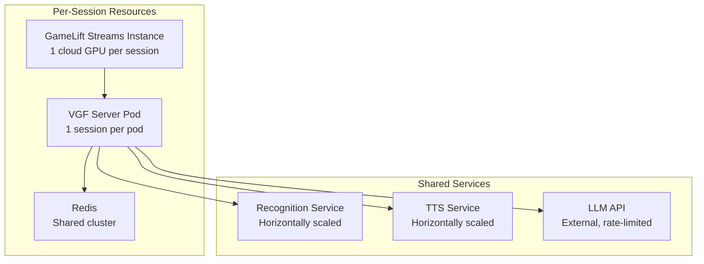
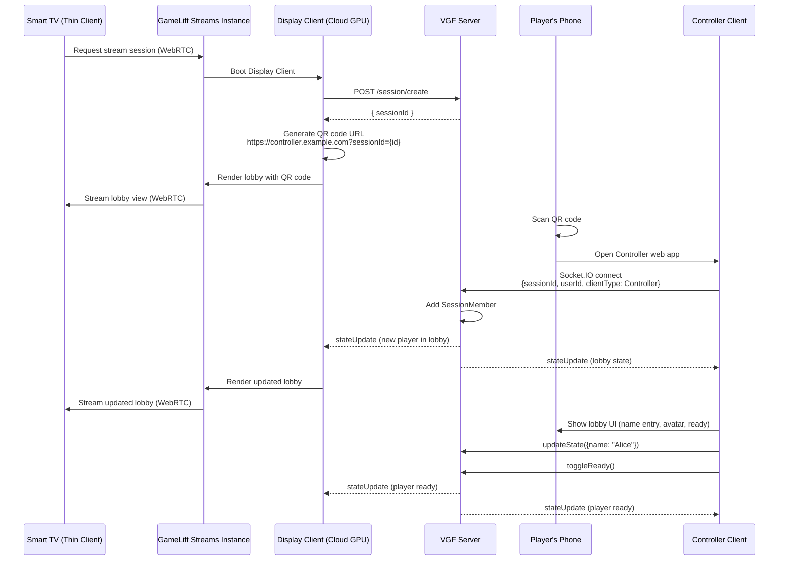
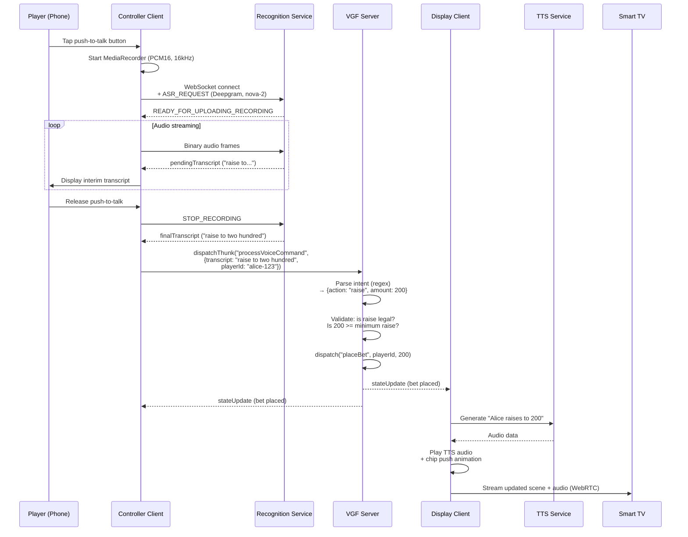
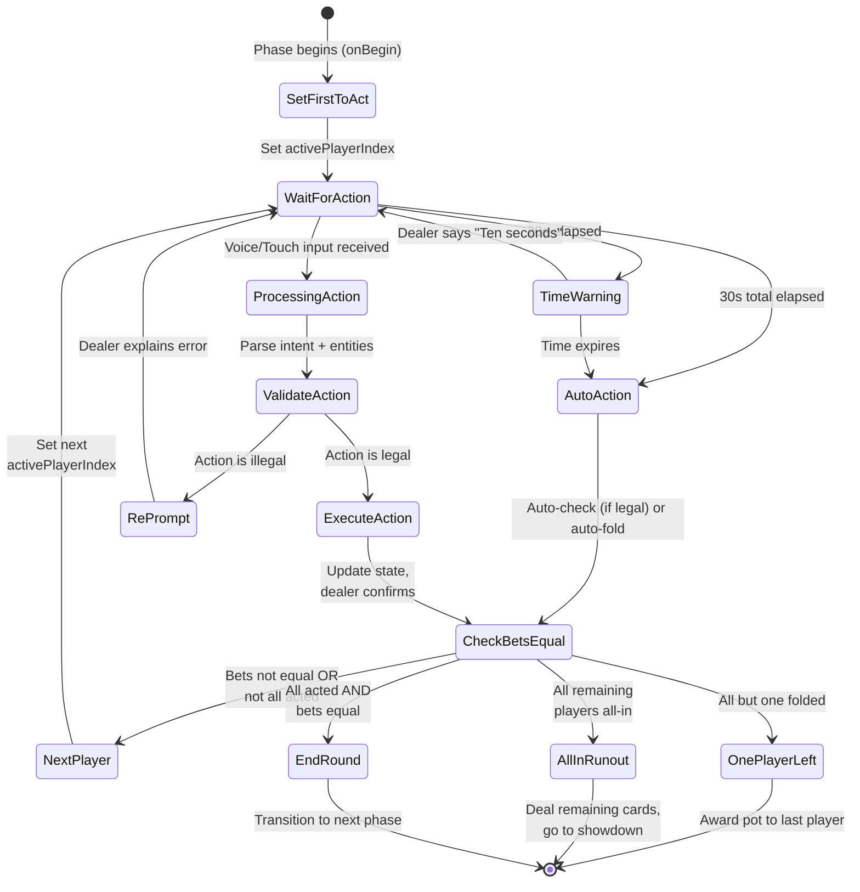
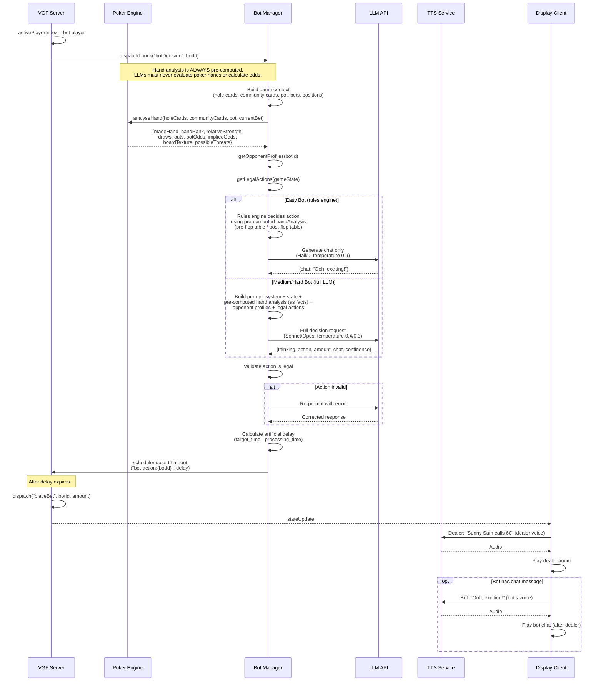

# Weekend Poker — Technical Design Document: Architecture Decisions, Cross-Cutting Concerns & Integration

> **Version:** 1.0
> **Date:** 2026-02-09
> **Author:** Principal Software Engineer
> **Status:** Draft for Review

---

## Table of Contents

1. [Architecture Decision Records (ADRs)](#1-architecture-decision-records-adrs)
2. [Cross-Cutting Concerns](#2-cross-cutting-concerns)
3. [Scalability & Reliability](#3-scalability--reliability)
4. [Testing Strategy](#4-testing-strategy)
5. [Risk Mitigations](#5-risk-mitigations)
6. [Data Flow Diagrams](#6-data-flow-diagrams)
7. [Dependency Map](#7-dependency-map)
8. [Non-Functional Requirements](#8-non-functional-requirements)

---

## 1. Architecture Decision Records (ADRs)

### ADR-001: Server-Authoritative State via VGF Framework

**Context:**
Weekend Poker requires synchronised game state across a Display client (running on a GameLift Streams cloud GPU), multiple Controller clients (mobile phones), and AI bot logic (server-side). The state includes sensitive information (hole cards) and must enforce poker rules atomically. The team has existing expertise and production infrastructure around VGF.

**Options Considered:**

| Option | Pros | Cons |
|--------|------|------|
| A. VGF framework (server-authoritative, Redux-like) | Proven in production; built-in phase management, scheduler, Display/Controller architecture; React hooks SDK; Socket.IO transport; Redis persistence | Broadcasts full state to all clients (no per-client filtering); framework coupling |
| B. Custom WebSocket server with client-side state | Full control; per-client state filtering possible | Massive engineering effort; no phase system; no scheduler; no reconnection handling |
| C. Firebase Realtime Database | Low ops burden; built-in auth | No phase management; poor fit for turn-based logic; latency unpredictable; vendor lock-in |

**Decision:** Option A — VGF v4.3.1 with `FailoverVGFServiceFactory`.

**Consequences:**
- All game state lives on the server; clients dispatch thunks/reducers and receive broadcast state updates.
- Phase-based game flow maps naturally to poker rounds (Lobby, PostingBlinds, Dealing, PreFlopBetting, etc.).
- The `endIf` lifecycle hook provides clean automatic phase transitions.
- Private state (hole cards) is stored in `SessionMember.state` and rendered only by the owning Controller. This is not cryptographically secure — acceptable for a casual game (see ADR-006).
- The deprecated `actions` field in `GameRuleset` must not be used; all mutations via reducers and thunks.
- The scheduler provides failover-safe timers backed by Redis, essential for action timers and bot thinking delays.

---

### ADR-002: Voice Pipeline — Push-to-Talk with Recognition Service SDK

**Context:**
Voice is the primary input. The system must convert player speech (captured on the mobile phone) to game actions with <1,200ms end-to-end latency. The company has an in-house Recognition Service with a published TypeScript SDK (`@volley/recognition-client-sdk` v0.1.424) providing real-time STT via Deepgram (primary) and Google STT (fallback).

**Options Considered:**

| Option | Pros | Cons |
|--------|------|------|
| A. In-house Recognition Service via SDK | Existing infrastructure; VGF-native integration (`SimplifiedVGFRecognitionClient`); keyword boosting via slot maps; Deepgram/Google failover; low operational burden | Dependency on internal service availability |
| B. Direct Deepgram API from phone | Simpler stack; one fewer hop | No failover; no VGF state integration; must build slot map management; duplicates existing capability |
| C. On-device Whisper (local STT) | Offline capable; zero server latency | High CPU/GPU on phone; model download (~75 MB); accuracy lower for short poker commands; no keyword boosting |
| D. Alexa ASR (Fire TV native) | Zero latency on Fire TV | Only available on Fire TV; no phone controller support; limited customisation |

**Decision:** Option A — `SimplifiedVGFRecognitionClient` with push-to-talk activation on the mobile Controller.

**Consequences:**
- Audio captured via browser `MediaRecorder` API (PCM Linear16, 16 kHz, mono) on the player's phone.
- Push-to-talk button on the Controller UI activates recording.
- Audio chunks streamed in real time to the Recognition Service via WebSocket.
- Per-phase slot maps boost poker vocabulary accuracy (e.g., betting phase: `['check', 'call', 'raise', 'fold', 'all in', 'bet', 'pot', 'half pot']`).
- `finalTranscript` is dispatched to a server-side thunk (`processVoiceCommand`) that parses intent and entities.
- Circuit breaker in the Recognition Service handles Deepgram failures by failing over to Google STT.
- v1 uses turn-based gating: voice input is only processed during the active player's turn. Speaker identification (diarisation) is deferred to v2.

---

### ADR-003: AI Bot Model Selection — Hybrid Rules Engine + LLM

**Context:**
AI bots must provide three difficulty tiers (Easy, Medium, Hard) with distinct personalities. LLMs struggle to play deliberately badly — their training optimises for correctness, making "intentionally weak play" unreliable and non-human.

**Options Considered:**

| Option | Pros | Cons |
|--------|------|------|
| A. Full LLM for all difficulties | Unified architecture; personality at all levels | Easy bots inconsistently weak; cost per decision high; LLM latency even for trivial decisions |
| B. Full rules engine for all difficulties | Deterministic; cheap; fast | Hard bots feel robotic; no adaptive play; no natural-language reasoning |
| C. Hybrid: rules engine for Easy + LLM for Medium/Hard | Easy bots reliably beatable; Medium/Hard leverage LLM strengths (solid/aggressive play aligns with training); personality chat via LLM at all levels | Two decision engines to maintain |

**Decision:** Option C — Hybrid architecture.

**Consequences:**
- **Easy bots:** Rules-based decision tree (pre-flop lookup table + post-flop strategy table from PRD Section 8.3). LLM (Claude Haiku 4.5 / GPT-4o-mini) called only for chat generation after the action is decided. Temperature 0.9-1.0 for varied chat.
- **Medium bots:** Full LLM decision-making (Claude Sonnet 4.5). Instructions: "play solid TAG poker." Temperature 0.4-0.6.
- **Hard bots:** Full LLM decision-making (Claude Opus 4.6). Instructions: "play aggressive LAG poker; exploit opponents." Temperature 0.2-0.4. Note: the PRD suggests occasional higher temperature (0.6-0.8) for bluff decisions, but this creates a chicken-and-egg problem (the decision to bluff comes from the LLM itself). For v1, use a fixed temperature of 0.3 for Hard bots; the system prompt's bluffing instructions provide sufficient variability without dynamic temperature switching.
- Hand strength, draws, pot odds, and board texture are **always pre-computed** by the poker engine and included as facts in the LLM prompt. LLMs must never be asked to calculate these.
- Structured JSON output enforced via function calling or constrained decoding.
- Fallback: if LLM times out or errors, a rules-based fallback decides (strong hand = bet/raise, draw = check/call, nothing = check/fold).
- Opponent tracking (VPIP, PFR, aggression, fold-to-cbet) computed by the server; Easy bots ignore it, Medium bots use basic stats, Hard bots use full profiles.

---

### ADR-004: Rendering Infrastructure — GameLift Streams Cloud GPU

**Context:**
The game must render premium 3D visuals (React Three Fiber, Theatre.js) and deliver them to Smart TVs (Fire TV, Samsung Tizen, LG webOS). Smart TV WebGL capabilities are limited and inconsistent.

**Options Considered:**

| Option | Pros | Cons |
|--------|------|------|
| A. Local rendering on Smart TV | No cloud dependency; no streaming latency | Severe WebGL constraints on TVs; inconsistent performance across models; cannot support post-processing |
| B. GameLift Streams (cloud GPU rendering + WebRTC delivery) | TV is a thin WebRTC client; consistent quality; full post-processing; unconstrained by TV hardware | Cloud cost; streaming latency; dependency on AWS service; requires Windows packaging |
| C. NVIDIA GeForce Now / other cloud gaming | Similar to B; established service | Less control; no custom session management; may not support Electron apps |

**Decision:** Option B — Amazon GameLift Streams with `gen4n_high` stream class.

**Consequences:**
- Display client is a React + R3F + Theatre.js application packaged as a Windows Electron executable.
- The application runs on a GameLift Streams cloud GPU instance (Windows Server 2022).
- GameLift Streams captures rendered output and delivers it to the TV browser via WebRTC.
- TV remote input is forwarded from the thin client to the cloud instance via the GameLift Streams Web SDK.
- The Display client connects to the VGF server via Socket.IO (internal AWS networking — low latency).
- The Controller (phone) is entirely independent of GameLift Streams; it connects directly to the VGF server via Socket.IO over the public internet.
- QR code rendered by the Display client on the cloud GPU; must be readable from 2-3 metres.
- Session timeout set to 4 hours to support long poker nights.
- Regions: us-east-1, us-west-2, eu-west-1 at launch.
- TTS audio is played by the Display client on the cloud instance; GameLift Streams captures system audio as part of the WebRTC stream.

---

### ADR-005: Mobile Controller Architecture — QR Code + Socket.IO

**Context:**
Players need private screens (hole cards, betting controls) on their phones. The VGF framework has first-class support for Display + Controller architecture via Socket.IO.

**Options Considered:**

| Option | Pros | Cons |
|--------|------|------|
| A. VGF Controller via Socket.IO (QR code join) | Native VGF support; proven pattern; no app install; browser-based; reconnection built in | Requires phone + TV; WebSocket connection over public internet |
| B. Native mobile app | Better performance; push notifications; native mic access | App store deployment; friction to join; platform-specific code |
| C. TV remote only (no phone) | Simplest; no second device | No private cards; voice capture from TV mic unreliable; poor UX for betting controls |

**Decision:** Option A — VGF Controller client as a browser-based web app, joined via QR code scan.

**Consequences:**
- Display client creates a VGF session; server returns `sessionId`.
- Display renders a QR code containing `https://controller.example.com?sessionId={sessionId}`.
- Player scans QR code; phone browser opens Controller web app.
- Controller creates a `SocketIOClientTransport` with `clientType: ClientType.Controller`.
- Controller receives full game state via VGF broadcast; only renders the owning player's cards and controls.
- Player's hole cards stored in `SessionMember.state` (per-member).
- Socket.IO: infinite reconnection, 50ms initial delay, 500ms max delay, WebSocket-only transport.
- `sessionMemberId` is stable across reconnections.
- Max 4 controllers per session (enforced in `onConnect` thunk).

---

### ADR-006: Private State Security — Client-Side Filtering (v1)

**Context:**
Poker requires private information (hole cards). VGF broadcasts full state to all clients. Several approaches exist for preventing information leakage.

**Options Considered:**

| Option | Pros | Cons |
|--------|------|------|
| A. Client-side filtering (render only own cards) | Simple; no framework changes; immediate | Cards visible in WebSocket messages to savvy players using dev tools |
| B. Server-side per-member state (SessionMember.state) | Natural VGF pattern; cleaner separation | Still broadcast to all clients; same dev-tools vulnerability |
| C. Server-side redaction (filter state per client before broadcast) | True security; cards never sent to non-owning clients | Requires VGF framework changes (per-client state filtering not supported) |
| D. Client-side encryption (encrypted card data, per-player decryption key) | Secure without framework changes | Key distribution complexity; performance overhead; over-engineered for casual play |

**Decision:** Option B for v1 — store hole cards in `SessionMember.state`, render only on owning Controller.

**Consequences:**
- A technically savvy player could inspect WebSocket messages to see opponents' cards. This requires browser developer tools, which is impractical during normal casual play.
- Acceptable trade-off for a casual, no-stakes poker game.
- For competitive or real-money play (v2), Option C (server-side redaction with VGF framework enhancement) would be required.
- **Deck storage (critical):** The remaining deck must **never** appear in VGF game state, as VGF broadcasts state to all clients. Knowing the deck order reveals all future cards. The deck is stored in a server-side module-level `Map<string, Card[]>` keyed by session ID, entirely outside VGF state. This map is ephemeral (in-process memory only) and is **not persisted to Redis**. Consequence: if the VGF server pod restarts mid-hand, the deck is lost. Recovery: the current hand is voided and a new hand is dealt from a freshly shuffled deck. This is acceptable because mid-hand pod restarts are rare and voiding a single hand has negligible impact on a casual game.
- **Bot hole cards:** Similarly stored in a server-side module-level `Map<string, Map<string, [Card, Card]>>` (keyed by session ID, then bot ID), outside VGF state. Same restart semantics as the deck.

---

### ADR-007: Intent Recognition — Lightweight NLU on Server

**Context:**
Voice transcripts from the Recognition Service must be parsed into poker actions with entities (action type, bet amount). The parsing must handle natural language variations ("make it three hundred", "bump it to 3x", "I'm out").

**Options Considered:**

| Option | Pros | Cons |
|--------|------|------|
| A. Pattern matching + regex on server | Fast (<10ms); deterministic; zero cost; easy to test | Brittle with unusual phrasings; maintenance burden as variations grow |
| B. Small LLM call (Haiku) for intent parsing | Handles novel phrasings; more flexible | 200-500ms latency; cost per command; overkill for a bounded intent space |
| C. Dedicated NLU service (Dialogflow, LUIS, Rasa) | Purpose-built; entity extraction | External dependency; setup overhead; another service to maintain |
| D. Hybrid: regex for clear patterns, LLM fallback for ambiguous | Fast path for common commands; robust fallback | Two code paths; more complex |

**Decision:** Option D — Regex-based intent parser with LLM fallback for ambiguous inputs.

**Consequences:**
- Primary parser: TypeScript function using regex patterns for canonical forms (`/^(fold|i fold|i'm out|muck)/i`, etc.) and entity extraction for amounts.
- Handles ~90% of inputs in <10ms.
- Ambiguous inputs (confidence below threshold or no pattern match) are routed to a fast LLM call (Haiku 4.5) with the transcript + legal actions as context.
- The LLM fallback returns a structured JSON intent, adding ~300-500ms only for edge cases.
- All intents validated against the legal action matrix for the current game state before execution.
- "Raise [amount]" disambiguation: if amount > current bet, interpret as "raise TO"; if amount <= current bet, interpret as "raise BY". If still ambiguous, dealer asks for clarification.
- **Implementation note:** The LLM fallback is a v1 requirement, not deferred. The `processVoiceCommand` thunk must check if `parseIntent` returns `intent: 'unknown'` or confidence below 0.5, and route to the Haiku fallback before giving up. The backend TDD must implement this path.

---

### ADR-008: TTS Strategy — Pre-Generated Common Phrases + Dynamic Generation

**Context:**
The dealer must speak every action confirmation, turn prompt, and game announcement. Latency target is <500ms. The game features multiple dealer characters (Vincent, Maya, Remy, Jade) each with a distinct TTS voice.

**Options Considered:**

| Option | Pros | Cons |
|--------|------|------|
| A. All real-time TTS generation | Maximum flexibility; any phrase possible | Latency (~200-500ms per phrase); cost per utterance |
| B. All pre-generated audio clips | Zero latency; consistent quality | Cannot handle dynamic content (player names, amounts); storage overhead |
| C. Hybrid: pre-generated common phrases + real-time for dynamic | Fast for common phrases; flexible for dynamic content | Two audio pipelines; cache management |

**Decision:** Option C — Hybrid approach.

**Consequences:**
- Pre-generate ~50-80 common phrases per dealer voice at build time (e.g., "Check", "Fold", "Your turn", "The flop", "The turn", "The river", "All in", etc.).
- Store as compressed audio files on CDN; loaded by the Display client at session start.
- Dynamic phrases (player names, specific amounts, contextual commentary) generated in real time via TTS API.
- TTS audio played by the Display client on the cloud GPU instance; captured by GameLift Streams as part of the WebRTC audio stream.
- Bot chat uses the same TTS pipeline but with a different voice per bot personality.
- Audio queue ensures dealer announcements play before bot chat; bot chat is lower priority and may be truncated if the game needs to advance.

---

## 2. Cross-Cutting Concerns

### 2.1 Error Handling Strategy

#### Layers of Error Handling

| Layer | Scope | Strategy |
|-------|-------|----------|
| **VGF Thunks** | Game logic errors (invalid bets, illegal actions, rule violations) | Catch in thunk; dispatch error state update; dealer announces the issue to the player via TTS (e.g., "The minimum raise is 60") |
| **Recognition Service** | STT failures, WebSocket disconnection, provider errors | SDK handles retries (4 attempts, 200ms delay); circuit breaker fails over Deepgram to Google; on persistent failure, display "Use touch controls" |
| **LLM API** | Bot decision timeouts, malformed responses, API errors | Timeout at 1.5s (Easy chat), 2.5s (Medium), 4s (Hard); on failure, use rules-based fallback; log failure for monitoring |
| **Socket.IO** | Network disruption, reconnection | Infinite reconnection with backoff (50ms initial, 500ms max); `sessionMemberId` stable across reconnects; disconnected player auto-folds after 30s |
| **GameLift Streams** | Stream quality degradation, session failure | Monitor stream health; on session loss, TV shows "Reconnecting..." overlay; game state preserved on VGF server |
| **TTS Service** | Audio generation failure | Fall back to text-only dealer messages in the speech bubble; game continues without voice |

#### Error Propagation Rules

1. **Never expose internal errors to players.** All player-facing error messages are friendly dealer announcements.
2. **Never block the game loop on an external service failure.** Every external call (LLM, TTS, Recognition) has a timeout and fallback.
3. **Log all errors with structured context** (session ID, player ID, phase, hand number) for post-mortem analysis.
4. **Idempotent reducers.** State mutations via reducers must be pure and repeatable. If a thunk fails mid-execution, no partial state corruption occurs because reducers are only dispatched on success.

### 2.2 Logging & Observability

#### Structured Logging

VGF integrates with `@volley/logger` (Pino-based). All log entries include:

```typescript
interface LogContext {
  sessionId: string
  handNumber: number
  phase: PokerPhase
  activePlayerId?: string
  clientType?: 'Display' | 'Controller' | 'Server'
  correlationId?: string  // Traces a request across services
}
```

#### Log Levels

| Level | Usage |
|-------|-------|
| `error` | Unrecoverable failures, LLM API errors, recognition service failures |
| `warn` | Fallback activations, reconnections, timeout triggers, invalid player actions |
| `info` | Phase transitions, player actions, bot decisions, session lifecycle events |
| `debug` | State diffs, LLM prompts/responses, raw transcripts, detailed timing |

#### Metrics (Datadog)

| Metric | Type | Tags |
|--------|------|------|
| `poker.hand.duration` | Histogram | `blind_level`, `player_count` |
| `poker.voice.latency` | Histogram | `provider` (deepgram/google), `phase` |
| `poker.voice.success_rate` | Counter | `phase`, `intent` |
| `poker.bot.decision_latency` | Histogram | `difficulty`, `model`, `fallback` |
| `poker.bot.llm_cost` | Counter | `difficulty`, `model` |
| `poker.session.duration` | Histogram | `player_count`, `blind_level` |
| `poker.gamelift.frame_rate` | Gauge | `region` |
| `poker.gamelift.input_latency` | Histogram | `region` |
| `poker.reconnection.count` | Counter | `client_type` |
| `poker.tts.latency` | Histogram | `dealer_id`, `phrase_type` (cached/dynamic) |

#### Distributed Tracing

- Each player action (voice command or touch input) generates a `correlationId` that traces through: Controller -> VGF Server -> Recognition Service (if voice) -> LLM API (if bot) -> TTS Service -> Display Client.
- Datadog APM traces for end-to-end latency analysis.

### 2.3 Security Model

#### Session Authentication

| Concern | Approach |
|---------|----------|
| Session creation | Display client calls `POST /session/create`; server returns `sessionId` (UUID v4) |
| Session joining | Controller extracts `sessionId` from QR code URL; connects via Socket.IO with `sessionId` + `userId` |
| Session isolation | VGF server enforces session boundaries; clients only receive state for their session |
| Host privileges | The Display client (or the first Controller) is designated host; host-only operations (start game, kick player, pause, end game) validated in thunks via `clientType` check |
| Rate limiting | Socket.IO middleware limits dispatch frequency per client (e.g., max 10 dispatches/second) to prevent abuse |

#### Input Validation

| Input | Validation |
|-------|-----------|
| Player name | Max 20 characters; profanity filter; HTML entity encoding to prevent XSS in rendered text |
| Bet amounts | Server-side validation against min/max bounds, player stack, and minimum raise rules; never trust client-provided amounts |
| Voice transcripts | Treated as untrusted input; parsed through intent recognition with explicit intent whitelist; no dynamic code execution from transcripts |
| Session IDs | UUID v4 format validation; session existence check before join |
| Client type | Validated on connection; cannot change after initial handshake |

#### No Arbitrary Code Execution

Voice transcripts and LLM outputs are parsed into a fixed set of actions (`fold`, `check`, `call`, `bet`, `raise`, `all_in`) with numeric amounts. There is no pathway from user input to dynamic code execution.

### 2.4 Data Privacy

| Concern | Policy |
|---------|--------|
| Voice audio | Audio is streamed to the Recognition Service for STT processing; not stored beyond the transcription session; recognition service closes WebSocket after final transcript |
| Transcripts | Stored transiently in server memory for the current hand; not persisted to database; available in debug logs (configurable log level) |
| Player names | Stored in `SessionMember.state` for session duration; not persisted beyond session |
| LLM prompts | Contain game state and bot personality; do not contain player PII; sent to LLM API provider (subject to their data policy) |
| Analytics events | Aggregated; no PII; session IDs are anonymised UUIDs |
| No user accounts in v1 | No authentication, no stored profiles, no persistent player data |

---

## 3. Scalability & Reliability

### 3.1 Scaling Model



#### VGF Server Scaling

- Each VGF server pod handles one game session (4 players max + bots).
- Pods deployed on AWS EKS with Horizontal Pod Autoscaler (HPA).
- Session affinity: Socket.IO requires sticky sessions; ALB routes all connections for a session to the same pod.
- Memory per pod: ~50-100 MB (game state + Node.js runtime).
- CPU per pod: minimal for poker logic; spikes during LLM calls (but these are async HTTP).

#### GameLift Streams Scaling

- Each game session consumes one `gen4n_high` cloud GPU instance.
- Stream group capacity modes:
  - **Always-on:** Pre-provisioned instances for low-latency session start. Higher cost.
  - **On-demand:** Instances provisioned when a session is requested. ~30-60s provisioning delay.
- Recommended: Small always-on buffer (2-5 instances per region) + on-demand overflow.
- Session timeout: 4 hours (max).

#### Concurrent Session Targets

| Scale | Sessions | VGF Pods | GameLift Instances | Redis |
|-------|----------|----------|--------------------|-------|
| Alpha | 1-5 | 5 | 5 (always-on) | Single node |
| Beta | 10-50 | 50 | 10 always-on + on-demand | Single node |
| Launch | 50-200 | 200 | 20 always-on + on-demand | Cluster (3 nodes) |
| Growth | 200-1000 | 1000 | 50 always-on + on-demand | Cluster (6 nodes) |

### 3.2 Failover Strategy

| Component | Failure Mode | Recovery |
|-----------|-------------|----------|
| **VGF Server pod** | Pod crash/restart | `FailoverVGFServiceFactory` recovers session state from Redis; scheduler state restored; clients auto-reconnect via Socket.IO |
| **Redis** | ElastiCache node failure | Multi-AZ ElastiCache with automatic failover; `FailoverVGFServiceFactory` handles Redis reconnection |
| **Redis** | Complete Redis outage | VGF uses `MemoryStorage` as primary + `RedisPersistence` as backup. During a Redis outage: (1) existing sessions continue in-memory; (2) new sessions can be created; (3) scheduler timers continue in-memory. However, persistence is lost — if the VGF server pod **also** restarts during a Redis outage, all sessions on that pod are unrecoverable. This is an accepted risk for a casual game; full Redis outages are extremely rare with Multi-AZ ElastiCache. |
| **GameLift Streams instance** | GPU crash | Session lost; TV shows reconnection prompt; new session must be created (game state preserved on VGF server if pod is alive) |
| **Recognition Service** | Primary provider (Deepgram) failure | Circuit breaker fails over to Google STT; transparent to game code |
| **LLM API** | Provider outage or timeout | Rules-based fallback for bot decisions; no game disruption |
| **TTS Service** | API failure | Text-only dealer messages (speech bubble only); game continues |

### 3.3 Redis Persistence Model

| Data | Redis Key Pattern | TTL | Purpose |
|------|------------------|-----|---------|
| Session state | `vgf:session:{sessionId}:state` | 4 hours | Full game state backup |
| Session members | `vgf:session:{sessionId}:members` | 4 hours | Connected client records |
| Scheduler jobs | `vgf:scheduler:{sessionId}:*` | 4 hours | Timeouts and intervals (action timers, bot delays) |
| Session metadata | `vgf:session:{sessionId}:meta` | 4 hours | Session creation time, host ID |

Redis is used for:
1. **Session durability** — state survives pod restarts.
2. **Scheduler persistence** — timers (action timeouts, bot thinking delays) survive pod restarts via `RedisRuntimeSchedulerStore`.
3. **Session locking** — prevents duplicate session processing in multi-pod scenarios.

---

## 4. Testing Strategy

### 4.1 Unit Testing

| Module | Framework | Coverage Target | Key Test Cases |
|--------|-----------|-----------------|----------------|
| **Poker Engine — Hand Evaluator** | Vitest | 95%+ | All 10 hand rankings; kicker comparisons; ace-high and ace-low straights; split pots; all 7-card combinations for 4 players |
| **Poker Engine — Pot Calculator** | Vitest | 95%+ | Main pot; 2-player side pot; 3-player side pot (4 players, all different stacks); odd chip distribution; all-in for less than BB |
| **Poker Engine — Betting Rules** | Vitest | 95%+ | Minimum bet/raise enforcement; all-in reopening rules; incomplete raise rules; BB option (check or raise); heads-up blind rules |
| **Voice Intent Parser** | Vitest | 90%+ | All canonical commands; natural language variations (Section 7.5 of PRD); bet amount parsing (exact, BB multiple, pot fraction); raise ambiguity resolution; invalid/out-of-range amounts |
| **Easy Bot Rules Engine** | Vitest | 90%+ | Pre-flop decision tables (all hand tiers x all positions); post-flop strategy tables (all hand strengths x board textures); bluff frequency (~5%); emotional state effects on decisions |
| **Phase Transitions** | Vitest | 85%+ | All `endIf` conditions; chained transitions (e.g., all fold → HAND_COMPLETE); all-in runout path; heads-up special rules |
| **VGF Reducers** | Vitest | 90%+ | `placeBet`: stack deduction, pot update, bet tracking; `fold`: status change; `dealCommunityCards`: card addition; `rotateBlinds`: button movement, SB/BB assignment |

#### Testing Philosophy

- **Tests are the source of truth.** If a test fails, the code is wrong — not the test.
- Pre-compute expected hand evaluation results mathematically. Do not derive expectations from the code under test.
- Side pot tests must use the explicit algorithm (sorted bets, level-by-level calculation) to verify results independently.

### 4.2 Integration Testing

| Test Scenario | Scope | Key Assertions |
|--------------|-------|----------------|
| **Full hand lifecycle** | Lobby -> PostingBlinds -> Dealing -> PreFlop -> Flop -> Turn -> River -> Showdown -> PotDistribution -> HandComplete | Correct blind posting; correct dealing; correct turn order; pot amounts correct at each stage; winner determination correct; button rotation correct |
| **Side pot scenarios** | 2, 3, 4 players all-in with varying stack sizes | Each pot awarded to correct winner; ineligible players excluded; unmatched chips returned |
| **Bot integration (Medium)** | Game state -> prompt construction -> LLM mock -> response parse -> action validation -> state update | Valid JSON response parsed; illegal actions rejected and re-prompted; fallback activated on timeout |
| **Voice pipeline (basic)** | Recorded audio file -> Recognition SDK mock -> transcript -> intent parser -> game action | Correct intent extracted; correct amount parsed; invalid actions trigger dealer error response |
| **Voice pipeline (end-to-end)** | Controller push-to-talk -> MediaRecorder capture -> Recognition SDK (mocked WebSocket) -> final transcript -> VGF `processVoiceCommand` thunk -> intent parser -> action validation -> state update -> TTS enqueue -> Display TTS playback | Transcript arrives within latency budget; intent correctly parsed; game state updated; TTS message enqueued with correct priority; dealer confirmation plays on Display. Covers the full cross-system flow: phone -> recognition service -> VGF server -> intent parser -> game engine -> TTS -> Display client. |
| **Reconnection** | Player disconnects mid-hand -> reconnects before timeout | `sessionMemberId` preserved; game state recovered; player can act on their turn; no duplicate state |
| **Multi-player state sync** | 4 Controllers + 1 Display connected; actions dispatched; state verified on all clients | All clients receive identical state updates; phase transitions synchronised; no stale state |

### 4.3 End-to-End Testing (Playwright)

| Test | Description |
|------|-------------|
| **Session lifecycle** | Create session -> QR code displayed -> Controller joins -> name entry -> ready -> start game -> play 1 hand -> end session |
| **Voice command flow** | Push-to-talk -> speak "raise to 200" -> dealer confirms -> state updated (using mocked audio input) |
| **Bot game** | 1 human + 3 Easy bots -> play 5 hands -> verify all bots act within timing budget -> no game state errors |
| **Disconnection recovery** | Player disconnects (network simulation) -> reconnects -> continues play |
| **Touch fallback** | All betting actions via touch controls on Controller UI -> verify state changes |

### 4.4 Load Testing

| Scenario | Tool | Target |
|----------|------|--------|
| Concurrent sessions | k6 or Artillery | 200 concurrent VGF sessions; verify pod auto-scaling; Redis throughput |
| Socket.IO throughput | k6 | 800 concurrent WebSocket connections (200 sessions x 4 clients); verify state broadcast latency <100ms |
| LLM API load | k6 | 600 concurrent LLM calls (200 sessions x 3 bots); verify p95 latency <4s |
| Recognition Service load | k6 | 200 concurrent STT sessions; verify failover under load |

### 4.5 Visual Regression Testing

| Tool | Scope | Approach |
|------|-------|----------|
| Playwright + screenshot comparison | 3D scene rendering | Capture Display client screenshots at key game states (lobby, dealing, betting, showdown); compare against baseline images; threshold for acceptable pixel difference |
| Storybook (if applicable) | Controller UI components | Component-level visual testing for betting controls, card display, lobby UI |
| Manual QA on TV hardware | GameLift Streams output | Verify QR code readability at 2-3m; verify text legibility; verify colour-blind accessibility; verify timer visibility |

### 4.6 Split-Screen Development Mode

As specified in PRD Section 25.4, a split-screen mode enables local development without a physical phone:
- Left 2/3: Display client (3D game view).
- Right 1/3: Mock Controller client (hole cards, betting controls, push-to-talk or text input).
- Activated via `DEV_SPLIT_SCREEN=true` environment variable.
- Mock Controller is a standard VGF Controller client in an iframe; behaves identically to a real phone.
- Completely stripped from production builds.

---

## 5. Risk Mitigations

### 5.1 Voice Command Latency (Target <1,200ms)

| Risk | The end-to-end voice command latency (STT + intent parsing + validation + TTS confirmation) exceeds 1,200ms, making voice interaction feel sluggish. |
|------|---|
| **Severity** | High |
| **Probability** | Medium |
| **Mitigation Design** | |

**Latency budget breakdown:**

| Component | Target | Maximum | Mitigation |
|-----------|--------|---------|-----------|
| Audio capture + WebSocket delivery | 50ms | 100ms | Phone on same WiFi as route to AWS; push-to-talk eliminates VAD latency |
| STT processing (Deepgram) | 200ms | 500ms | Deepgram `nova-2` model; keyword boosting via slot maps improves first-pass accuracy |
| Intent parsing (regex) | 5ms | 10ms | Server-side regex; no external call |
| Intent parsing (LLM fallback) | 300ms | 500ms | Only triggered for ambiguous inputs (~10% of commands) |
| Game validation | 5ms | 10ms | In-memory state lookup |
| TTS generation (cached phrase) | 0ms | 0ms | Pre-generated common phrases |
| TTS generation (dynamic phrase) | 200ms | 500ms | Streaming TTS where supported; short phrase optimisation |
| **Total (fast path)** | **~460ms** | **~1,120ms** | Regex intent + cached TTS |
| **Total (slow path)** | **~760ms** | **~1,620ms** | LLM fallback + dynamic TTS |

**Additional mitigations:**
- Display immediately shows a visual indicator ("processing...") when a voice command is received, providing instant feedback.
- Interim transcripts from the Recognition Service are displayed on the Controller as the player speaks, giving real-time feedback.
- Dealer TTS confirmation plays asynchronously — the game state updates immediately, and the spoken confirmation follows.

### 5.2 GameLift Streams Availability & Latency

| Risk | GameLift Streams session provisioning is slow, or streaming latency degrades the experience. |
|------|---|
| **Severity** | High |
| **Probability** | Medium |
| **Mitigation Design** | |

- **Session provisioning:** Maintain a small always-on instance pool (2-5 per region) for instant session start. On-demand overflow for peak times, with a "preparing your table..." loading cinematic covering provisioning delay.
- **Streaming latency:** Deploy to regions nearest players. Poker is turn-based, so 100-200ms of input latency is imperceptible during play (players think for seconds, not milliseconds).
- **Session failure:** If the GameLift Streams session drops, the VGF server and game state remain intact on EKS. The TV shows "Reconnecting..." while a new stream session is provisioned. Players' phones continue to function (they connect to VGF server, not to GameLift Streams).
- **Monitoring:** Track `gamelift.stream.quality` and `gamelift.input.latency` metrics; alert on degradation.

### 5.3 LLM Response Times for Bot Decisions

| Risk | LLM API calls exceed latency budget, slowing game pace. |
|------|---|
| **Severity** | Medium |
| **Probability** | Medium |
| **Mitigation Design** | |

- **Timeout enforcement:** Hard timeouts per difficulty: 1.5s (Easy chat), 2.5s (Medium), 4s (Hard).
- **Fallback:** On timeout, immediately use rules-based fallback (strong hand = bet, draw = call, nothing = fold). Log the fallback activation.
- **Masking:** Bot "thinking" animation plays on the Display client while the LLM call is in progress. The artificial delay (to simulate human-like timing) absorbs LLM latency. If LLM responds in 1.5s and target thinking time is 3s, only 1.5s of artificial delay is added.
- **Pre-flop shortcut:** For Easy and Medium bots, pre-flop decisions use a lookup table, eliminating ~30% of LLM calls.
- **Prompt optimisation:** System prompts cached; game state context kept minimal (only relevant information for the current decision). Easy bot chat prompts are particularly short.
- **Parallel requests:** If multiple bots need to decide in the same round (e.g., pre-flop), batch API calls in parallel where possible.

### 5.4 Reconnection Edge Cases

| Risk | Players disconnect and reconnect in the middle of a hand, causing state inconsistencies or game lockups. |
|------|---|
| **Severity** | Medium |
| **Probability** | High (WiFi is unreliable) |
| **Mitigation Design** | |

- **Socket.IO reconnection:** Infinite attempts, 50ms initial delay, 500ms max delay, WebSocket-only.
- **Stable identity:** `sessionMemberId` persists across reconnections; `connectionId` may change.
- **Disconnect handling thunk:**
  1. Mark player as disconnected in state.
  2. Schedule auto-fold timeout: `upsertTimeout("disconnect-fold:{clientId}", 30_000)`.
  3. If it's the disconnected player's turn, start the 30s countdown immediately.
  4. If the player reconnects before timeout, cancel the scheduled auto-fold.
- **Seat reservation:** Disconnected player's seat is held for 3 hands (configurable). After 3 hands of absence, the player is removed and a bot fills the seat (if auto-fill is enabled).
- **State recovery on reconnect:** VGF broadcasts full state on reconnection. The Controller client re-renders from the latest state. No incremental sync needed.
- **Mid-action disconnect:** If a player disconnects while a voice command is being processed, the in-flight command is discarded. The player must re-issue the command after reconnection.

### 5.5 Recognition Service Provider Failure

| Risk | Deepgram (primary STT provider) experiences an outage, degrading voice functionality. |
|------|---|
| **Severity** | Medium |
| **Probability** | Low |
| **Mitigation Design** | |

- **Circuit breaker:** Built into the Recognition Service. Monitors Deepgram health; on failure, automatically routes to Google STT.
- **Lease-based quota:** Concurrency control prevents overloading either provider.
- **Failover transparency:** Game code uses the `SimplifiedVGFRecognitionClient`, which abstracts away provider selection. No game-side code changes needed during failover.
- **Monitoring:** Track provider-level error rates and failover events in Datadog.
- **Touch fallback:** After 3 consecutive failed voice attempts, the Controller switches to touch-primary mode. Detection mechanism: the Controller client tracks consecutive recognition failures (WebSocket disconnect, no transcript received within 5s of stopping recording, or empty transcript). After 3 failures, the Controller sets a local `voiceDisabled` flag, hides the push-to-talk button, and prominently displays touch betting controls. The dealer is notified via a thunk dispatch (`notifyVoiceUnavailable`) so it can announce "Use your phone to select an action" via TTS. The flag is reset if the player manually re-enables voice from a settings toggle on the Controller.

---

## 6. Data Flow Diagrams

### 6.1 Player Joins via QR Code



### 6.2 Voice Command to Game Action



### 6.3 Betting Round Lifecycle



### 6.4 Bot Decision Cycle



---

## 7. Dependency Map

### 7.1 Runtime Dependencies

| Dependency | Version | Purpose | Fallback Strategy | Upgrade Path |
|-----------|---------|---------|-------------------|-------------|
| `@volley/vgf` | 4.3.1 | Game framework (server + client) | None (core framework) | Pin to 4.x; test upgrades in staging; no breaking changes expected within 4.x |
| `@volley/recognition-client-sdk` | 0.1.424 | Voice recognition SDK | Touch controls only | Pin to 0.1.x; SDK follows semver |
| `@volley/logger` | Latest | Structured logging | Console.log fallback | Non-critical; any version works |
| `react` | 19.x | UI framework | None (core) | Follow VGF compatibility matrix |
| `react-dom` | 19.x | DOM rendering | None | Paired with React |
| `@react-three/fiber` | Latest | React Three.js integration | None (core 3D) | Follow Three.js compatibility |
| `@react-three/drei` | Latest | R3F helpers | Can implement manually | Follow R3F compatibility |
| `@react-three/postprocessing` | Latest | Bloom, vignette | Disable post-processing | Follow R3F compatibility |
| `three` | Latest | WebGL renderer | None (core 3D) | Follow R3F compatibility matrix |
| `@theatre/core` | Latest | Animation engine | Fall back to manual Tween.js | Independent of R3F version |
| `@theatre/r3f` | Latest | Theatre.js R3F integration | Manual animation wiring | Paired with @theatre/core |
| `socket.io` / `socket.io-client` | Latest (VGF bundles) | WebSocket transport | None (VGF dependency) | Managed by VGF |
| `ioredis` | Latest | Redis client | None (required for production) | Stable API; minor version bumps safe |
| `express` | 4.x | HTTP server | None (VGF dependency) | Managed by VGF |
| `zod` | 3.x | Schema validation | Manual validation | Stable API |
| `qrcode.react` | Latest | QR code rendering | Static QR image fallback | Stable library |
| `electron` | Latest | Windows packaging for GameLift Streams | None (required for deployment) | Follow GameLift Streams compatibility |
| `@noriginmedia/norigin-spatial-navigation` | Latest | TV remote focus management | Custom focus management | Stable library |
| TTS client (in-house or third-party SDK) | Latest | Text-to-speech generation for dealer and bot voices | Text-only dealer messages (speech bubble fallback) | Depends on chosen TTS provider |

### 7.2 External Services

| Service | Provider | SLA | Fallback | Cost Model |
|---------|----------|-----|----------|-----------|
| **Amazon GameLift Streams** | AWS | 99.9% | None (core delivery) | Per-instance-hour (gen4n_high) |
| **Claude API** | Anthropic | 99.5%+ | Rules-based bot fallback | Per-token (input + output) |
| **Deepgram** | Deepgram | 99.9% | Google STT (via Recognition Service circuit breaker) | Per-minute of audio |
| **Google STT** | Google Cloud | 99.9% | Touch controls fallback | Per-minute of audio |
| **TTS Service** | In-house / ElevenLabs / Amazon Polly | Varies | Text-only dealer (speech bubble) | Per-character or per-request |
| **Amazon ElastiCache (Redis)** | AWS | 99.99% (Multi-AZ) | In-memory only (session data lost on pod restart) | Per-node-hour |
| **Amazon EKS** | AWS | 99.95% | N/A | Per-cluster + per-pod compute |
| **CDN (3D assets, audio, video)** | CloudFront | 99.9% | Assets bundled with Electron app as fallback | Per-GB transfer |

### 7.3 Internal Services

| Service | Team | Status | API Stability |
|---------|------|--------|--------------|
| VGF Framework | Platform | Production (v4.3.1) | Stable; deprecated `actions` field to be removed in v5 |
| Recognition Service | Voice | Production | Stable; WebSocket API documented |
| TTS Service | Voice | Production | Stable; HTTP API |

---

## 8. Non-Functional Requirements

### 8.1 Performance Budgets

| Metric | Target | Maximum | Measurement |
|--------|--------|---------|-------------|
| **Frame rate (cloud GPU)** | 60 fps | 55 fps (p5) | GameLift Streams dashboard + R3F `useFrame` stats |
| **Frame rate (TV delivery)** | 60 fps at 1080p | 55 fps (p5) | GameLift Streams stream quality metrics |
| **Scene load time** | < 3s | < 5s | `Performance.mark()` from DOM ready to first render |
| **State broadcast latency** | < 50ms | < 100ms | Datadog APM (server dispatch to client receive) |
| **Controller connection** | < 2s | < 3s after QR scan | `Performance.mark()` from Socket.IO init to CONNECTED |
| **Voice round-trip (fast path)** | < 500ms (p50) | < 1,200ms (p95) | Datadog trace (push-to-talk release to state update) |
| **Voice round-trip (slow path)** | < 800ms (p50) | < 1,700ms (p95) | Datadog trace (LLM fallback path) |
| **Voice command to dealer confirmation** | ~1,000ms (p50) | < 3,300ms (p99) | End-to-end including TTS playback start; aligns with backend TDD Section 4.6 |
| **Bot decision (Easy)** | < 1s processing | < 1.5s processing | Datadog histogram (rules engine + chat LLM) |
| **Bot decision (Medium)** | < 2s processing | < 2.5s processing | Datadog histogram (LLM call) |
| **Bot decision (Hard)** | < 3s processing | < 4s processing | Datadog histogram (LLM call) |
| **TTS generation (cached)** | 0ms | 0ms | Pre-generated at build time |
| **TTS generation (dynamic)** | < 200ms | < 500ms | Datadog histogram |

### 8.2 Latency Targets

```mermaid
gantt
    title Voice Command Latency Budget (Fast Path)
    dateFormat X
    axisFormat %L ms

    section Audio
    Capture + deliver     :0, 50

    section STT
    Deepgram processing   :50, 250

    section Server
    Intent parsing (regex):250, 255
    Game validation       :255, 260
    State dispatch        :260, 270

    section TTS
    Cached phrase lookup   :270, 275

    section Display
    Animation trigger     :275, 290
    Audio playback start  :290, 300
```



### 8.3 Memory Limits

| Component | Memory Budget | Rationale |
|-----------|--------------|-----------|
| **VGF Server pod** | 256 MB | Game state (~5 KB) + Node.js runtime + Socket.IO connections (4 clients) |
| **Display Client (cloud GPU)** | 2 GB | Three.js scene (~150 MB textures, see note below) + React + Theatre.js + audio buffers |

**Card asset texture note:** The actual card deck asset (`52-card_deck.glb`) uses 52 individual textures (256x512 each, ~37.5 MB GPU memory total) rather than the single 1024x1024 texture atlas originally planned. This increases both texture memory and draw calls compared to the atlas approach. With a maximum of 17 cards visible simultaneously (5 community + 4x2 hole cards + deck), the draw call overhead is ~51 additional calls (17 cards x 3 primitives each). This is manageable on GameLift Streams GPU hardware (`gen4n_high`) and does not breach the frontend TDD's 200 draw call hard limit. The texture memory increase (~37 MB vs ~4 MB for an atlas) is absorbed within the 2 GB budget. Compressing card textures to KTX2/ETC1S would reduce the footprint to ~10-15 MB. For v1, using the asset as-is is acceptable; repacking into an atlas is a v2 optimisation if draw calls become a bottleneck.
| **Controller Client (phone)** | 50 MB | Lightweight React app; no 3D; minimal state |
| **Redis per session** | ~50 KB | Serialised game state + scheduler jobs |

### 8.4 Bandwidth Constraints

| Connection | Downstream | Upstream | Notes |
|-----------|-----------|---------|-------|
| **TV (GameLift Streams)** | 10-15 Mbps | < 100 Kbps (input events) | WebRTC video stream; minimum 10 Mbps for 1080p/60fps |
| **Controller (Socket.IO)** | < 50 Kbps | < 50 Kbps | JSON state updates (~2-5 KB per update); infrequent |
| **Controller (voice)** | < 10 Kbps (transcripts) | ~256 Kbps (PCM16 16kHz mono) | Audio streaming only during push-to-talk |
| **VGF Server -> LLM API** | < 100 Kbps (responses) | < 50 Kbps (prompts) | Per-bot, per-decision |

### 8.5 Availability Targets

| Component | Target Availability | Justification |
|-----------|-------------------|---------------|
| **VGF Server** | 99.9% (8.7h downtime/year) | Game-critical; multi-pod deployment on EKS |
| **GameLift Streams** | 99.9% | AWS SLA; critical for TV delivery |
| **Recognition Service** | 99.5% | Voice is primary but has touch fallback |
| **LLM API** | 99.0% | Bot decisions have rules-based fallback |
| **TTS Service** | 99.0% | Text-only fallback available |
| **Redis (ElastiCache)** | 99.99% | Multi-AZ with automatic failover |

### 8.6 Capacity Planning

| Metric | Per Session | At 200 Sessions | Notes |
|--------|------------|-----------------|-------|
| VGF Server pods | 1 | 200 | |
| VGF Server CPU | 0.25 vCPU | 50 vCPU | |
| VGF Server memory | 256 MB | 50 GB | |
| GameLift Streams instances | 1 | 200 | |
| Socket.IO connections | 2-5 (1 Display + 1-4 Controllers) | 400-1,000 | Bots are server-side players with no WebSocket connection. A session with 1 human + 3 bots has only 2 connections (1 Display + 1 Controller). A session with 4 humans has 5 (1 Display + 4 Controllers). |
| Redis memory | 50 KB | 10 MB | |
| Redis connections | 2 (VGF + scheduler) | 400 | |
| LLM API calls/minute | ~12 (3 bots, ~4 hands/min) | ~2,400 | |
| Recognition Service sessions/minute | ~4 (1 human, ~4 actions/min) | ~800 | |
| Network egress (GameLift Streams) | ~10 Mbps | ~2 Gbps | |

---

## Appendix A: Glossary

| Term | Definition |
|------|-----------|
| **VGF** | Volley Games Framework — the company's server-authoritative game framework |
| **Display Client** | The React + R3F application running on a GameLift Streams cloud GPU, rendering the shared game view |
| **Controller Client** | The React web app running on a player's phone, showing private cards and controls |
| **Thin Client** | The TV's role — it only receives a WebRTC video stream, no local rendering |
| **Phase** | A VGF game flow stage (e.g., Lobby, PreFlopBetting, Showdown) |
| **Thunk** | An async server-side function that can read state, validate, call APIs, and dispatch reducers |
| **Reducer** | A pure, synchronous function that transforms game state |
| **Slot Map** | A keyword boosting configuration for the Recognition Service to improve accuracy for domain-specific vocabulary |
| **ADR** | Architecture Decision Record — a documented architectural decision with context, options, decision, and consequences |
| **TAG** | Tight-Aggressive — a poker playing style (selective hands, aggressive betting) |
| **LAG** | Loose-Aggressive — a poker playing style (many hands, aggressive betting) |
| **VPIP** | Voluntarily Put In Pot — percentage of hands where a player voluntarily contributed chips |
| **PFR** | Pre-Flop Raise — percentage of hands where a player raised pre-flop |
