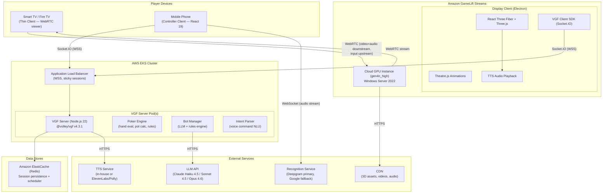
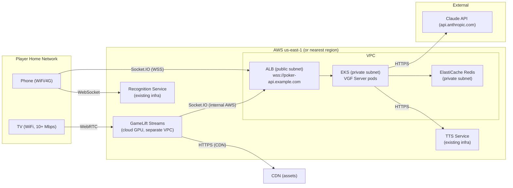
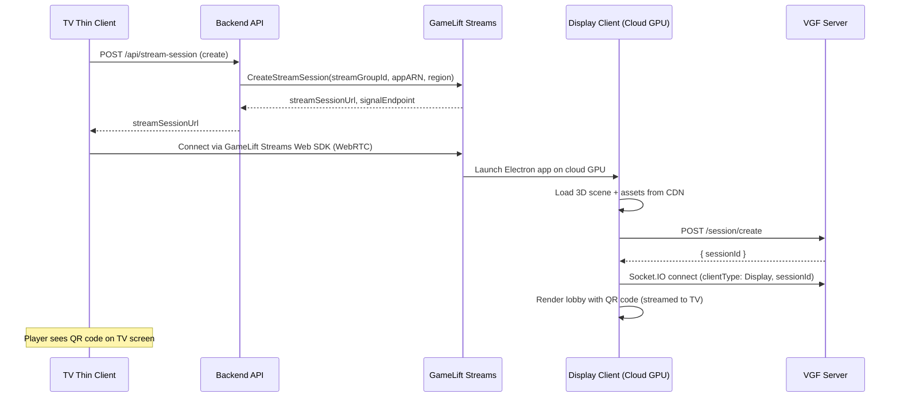
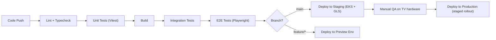
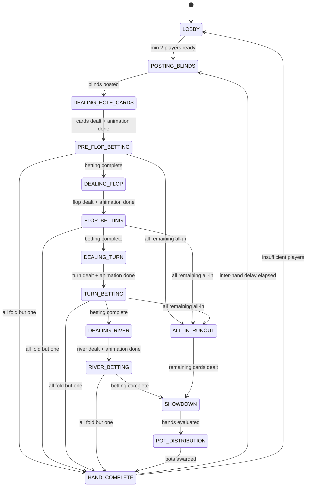
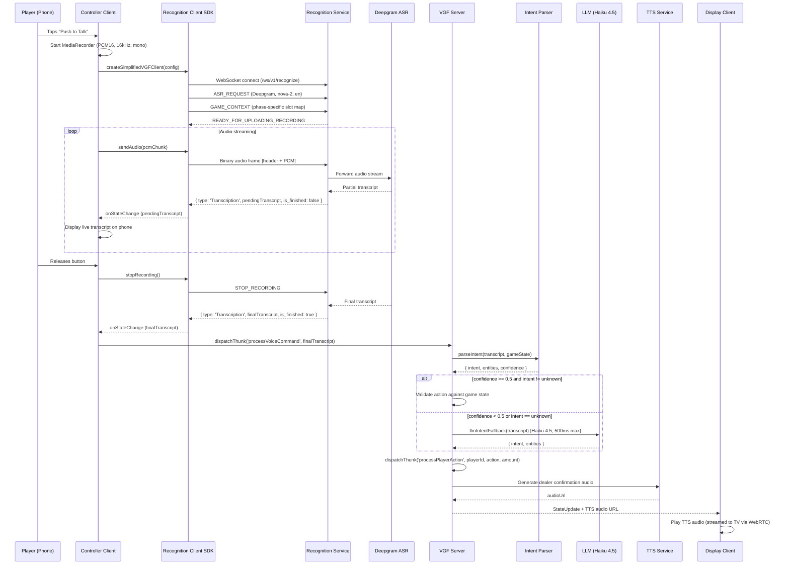
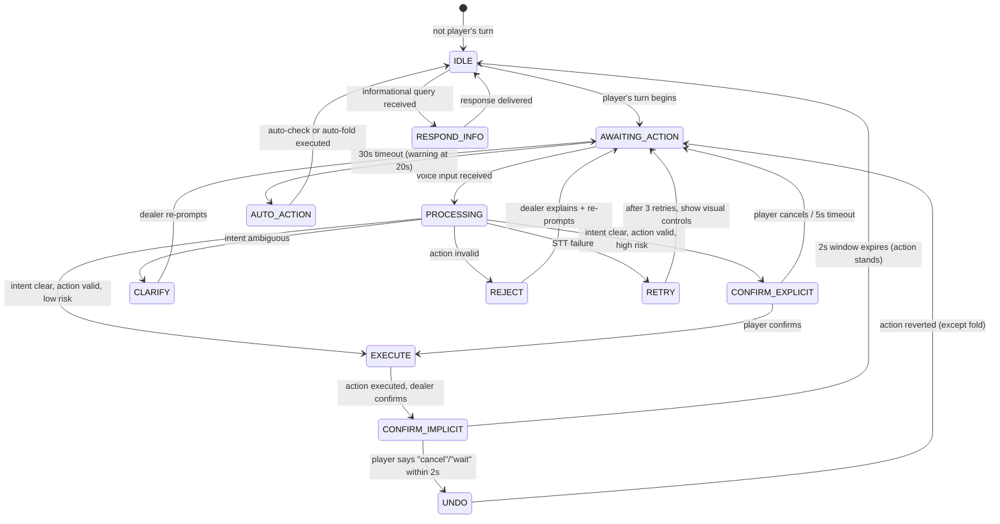
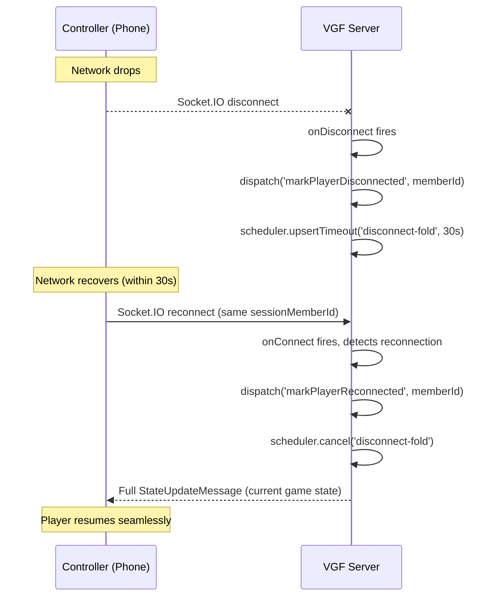

# Weekend Poker — Technical Design Document: Backend Systems

> **Version:** 1.0
> **Date:** 2026-02-09
> **Author:** Staff SWE 1 (Backend / Infrastructure)
> **Status:** Draft for Review

---

## Table of Contents

1. [High-Level System Architecture](#1-high-level-system-architecture)
2. [Infrastructure & Deployment](#2-infrastructure--deployment)
3. [VGF Server Design](#3-vgf-server-design)
4. [Voice Pipeline Architecture](#4-voice-pipeline-architecture)
5. [AI Bot System Design](#5-ai-bot-system-design)
6. [State Management](#6-state-management)
7. [API & Protocol Design](#7-api--protocol-design)

---

## 1. High-Level System Architecture

### 1.1 Component Diagram



### 1.2 Component Responsibilities

| Component | Technology | Responsibility |
|-----------|-----------|---------------|
| **TV Thin Client** | Browser + GameLift Streams Web SDK | Receives WebRTC video/audio stream; forwards TV remote input to cloud GPU instance |
| **Display Client** | React 19 + R3F + Theatre.js + VGF Client SDK (Electron on Windows) | 3D rendering, animations, shared game view, TTS audio playback; connects to VGF server via Socket.IO |
| **Controller Client** | React 19 + VGF Client SDK + Recognition Client SDK | Private card display, betting controls, push-to-talk voice capture; connects to VGF server via Socket.IO and Recognition Service via WebSocket |
| **VGF Server** | Node.js 22 + @volley/vgf v4.3.1 (`FailoverVGFServiceFactory`) | Server-authoritative game state, phase management, reducer/thunk execution, state broadcast to all clients |
| **Poker Engine** | TypeScript (server-side, pure functions) | Hand evaluation, pot/side-pot calculation, blind rotation, betting rule enforcement |
| **Bot Manager** | TypeScript + LLM APIs (server-side) | Bot decision pipeline (rules engine for Easy, LLM for Medium/Hard), personality, timing, chat generation |
| **Intent Parser** | TypeScript (server-side) | Transforms raw transcript text into structured poker actions (intent + entities) |
| **Redis** | Amazon ElastiCache (ioredis) | VGF session persistence (`RedisPersistence`), scheduler state (`RedisRuntimeSchedulerStore`) |
| **Recognition Service** | In-house (@volley/recognition-client-sdk) | Real-time STT: phone mic audio -> Deepgram/Google -> plain text transcript |
| **TTS Service** | In-house (apps/tts-service) or external API | Text -> spoken audio for dealer announcements and bot chat |
| **LLM API** | Claude API (Anthropic) | Bot decision-making (Medium/Hard), chat generation (all levels), dealer commentary |
| **GameLift Streams** | AWS | Cloud GPU provisioning, WebRTC video/audio delivery to TV |
| **CDN** | CloudFront or equivalent | Static asset delivery (3D models, textures, videos, audio files) to Display client on cloud GPU |

### 1.3 Transport Separation

The system uses four distinct transport protocols, each serving a specific data flow. They do not overlap.

| Data Flow | Protocol | Endpoints | Notes |
|-----------|----------|-----------|-------|
| Game state sync (all clients <-> server) | Socket.IO over WebSocket (WSS) | VGF server <-> Display client, Controller client(s) | VGF framework manages this entirely |
| Rendered game delivery (cloud -> TV) | WebRTC | GameLift Streams cloud GPU -> TV browser | Managed by GameLift Streams SDK; game code does not interact with WebRTC |
| Voice audio capture (phone -> STT) | WebSocket | Controller client -> Recognition Service | Managed by @volley/recognition-client-sdk |
| LLM / TTS API calls | HTTPS | VGF server -> Claude API, TTS Service | Server-side only; never client-facing |

### 1.4 Network Topology



Key points:

- The **VGF server must be reachable via a public WSS endpoint** (`wss://poker-api.example.com`). Both the Display client (inside GameLift Streams on AWS) and Controller clients (on players' home networks) connect to it.
- The **ALB must use sticky sessions** because Socket.IO requires connection affinity for the WebSocket upgrade handshake.
- The Display client on the cloud GPU connects to the VGF server over internal AWS networking (low latency). Controller clients traverse the public internet.
- Redis is in a private subnet, accessible only from EKS pods.

---

## 2. Infrastructure & Deployment

### 2.1 GameLift Streams — Cloud GPU Rendering

The Display client does not run on the TV. It runs on a GameLift Streams cloud GPU instance. The TV receives a WebRTC video stream of the rendered output.

#### Session Lifecycle



#### Configuration

```typescript
// GameLift Streams application config
const streamConfig = {
  streamClass: 'gen4n_high',
  runtimeEnvironment: 'WindowsServer2022',
  applicationExecutable: 'weekend-poker-display.exe', // Electron packaged
  sessionTimeoutMinutes: 240, // 4 hours for long poker nights
  regions: ['us-east-1', 'us-west-2', 'eu-west-1'],
  capacityMode: 'ON_DEMAND', // Switch to ALWAYS_ON for production at scale
}
```

#### Packaging

The Display client is packaged as an Electron application compiled to a Windows executable via electron-builder. This `.exe` is uploaded to S3 and referenced by the GameLift Streams application configuration. The Electron app runs on Windows Server 2022 on the cloud GPU.

### 2.2 EKS — VGF Server

The VGF game server runs on Amazon EKS (Elastic Kubernetes Service).

#### Pod Specification

```yaml
apiVersion: apps/v1
kind: Deployment
metadata:
  name: weekend-poker-vgf-server
spec:
  replicas: 2
  selector:
    matchLabels:
      app: weekend-poker-vgf
  template:
    metadata:
      labels:
        app: weekend-poker-vgf
    spec:
      containers:
        - name: vgf-server
          image: weekend-poker-vgf:latest
          ports:
            - containerPort: 3000
          resources:
            requests:
              cpu: "500m"
              memory: "512Mi"
            limits:
              cpu: "1000m"
              memory: "1Gi"
          env:
            - name: PORT
              value: "3000"
            - name: REDIS_URL
              valueFrom:
                secretKeyRef:
                  name: redis-credentials
                  key: url
            - name: ANTHROPIC_API_KEY
              valueFrom:
                secretKeyRef:
                  name: llm-credentials
                  key: anthropic-key
            - name: TTS_SERVICE_URL
              value: "https://tts.internal.example.com"
            - name: NODE_ENV
              value: "production"
          livenessProbe:
            httpGet:
              path: /health
              port: 3000
            initialDelaySeconds: 10
            periodSeconds: 15
          readinessProbe:
            httpGet:
              path: /health
              port: 3000
            initialDelaySeconds: 5
            periodSeconds: 10
```

#### Scaling Considerations

Each VGF server pod handles one or more game sessions. With 4 players per session and Socket.IO connections being lightweight, a single pod can comfortably handle ~50 concurrent sessions. Scaling is horizontal — add pods as session count grows.

**Important:** Socket.IO sticky sessions are mandatory. The ALB must route all requests from a given client to the same pod for the duration of the WebSocket connection. Configure the ALB target group with `stickiness.enabled=true` and `stickiness.type=lb_cookie`.

#### ALB Configuration

```yaml
apiVersion: networking.k8s.io/v1
kind: Ingress
metadata:
  name: vgf-server-ingress
  annotations:
    alb.ingress.kubernetes.io/scheme: internet-facing
    alb.ingress.kubernetes.io/target-type: ip
    alb.ingress.kubernetes.io/listen-ports: '[{"HTTPS": 443}]'
    alb.ingress.kubernetes.io/certificate-arn: arn:aws:acm:...
    alb.ingress.kubernetes.io/target-group-attributes: stickiness.enabled=true,stickiness.type=lb_cookie,stickiness.lb_cookie.duration_seconds=86400
spec:
  rules:
    - host: poker-api.example.com
      http:
        paths:
          - path: /
            pathType: Prefix
            backend:
              service:
                name: weekend-poker-vgf-server
                port:
                  number: 3000
```

### 2.3 Redis — State Persistence

Amazon ElastiCache (Redis) provides two critical functions:

1. **Session persistence** (`RedisPersistence`) — VGF game state survives server pod restarts
2. **Scheduler persistence** (`RedisRuntimeSchedulerStore`) — Pending timeouts/intervals (action timers, bot delays) survive failover

#### Configuration

```typescript
import { createClient } from 'ioredis'

const redisClient = new createClient({
  host: process.env.REDIS_URL,
  port: 6379,
  maxRetriesPerRequest: 3,
  retryStrategy: (times: number) => Math.min(times * 100, 3000),
  enableReadyCheck: true,
  lazyConnect: true,
})
```

ElastiCache should be configured with:
- **Engine:** Redis 7.x
- **Node type:** `cache.r7g.large` (sufficient for session state)
- **Multi-AZ:** Enabled (automatic failover)
- **Encryption in transit:** Enabled
- **Backup:** Daily automated snapshots

### 2.4 Deployment Pipeline



Build artefacts:
- **VGF Server:** Docker image -> ECR -> EKS deployment
- **Display Client:** Electron `.exe` -> S3 -> GameLift Streams application update
- **Controller Client:** Static web build -> S3 + CloudFront
- **TV Thin Client:** Packaged app -> app store submission (Fire TV, Tizen, webOS)

---

## 3. VGF Server Design

### 3.1 Game Ruleset Structure

The VGF game ruleset is the central configuration object. It defines all phases, reducers, thunks, and lifecycle hooks.

```typescript
import type {
  GameRuleset,
  GameReducer,
  GameThunk,
  Phase,
} from '@volley/vgf/server'

// ── Phase Enum ──────────────────────────────────────────────────
enum PokerPhase {
  Lobby = 'LOBBY',
  PostingBlinds = 'POSTING_BLINDS',
  DealingHoleCards = 'DEALING_HOLE_CARDS',
  PreFlopBetting = 'PRE_FLOP_BETTING',
  DealingFlop = 'DEALING_FLOP',
  FlopBetting = 'FLOP_BETTING',
  DealingTurn = 'DEALING_TURN',
  TurnBetting = 'TURN_BETTING',
  DealingRiver = 'DEALING_RIVER',
  RiverBetting = 'RIVER_BETTING',
  AllInRunout = 'ALL_IN_RUNOUT',
  Showdown = 'SHOWDOWN',
  PotDistribution = 'POT_DISTRIBUTION',
  HandComplete = 'HAND_COMPLETE',
}

// ── Ruleset ─────────────────────────────────────────────────────
const pokerRuleset: GameRuleset<PokerGameState> = {
  setup: (initialState) => createInitialState(initialState),

  reducers: {
    updatePlayerBet,
    foldPlayer,
    dealCommunityCards,
    rotateDealerButton,
    updatePot,
    awardPot,
    setActivePlayer,
    markPlayerDisconnected,
    markPlayerReconnected,
    updateDealerCharacter,
    updateBlindLevel,
    addBotPlayer,
    removeBotPlayer,
    updateEmotionalState,
    updateOpponentProfile,
    setPlayerLastAction,
    updateSessionHighlights,
  },

  thunks: {
    processPlayerAction,
    processVoiceCommand,
    startHand,
    evaluateHands,
    distributePot,
    botDecision,
    autoFoldPlayer,
    requestTTS,
    handleRebuy,
    sitOutPlayer,
    dealInPlayer,
    endSession,
  },

  phases: {
    [PokerPhase.Lobby]: lobbyPhase,
    [PokerPhase.PostingBlinds]: postingBlindsPhase,
    [PokerPhase.DealingHoleCards]: dealingHoleCardsPhase,
    [PokerPhase.PreFlopBetting]: preFlopBettingPhase,
    [PokerPhase.DealingFlop]: dealingFlopPhase,
    [PokerPhase.FlopBetting]: flopBettingPhase,
    [PokerPhase.DealingTurn]: dealingTurnPhase,
    [PokerPhase.TurnBetting]: turnBettingPhase,
    [PokerPhase.DealingRiver]: dealingRiverPhase,
    [PokerPhase.RiverBetting]: riverBettingPhase,
    [PokerPhase.AllInRunout]: allInRunoutPhase,
    [PokerPhase.Showdown]: showdownPhase,
    [PokerPhase.PotDistribution]: potDistributionPhase,
    [PokerPhase.HandComplete]: handCompletePhase,
  },

  onConnect: handleClientConnect,
  onDisconnect: handleClientDisconnect,
}
```

### 3.2 Phase Definitions

Each phase has lifecycle hooks (`onBegin`, `onEnd`), an automatic transition condition (`endIf`), and a `next` phase. Phase-specific reducers and thunks are scoped so they are only dispatchable during that phase.

#### Phase Flow



#### Betting Phase Definition (Example: FlopBetting)

All four betting phases (PreFlop, Flop, Turn, River) share the same structure. The differences are: (a) first-to-act logic, and (b) the `next` phase.

```typescript
const flopBettingPhase: Phase<PokerGameState> = {
  reducers: {
    // Phase-scoped: only available during FLOP_BETTING
    recordAction: recordBettingAction,
  },

  thunks: {
    placeBet: placeBetThunk,
    promptNextPlayer: promptNextPlayerThunk,
    triggerBotTurn: triggerBotTurnThunk,
  },

  onBegin: async (ctx) => {
    const state = ctx.getState()
    // Determine first active player left of dealer button
    const firstToAct = findFirstActivePlayerLeftOfButton(
      state.players,
      state.dealerIndex,
    )
    ctx.dispatch('setActivePlayer', firstToAct)

    // Set action timer for first player
    await setActionTimer(ctx, firstToAct)

    // If first player is a bot, trigger bot decision
    const player = state.players[firstToAct]
    if (player.isBot) {
      await ctx.dispatchThunk('triggerBotTurn', player.id)
    }

    // Request dealer TTS prompt
    await ctx.dispatchThunk('requestTTS', {
      type: 'turn_prompt',
      playerId: player.id,
      hasBet: false,
    })
  },

  endIf: (ctx) => {
    const state = ctx.getState()
    return isBettingRoundComplete(state) || isOnlyOnePlayerRemaining(state)
  },

  onEnd: async (ctx) => {
    // Cancel any pending action timers
    await ctx.scheduler.cancel(`action-timer:*`)
    await ctx.scheduler.cancel(`time-warning:*`)

    // Collect bets into pot
    const state = ctx.getState()
    const totalBets = state.players.reduce((sum, p) => sum + p.bet, 0)
    ctx.dispatch('updatePot', state.pot + totalBets)

    // Reset player bets to 0 for next round
    for (const player of state.players) {
      if (player.bet > 0) {
        ctx.dispatch('updatePlayerBet', player.id, 0)
      }
    }
  },

  next: (ctx) => {
    const state = ctx.getState()
    if (isOnlyOnePlayerRemaining(state)) return PokerPhase.HandComplete
    if (areAllRemainingPlayersAllIn(state)) return PokerPhase.AllInRunout
    return PokerPhase.DealingTurn
  },
}
```

#### Dealing Phase Definition (Example: DealingFlop)

```typescript
const dealingFlopPhase: Phase<PokerGameState> = {
  reducers: {},
  thunks: {},

  onBegin: async (ctx) => {
    const state = ctx.getState()
    const sessionId = ctx.getSessionId()
    const redisClient = ctx.getRedisClient()

    // Retrieve deck from Redis (server-side only; see Section 6.2)
    const deck = await getDeck(redisClient, sessionId)

    // Burn 1 card, deal 3 community cards
    const [burnCard, ...rest] = deck
    const flopCards = rest.slice(0, 3)
    const remainingDeck = rest.slice(3)

    ctx.dispatch('dealCommunityCards', flopCards)
    await setDeck(redisClient, sessionId, remainingDeck)

    // Request dealer TTS: "The flop: [card], [card], [card]."
    await ctx.dispatchThunk('requestTTS', {
      type: 'flop_announce',
      cards: flopCards,
    })

    // Set a timeout for animation + TTS completion
    await ctx.scheduler.upsertTimeout({
      name: 'dealing-animation-complete',
      delayMs: 2000, // 2s for flop deal animation
      mode: 'hold',
      dispatch: { kind: 'reducer', name: 'markDealingComplete', args: [] },
    })
  },

  endIf: (ctx) => {
    return ctx.getState().dealingComplete === true
  },

  onEnd: async (ctx) => {
    ctx.dispatch('markDealingComplete', false) // Reset flag
  },

  next: PokerPhase.FlopBetting,
}
```

### 3.3 Thunk Patterns

Thunks handle all async operations and complex validation. They follow the pattern: **validate -> execute -> broadcast**.

#### processPlayerAction

The core thunk that handles any player action (from voice, touch, or bot).

```typescript
const processPlayerAction: GameThunk<
  PokerGameState,
  [string, PlayerAction, number?]
> = async (ctx, playerId, action, amount?) => {
  const state = ctx.getState()
  const player = state.players.find((p) => p.id === playerId)

  // ── Validation ────────────────────────────────────────────
  if (!player) throw new Error(`Player ${playerId} not found`)
  if (state.players[state.activePlayerIndex]?.id !== playerId) {
    throw new Error('Not your turn')
  }

  const legalActions = getLegalActions(state, playerId)
  if (!legalActions.some((la) => la.action === action)) {
    // Request dealer TTS explaining why it's invalid
    await ctx.dispatchThunk('requestTTS', {
      type: 'invalid_action',
      playerId,
      attempted: action,
      legal: legalActions,
    })
    return
  }

  if (action === 'bet' || action === 'raise') {
    const { minBet, maxBet } = getBetLimits(state, playerId, action)
    if (amount === undefined) {
      await ctx.dispatchThunk('requestTTS', {
        type: 'amount_required',
        playerId,
        action,
      })
      return
    }
    if (amount < minBet || amount > maxBet) {
      await ctx.dispatchThunk('requestTTS', {
        type: 'amount_out_of_range',
        playerId,
        min: minBet,
        max: maxBet,
      })
      return
    }
  }

  // ── Execution ─────────────────────────────────────────────
  switch (action) {
    case 'fold':
      ctx.dispatch('foldPlayer', playerId)
      break
    case 'check':
      // No state change needed beyond recording the action
      break
    case 'call': {
      const callAmount = state.currentBet - player.bet
      ctx.dispatch('updatePlayerBet', playerId, state.currentBet)
      break
    }
    case 'bet':
      ctx.dispatch('updatePlayerBet', playerId, amount!)
      // currentBet is updated in the reducer
      break
    case 'raise':
      ctx.dispatch('updatePlayerBet', playerId, amount!)
      break
    case 'all_in':
      ctx.dispatch('updatePlayerBet', playerId, player.stack + player.bet)
      break
  }

  // Record the action for hand history and update player's lastAction
  ctx.dispatch('recordAction', {
    playerId,
    action,
    amount: amount ?? 0,
    timestamp: Date.now(),
  })
  ctx.dispatch('setPlayerLastAction', playerId, action)

  // Cancel action timer for this player
  await ctx.scheduler.cancel(`action-timer:${playerId}`)
  await ctx.scheduler.cancel(`time-warning:${playerId}`)

  // ── Dealer TTS confirmation ───────────────────────────────
  await ctx.dispatchThunk('requestTTS', {
    type: 'action_confirmation',
    playerId,
    action,
    amount,
  })

  // ── Advance to next player ────────────────────────────────
  // endIf will fire after state update and handle phase transition
  // if the round is not over, prompt the next player
  const updatedState = ctx.getState()
  if (
    !isBettingRoundComplete(updatedState) &&
    !isOnlyOnePlayerRemaining(updatedState)
  ) {
    await ctx.dispatchThunk('promptNextPlayer')
  }
}
```

### 3.4 Scheduler Usage

All timers use VGF's `ctx.scheduler` (backed by Redis) rather than `setTimeout`. This ensures timers survive server restarts.

**Scheduler `mode` values:**
- `'hold'` — The timer holds the current phase open: `endIf` is not evaluated until after the timer fires and its dispatched action completes. This prevents the phase from advancing while a timer (e.g. dealing animation, bot thinking delay) is still pending.
- `'normal'` (default) — The timer fires independently; `endIf` is evaluated on every state change regardless of pending timers.

| Timer | Name Pattern | Delay | Dispatches | Purpose |
|-------|-------------|-------|------------|---------|
| Action timer | `action-timer:{playerId}` | 30,000ms | `autoFoldPlayer` thunk | Auto-check/fold on timeout |
| Time warning | `time-warning:{playerId}` | 20,000ms | `requestTTS` thunk (10s warning) | Dealer says "Ten seconds" |
| Bot thinking delay | `bot-action:{botId}` | Variable (see Sec 5.6) | `processPlayerAction` thunk | Human-like pause before bot acts |
| Sit-out removal | `sit-out:{playerId}` | 3 hands (tracked by reducer) | `removeSittingOutPlayer` thunk | Remove inactive player after 3 hands |
| Disconnect fold | `disconnect-fold:{clientId}` | 30,000ms | `autoFoldPlayer` thunk | Auto-fold disconnected player |
| Inter-hand delay | `inter-hand-delay` | 3,000ms (configurable 1-5s) | `startNextHand` thunk | Pause between hands |
| Dealing animation | `dealing-animation-complete` | 1,500-2,000ms | `markDealingComplete` reducer | Syncs animation with game flow |

```typescript
// Example: setting the action timer when it becomes a player's turn
async function setActionTimer(
  ctx: IThunkContext<PokerGameState>,
  playerIndex: number,
): Promise<void> {
  const player = ctx.getState().players[playerIndex]
  if (!player || player.isBot) return

  // 20s warning
  await ctx.scheduler.upsertTimeout({
    name: `time-warning:${player.id}`,
    delayMs: 20_000,
    mode: 'hold',
    dispatch: {
      kind: 'thunk',
      name: 'requestTTS',
      args: [{ type: 'time_warning', playerId: player.id }],
    },
  })

  // 30s auto-action
  await ctx.scheduler.upsertTimeout({
    name: `action-timer:${player.id}`,
    delayMs: 30_000,
    mode: 'hold',
    dispatch: {
      kind: 'thunk',
      name: 'autoFoldPlayer',
      args: [player.id],
    },
  })
}
```

### 3.5 Session Lifecycle

#### onConnect

```typescript
const handleClientConnect: OnConnect<PokerGameState> = async (ctx) => {
  const members = ctx.getMembers()
  const clientId = ctx.getClientId()
  const member = members[clientId]

  if (member.clientType === ClientType.Controller) {
    const controllerCount = Object.values(members).filter(
      (m) =>
        m.clientType === ClientType.Controller &&
        m.connectionState === 'CONNECTED',
    ).length

    if (controllerCount > 4) {
      ctx.sessionManager.kickClient(clientId)
      return
    }

    // Check if this is a reconnection (sessionMemberId is stable)
    const existingPlayer = ctx.getState().players.find(
      (p) => p.id === member.sessionMemberId,
    )
    if (existingPlayer) {
      ctx.dispatch('markPlayerReconnected', member.sessionMemberId)
      await ctx.scheduler.cancel(`disconnect-fold:${clientId}`)
    }
  }
}
```

#### onDisconnect

```typescript
const handleClientDisconnect: OnDisconnect<PokerGameState> = async (ctx) => {
  const clientId = ctx.getClientId()
  const members = ctx.getMembers()
  const member = members[clientId]

  if (member.clientType === ClientType.Controller) {
    ctx.dispatch('markPlayerDisconnected', member.sessionMemberId)

    const state = ctx.getState()
    const player = state.players.find(
      (p) => p.id === member.sessionMemberId,
    )

    // If it's this player's turn, start disconnect timer
    if (
      player &&
      state.players[state.activePlayerIndex]?.id === player.id
    ) {
      await ctx.scheduler.upsertTimeout({
        name: `disconnect-fold:${clientId}`,
        delayMs: 30_000,
        mode: 'hold',
        dispatch: {
          kind: 'thunk',
          name: 'autoFoldPlayer',
          args: [player.id],
        },
      })
    }
  }
}
```

### 3.6 Server Initialisation

```typescript
import {
  FailoverVGFServiceFactory,
  MemoryStorage,
  RedisPersistence,
  SocketIOTransport,
  RedisRuntimeSchedulerStore,
} from '@volley/vgf/server'
import express from 'express'
import { createServer } from 'http'

const app = express()
const httpServer = createServer(app)

// Health check endpoint
app.get('/health', (_, res) => res.json({ status: 'ok' }))

const storage = new MemoryStorage({ ttlSeconds: 14400 }) // 4 hours
const persistence = new RedisPersistence(redisClient)
const transport = new SocketIOTransport(httpServer, {
  cors: {
    origin: [
      'https://poker-controller.example.com',  // Controller client
      /\.gameliftstreams\.amazonaws\.com$/,       // Display client on GameLift Streams
    ],
    credentials: true,
  },
})
const runtimeStore = new RedisRuntimeSchedulerStore(redisClient)

const server = FailoverVGFServiceFactory.create<PokerGameState>({
  game: pokerRuleset,
  port: 3000,
  logger,
  app,
  httpServer,
  transport,
  storage,
  persistence,
  runtimeStore,
})

server.start()
```

**Production must use `FailoverVGFServiceFactory`** (not `VGFServiceFactory`). This provides automatic Redis failover and reconnection, which is essential during ElastiCache maintenance or transient failures.

---

## 4. Voice Pipeline Architecture

### 4.1 End-to-End Sequence



### 4.2 Recognition Client Configuration

The Controller client initialises the recognition SDK with poker-specific configuration. The slot map changes per game phase to boost recognition accuracy for context-relevant vocabulary.

```typescript
import {
  createSimplifiedVGFClient,
  RecognitionProvider,
  AudioEncoding,
  STAGES,
  RecognitionContextTypeV1,
} from '@volley/recognition-client-sdk'

function createRecognitionClient(
  phase: PokerPhase,
  onStateChange: (state: RecognitionState) => void,
) {
  return createSimplifiedVGFClient({
    stage: STAGES.PRODUCTION,
    asrRequestConfig: {
      provider: RecognitionProvider.DEEPGRAM,
      model: 'nova-2',
      language: 'en',
      sampleRate: 16000,
      encoding: AudioEncoding.LINEAR16,
      interimResults: true,
    },
    gameContext: {
      type: RecognitionContextTypeV1.GAME_CONTEXT,
      gameId: 'weekend-poker',
      gamePhase: phase,
      slotMap: getSlotMapForPhase(phase),
    },
    onStateChange,
  })
}

function getSlotMapForPhase(
  phase: PokerPhase,
): Record<string, string[]> {
  switch (phase) {
    case PokerPhase.Lobby:
      return {
        command: ['ready', 'start', 'settings', 'easy', 'medium', 'hard'],
      }
    case PokerPhase.PreFlopBetting:
    case PokerPhase.FlopBetting:
    case PokerPhase.TurnBetting:
    case PokerPhase.RiverBetting:
      return {
        action: ['check', 'call', 'raise', 'fold', 'all in', 'bet'],
        amount: [
          'fifty', '50', 'hundred', '100', 'two hundred', '200',
          'three hundred', '300', 'five hundred', '500', 'thousand', '1000',
        ],
        relative: [
          'pot', 'half pot', 'min raise', 'minimum',
          'three x', '3x', 'two x', '2x',
        ],
      }
    case PokerPhase.Showdown:
    case PokerPhase.HandComplete:
      return {
        command: ['next hand', 'leave table', 'rebuy', 'cash out', 'sit out'],
      }
    default:
      return {
        query: ['what is the pot', 'how many chips', 'what is the bet',
          'what do i have', 'what are the blinds', 'help', 'repeat'],
      }
  }
}
```

### 4.3 Intent Parser

The intent parser transforms a raw transcript string into a structured poker action. The primary path is a regex/pattern-based pure function (no LLM call — <10ms for ~90% of inputs). When the regex parser returns `intent: 'unknown'` or low confidence (<0.5), a **fast LLM fallback** (Claude Haiku 4.5, ~300-500ms) is invoked to classify the intent before giving up. This hybrid approach aligns with ADR-007 in the Architecture TDD.

```typescript
// ── Types ───────────────────────────────────────────────────────
interface ParsedIntent {
  intent: PokerIntent
  entities: {
    amount?: number
    amountType?: 'absolute' | 'bb_multiple' | 'pot_fraction'
  }
  confidence: number
  requiresConfirmation: boolean
  raw: string
}

type PokerIntent =
  | 'fold' | 'check' | 'call' | 'bet' | 'raise' | 'all_in'
  | 'query_pot' | 'query_stack' | 'query_bet' | 'query_call_amount'
  | 'query_my_cards' | 'query_blinds' | 'show_hand_rankings'
  | 'repeat' | 'help'
  | 'sit_out' | 'deal_me_in' | 'rebuy' | 'cash_out'
  | 'pause' | 'resume'
  | 'confirm' | 'cancel'
  | 'unknown'

// ── Parser ──────────────────────────────────────────────────────
function parseIntent(
  transcript: string,
  gameState: PokerGameState,
  playerId: string,
): ParsedIntent {
  const normalised = transcript.toLowerCase().trim()

  // ── Action intents (priority order) ───────────────────────
  if (matchesAny(normalised, ALL_IN_PATTERNS))
    return { intent: 'all_in', entities: {}, confidence: 0.95,
      requiresConfirmation: true, raw: transcript }

  if (matchesAny(normalised, FOLD_PATTERNS))
    return { intent: 'fold', entities: {}, confidence: 0.95,
      requiresConfirmation: false, raw: transcript }

  if (matchesAny(normalised, CHECK_PATTERNS)) {
    // "Pass" is ambiguous — if facing a bet, ask clarification
    if (normalised.includes('pass') && gameState.currentBet > 0) {
      return { intent: 'unknown', entities: {}, confidence: 0.5,
        requiresConfirmation: false, raw: transcript }
    }
    return { intent: 'check', entities: {}, confidence: 0.9,
      requiresConfirmation: false, raw: transcript }
  }

  // Raise/bet with amount parsing
  const raiseMatch = matchRaise(normalised, gameState)
  if (raiseMatch) return raiseMatch

  const betMatch = matchBet(normalised, gameState)
  if (betMatch) return betMatch

  if (matchesAny(normalised, CALL_PATTERNS))
    return { intent: 'call', entities: {}, confidence: 0.9,
      requiresConfirmation: false, raw: transcript }

  // ── Informational intents ─────────────────────────────────
  if (matchesAny(normalised, POT_QUERY_PATTERNS))
    return { intent: 'query_pot', entities: {}, confidence: 0.9,
      requiresConfirmation: false, raw: transcript }

  // ... (similar patterns for other informational intents)

  // ── Confirmation / cancellation ───────────────────────────
  if (matchesAny(normalised, CONFIRM_PATTERNS))
    return { intent: 'confirm', entities: {}, confidence: 0.9,
      requiresConfirmation: false, raw: transcript }

  if (matchesAny(normalised, CANCEL_PATTERNS))
    return { intent: 'cancel', entities: {}, confidence: 0.9,
      requiresConfirmation: false, raw: transcript }

  return { intent: 'unknown', entities: {}, confidence: 0.0,
    requiresConfirmation: false, raw: transcript }
}
```

#### LLM Fallback for Ambiguous Inputs (ADR-007)

When the regex parser returns `intent: 'unknown'` or `confidence < 0.5`, the `processVoiceCommand` thunk routes the transcript to a fast LLM call before giving up.

```typescript
async function llmIntentFallback(
  transcript: string,
  gameState: PokerGameState,
  playerId: string,
): Promise<ParsedIntent> {
  const legalActions = getLegalActions(gameState, playerId)
  const prompt = `You are a poker voice command classifier. The player said:
"${transcript}"

Game phase: ${gameState.phase}
Current bet: ${gameState.currentBet}
Pot: ${gameState.pot}
Legal actions: ${legalActions.map((a) => a.action).join(', ')}

Classify the intent as one of: ${POKER_INTENTS.join(', ')}
If the input includes an amount, extract it.
If you cannot determine the intent, respond with "unknown".

Respond with JSON only:
{ "intent": "...", "amount": <number or null>, "confidence": <0.0-1.0> }`

  try {
    const response = await anthropicClient.messages.create(
      {
        model: 'claude-haiku-4-5-20251001',
        max_tokens: 100,
        temperature: 0.0,
        messages: [{ role: 'user', content: prompt }],
      },
      { timeout: 500 }, // Hard 500ms timeout — must stay fast
    )

    const text = response.content[0].type === 'text'
      ? response.content[0].text : ''
    const parsed = JSON.parse(text)

    return {
      intent: parsed.intent ?? 'unknown',
      entities: parsed.amount
        ? { amount: parsed.amount, amountType: 'absolute' }
        : {},
      confidence: parsed.confidence ?? 0.5,
      requiresConfirmation: false,
      raw: transcript,
    }
  } catch {
    // LLM timeout or parse failure — fall through to 'unknown'
    return {
      intent: 'unknown', entities: {}, confidence: 0.0,
      requiresConfirmation: false, raw: transcript,
    }
  }
}
```

The `processVoiceCommand` thunk orchestrates the two-tier pipeline:

```typescript
const processVoiceCommand: GameThunk<
  PokerGameState,
  [string]
> = async (ctx, transcript) => {
  const state = ctx.getState()
  const playerId = ctx.getClientMemberId()

  // Tier 1: Regex-based parser (<10ms, handles ~90% of inputs)
  let parsed = parseIntent(transcript, state, playerId)

  // Tier 2: LLM fallback for ambiguous/unknown inputs (~300-500ms)
  if (parsed.intent === 'unknown' || parsed.confidence < 0.5) {
    parsed = await llmIntentFallback(transcript, state, playerId)
  }

  // Still unknown after LLM — give up, re-prompt
  if (parsed.intent === 'unknown') {
    await ctx.dispatchThunk('requestTTS', {
      type: 'unrecognised_command',
      playerId,
      transcript,
    })
    return
  }

  // Handle informational queries (no game state change)
  if (parsed.intent.startsWith('query_') || parsed.intent === 'help'
      || parsed.intent === 'repeat') {
    await ctx.dispatchThunk('requestTTS', {
      type: 'info_response',
      playerId,
      query: parsed.intent,
    })
    return
  }

  // Handle confirmation/cancellation for pending actions
  if (parsed.intent === 'confirm' || parsed.intent === 'cancel') {
    // Handled by voice state machine (see Section 4.4)
    return
  }

  // Map intent to PlayerAction and dispatch
  const action = intentToAction(parsed.intent)
  if (action) {
    await ctx.dispatchThunk(
      'processPlayerAction', playerId, action, parsed.entities.amount,
    )
  }
}
```

#### Bet Amount Parsing

```typescript
function parseAmount(
  text: string,
  gameState: PokerGameState,
): { amount: number; type: 'absolute' | 'bb_multiple' | 'pot_fraction' } | null {
  const normalised = text.toLowerCase()

  // Pot fractions: "half pot", "pot", "two thirds pot"
  if (/\b(pot|the pot)\b/.test(normalised)) {
    if (/\bhalf\b/.test(normalised))
      return { amount: Math.floor(gameState.pot / 2), type: 'pot_fraction' }
    if (/\b(two.thirds|2\/3)\b/.test(normalised))
      return { amount: Math.floor((gameState.pot * 2) / 3), type: 'pot_fraction' }
    if (/\b(three.quarters|3\/4)\b/.test(normalised))
      return { amount: Math.floor((gameState.pot * 3) / 4), type: 'pot_fraction' }
    return { amount: gameState.pot, type: 'pot_fraction' }
  }

  // BB multiples: "3x", "three times"
  const bbMultipleMatch = normalised.match(
    /(\d+)\s*(?:x|times)/i,
  )
  if (bbMultipleMatch) {
    const multiplier = parseInt(bbMultipleMatch[1], 10)
    return { amount: multiplier * gameState.blindLevel.bigBlind, type: 'bb_multiple' }
  }

  // Exact numbers: "200", "two hundred"
  // extractNumber handles both digit strings and English word numbers
  const numericAmount = extractNumber(normalised)
  if (numericAmount !== null) {
    return { amount: numericAmount, type: 'absolute' }
  }

  // Min/max keywords
  if (/\b(min|minimum)\b/.test(normalised)) {
    return { amount: gameState.blindLevel.bigBlind, type: 'absolute' }
  }

  return null
}
```

#### extractNumber — Numeric Text Parsing

```typescript
const WORD_TO_NUMBER: Record<string, number> = {
  zero: 0, one: 1, two: 2, three: 3, four: 4, five: 5,
  six: 6, seven: 7, eight: 8, nine: 9, ten: 10,
  eleven: 11, twelve: 12, thirteen: 13, fourteen: 14, fifteen: 15,
  sixteen: 16, seventeen: 17, eighteen: 18, nineteen: 19, twenty: 20,
  thirty: 30, forty: 40, fifty: 50, sixty: 60, seventy: 70,
  eighty: 80, ninety: 90,
}

const MULTIPLIERS: Record<string, number> = {
  hundred: 100, thousand: 1000, k: 1000,
}

/**
 * Extracts a numeric value from text. Handles:
 * - Digit strings: "200", "1500"
 * - English words: "two hundred", "fifty", "three thousand"
 * - Mixed: "5 hundred"
 * Returns null if no number is found.
 */
function extractNumber(text: string): number | null {
  // Try direct numeric match first
  const directMatch = text.match(/\b(\d+)\b/)
  if (directMatch) return parseInt(directMatch[1], 10)

  // Try word-based number parsing
  const words = text.split(/\s+/)
  let total = 0
  let current = 0
  let found = false

  for (const word of words) {
    const base = WORD_TO_NUMBER[word]
    const mult = MULTIPLIERS[word]

    if (base !== undefined) {
      current += base
      found = true
    } else if (mult !== undefined) {
      current = (current === 0 ? 1 : current) * mult
      found = true
    }
  }

  total += current
  return found ? total : null
}
```

#### Raise Disambiguation

"Raise 100" is ambiguous — it could mean "raise TO 100" or "raise BY 100". The resolution strategy:

```typescript
function resolveRaiseAmount(
  parsedAmount: number,
  currentBet: number,
  gameState: PokerGameState,
): { total: number; isAmbiguous: boolean; requiresConfirmation: boolean } {
  // "Raise to [amount]" or "Make it [amount]" — always absolute
  // (handled upstream by matching "to" keyword)

  // If amount > current bet, interpret as "raise TO amount"
  if (parsedAmount > currentBet) {
    return { total: parsedAmount, isAmbiguous: false, requiresConfirmation: false }
  }

  // If amount <= current bet, both interpretations are plausible.
  // Ask the player for confirmation rather than silently guessing.
  const raiseToTotal = parsedAmount
  const raiseByTotal = currentBet + parsedAmount

  return {
    total: raiseByTotal,       // default interpretation: raise BY
    isAmbiguous: true,
    requiresConfirmation: true, // triggers CONFIRM_EXPLICIT state
  }
}

// When requiresConfirmation is true, the processVoiceCommand thunk
// enters the CONFIRM_EXPLICIT voice state and the dealer asks:
//   "Did you mean raise TO {raiseToTotal}, or raise BY {parsedAmount}
//    to a total of {raiseByTotal}?"
// The player then says "to" or "by" (or the full amount) to confirm.
// If no response within 5 seconds, the action is cancelled and the
// player is re-prompted for their turn.
```

### 4.4 Voice Command State Machine



### 4.5 TTS Integration

TTS audio is generated server-side and sent to the Display client for playback. The Display client plays the audio through the system audio device, and GameLift Streams captures it as part of the WebRTC stream.

```typescript
interface TTSRequest {
  text: string
  voiceId: string        // Dealer or bot voice ID
  priority: 'high' | 'normal' | 'low'
  ssml?: boolean
}

interface TTSResponse {
  audioUrl: string       // URL to audio file (pre-signed S3 or direct)
  durationMs: number
}

// Server-side TTS thunk
const requestTTS: GameThunk<PokerGameState, [TTSEvent]> = async (
  ctx,
  event,
) => {
  const state = ctx.getState()
  const dealerConfig = getDealerConfig(state.dealerCharacterId)
  const text = generateDealerText(event, state, dealerConfig)

  // Enqueue TTS request — Display client picks this up from state
  ctx.dispatch('enqueueTTSMessage', {
    text,
    voiceId: dealerConfig.voiceId,
    priority: event.type === 'action_confirmation' ? 'high' : 'normal',
    timestamp: Date.now(),
  })
}
```

#### TTS Queue Priority

Dealer announcements and bot chat share a single TTS queue on the Display client. Priority rules:

1. **Dealer action confirmations** — always play first (high priority)
2. **Dealer game announcements** — normal priority
3. **Bot chat messages** — low priority; may be truncated if the game needs to advance
4. Bot chat uses a separate voice ID from the dealer
5. Bot chat is played at 85% volume relative to dealer announcements
6. Messages queue sequentially — never overlap

#### Queue Overflow Policy

The `enqueueTTSMessage` reducer enforces a **maximum queue depth of 5 messages**. When a new message arrives and the queue is full:

1. If the new message is `low` priority, it is silently dropped.
2. If the new message is `normal` or `high` priority, the oldest `low`-priority message is evicted to make room. If no `low`-priority messages exist, the oldest `normal`-priority message is evicted.
3. `high`-priority messages are never evicted.

This prevents unbounded queue growth during rapid-fire bot chat (e.g. quick folds where multiple bots act in succession) whilst ensuring dealer confirmations always get through.

### 4.6 Latency Budget

| Component | Target | Maximum |
|-----------|--------|---------|
| Phone mic -> Recognition Service | ~100ms | 200ms |
| STT processing (Deepgram) | 200ms | 500ms |
| Final transcript after stop | 500ms | 2,000ms |
| Intent parsing | <10ms | 50ms |
| Game state validation | <10ms | 50ms |
| TTS generation | 200ms | 500ms |
| **Total: voice command -> dealer confirmation** | **~1,000ms** | **~3,300ms** |

The 200-800ms interim transcript latency means players see live text feedback on their phone while speaking, which provides immediate responsiveness even though the full pipeline takes longer.

---

## 5. AI Bot System Design

### 5.1 Architecture Overview

```mermaid
graph TB
    subgraph "Bot Decision Pipeline"
        Trigger["Game Engine signals bot's turn"]
        Trigger --> GCBuilder["Game Context Builder"]
        GCBuilder --> HandAnalyser["Hand Analyser<br/>(pre-compute strength, draws, odds)"]
        HandAnalyser --> OpponentTracker["Opponent Tracker<br/>(VPIP, PFR, aggression)"]
        OpponentTracker --> Decision{"Difficulty?"}
        Decision -- "Easy" --> RulesEngine["Rules-Based Decision Engine"]
        Decision -- "Medium / Hard" --> PromptBuilder["LLM Prompt Builder"]
        RulesEngine --> ChatLLM["LLM Chat Generator<br/>(Haiku 4.5, temp 0.9-1.0)"]
        PromptBuilder --> FullLLM["LLM Decision + Chat<br/>(Sonnet 4.5 / Opus 4.6)"]
        ChatLLM --> ResponseParser["Response Parser"]
        FullLLM --> ResponseParser
        ResponseParser --> ActionValidator["Action Validator"]
        ActionValidator --> TimingEngine["Timing Engine<br/>(artificial delay)"]
        TimingEngine --> Execute["Execute via processPlayerAction"]
        Execute --> TTSQueue["TTS Queue<br/>(dealer confirmation + bot chat)"]
    end
```



### 5.2 Bot Configuration

```typescript
interface BotConfig {
  id: string
  name: string
  difficulty: 'easy' | 'medium' | 'hard'
  personality: BotPersonality
  model: string                    // LLM model ID
  systemPrompt: string             // Cached system prompt
  emotionalState: EmotionalState
  opponentNotes: Map<string, OpponentProfile>
  timingProfile: TimingProfile
}

interface BotPersonality {
  archetype: string               // e.g. "The optimistic newcomer"
  chatStyle: string               // e.g. "Cheerful, easily impressed"
  ttsVoiceId: string              // Distinct TTS voice for this bot
  chatFrequency: ChatFrequencyConfig
  catchphrases: string[]
}

interface EmotionalState {
  tilt: number                    // 0.0 = calm, 1.0 = fully tilted
  confidence: number              // 0.0 = timid, 1.0 = overconfident
  boredom: number                 // 0.0 = engaged, 1.0 = distracted
}

interface TimingProfile {
  obviousFoldMs: [number, number]     // [min, max]
  standardCallMs: [number, number]
  standardRaiseMs: [number, number]
  bigDecisionMs: [number, number]
  bluffMs: [number, number]
}

interface OpponentProfile {
  handsPlayed: number
  handsWon: number
  vpip: number                    // voluntarily put in pot %
  pfr: number                    // pre-flop raise %
  aggression: number             // (bets + raises) / (bets + raises + calls + checks)
  foldToCBet: number             // fold to continuation bet %
  showdownWinRate: number
  lastActions: PlayerAction[]    // last N actions for short-term patterns
}
```

### 5.3 Model Selection by Difficulty

| Difficulty | Decision Engine | LLM Model | LLM Role | Temperature |
|------------|----------------|-----------|----------|-------------|
| **Easy** | Rules-based decision tree | Claude Haiku 4.5 | Chat generation only | 0.9-1.0 |
| **Medium** | LLM-driven | Claude Sonnet 4.5 | Full decision + chat | 0.4-0.6 |
| **Hard** | LLM-driven | Claude Opus 4.6 | Full decision + chat | 0.2-0.4 (occasional 0.6-0.8 for bluffs) |

### 5.4 Easy Bot — Rules Engine

Easy bots use a deterministic rules engine with controlled randomness. The LLM is called only for chat generation.

```typescript
function easyBotDecision(
  gameContext: GameContext,
  botConfig: BotConfig,
): { action: PlayerAction; amount?: number } {
  const { holeCards, communityCards, currentBet, stack, pot, legalActions } =
    gameContext
  const handAnalysis = gameContext.handAnalysis

  // ── Pre-flop ──────────────────────────────────────────────
  if (communityCards.length === 0) {
    return easyPreFlopDecision(holeCards, currentBet, stack, gameContext)
  }

  // ── Post-flop ─────────────────────────────────────────────
  const strength = handAnalysis.handRank

  // Monster (trips+, top two pair): bet 50% pot or check-call
  if (strength >= 7) {
    if (Math.random() < 0.7 && canBet(legalActions)) {
      return { action: 'bet', amount: Math.floor(pot * 0.5) }
    }
    if (canCall(legalActions)) return { action: 'call' }
    return { action: 'check' }
  }

  // Strong (top pair good kicker, overpair)
  if (strength >= 5) {
    if (Math.random() < 0.5 && canBet(legalActions)) {
      return { action: 'bet', amount: Math.floor(pot * 0.5) }
    }
    if (canCall(legalActions)) return { action: 'call' }
    return { action: 'check' }
  }

  // Medium (middle pair, weak top pair)
  if (strength >= 3) {
    if (canCheck(legalActions)) return { action: 'check' }
    if (currentBet > pot * 0.6) {
      return Math.random() < 0.4 ? { action: 'fold' } : { action: 'call' }
    }
    return { action: 'call' }
  }

  // Draw (flush/straight draw)
  if (handAnalysis.outs > 0) {
    if (canCheck(legalActions)) return { action: 'check' }
    return Math.random() < 0.9 ? { action: 'call' } : { action: 'fold' }
  }

  // Nothing
  if (canCheck(legalActions)) return { action: 'check' }
  // 5% accidental bluff
  if (Math.random() < 0.05 && canBet(legalActions)) {
    return { action: 'bet', amount: Math.floor(pot * 0.5) }
  }
  return { action: 'fold' }
}
```

### 5.5 Medium/Hard Bot — LLM Decision Pipeline

```typescript
const botDecision: GameThunk<PokerGameState, [string]> = async (
  ctx,
  botId,
) => {
  const state = ctx.getState()
  const botPlayer = state.players.find((p) => p.id === botId)
  if (!botPlayer?.isBot || !botPlayer.botConfig) return

  const config = botPlayer.botConfig
  const sessionId = ctx.getSessionId()
  const gameContext = buildGameContext(state, botId, ctx.getMembers(), sessionId)
  const handAnalysis = analyseHand(gameContext)
  const opponentProfiles = config.opponentNotes

  let decision: BotDecision

  if (config.difficulty === 'easy') {
    // Rules engine for action, LLM for chat only
    const rulesAction = easyBotDecision(gameContext, config)
    const chatResponse = await generateEasyBotChat(
      config, gameContext, rulesAction,
    )
    decision = {
      thinking: 'Rules-based decision',
      action: rulesAction.action,
      amount: rulesAction.amount,
      chat: chatResponse.chat,
      // confidence is omitted for Easy bots — the timing engine
      // skips confidence-based modulation when difficulty === 'easy'
      // (see Section 5.6).
    }
  } else {
    // Full LLM decision for Medium/Hard
    const prompt = buildLLMPrompt(config, gameContext, handAnalysis, opponentProfiles)
    const llmResponse = await callLLM(config.model, prompt, config.difficulty)

    decision = parseDecisionResponse(llmResponse)

    // Validate the LLM's action is legal
    const legalActions = getLegalActions(state, botId)
    if (!legalActions.some((la) => la.action === decision.action)) {
      ctx.logger.warn('Bot LLM returned illegal action, using fallback', {
        botId, attempted: decision.action,
      })
      decision = fallbackDecision(gameContext, handAnalysis)
    }

    // Validate amount is in range
    if (decision.action === 'bet' || decision.action === 'raise') {
      const { minBet, maxBet } = getBetLimits(state, botId, decision.action)
      if (decision.amount !== undefined) {
        decision.amount = Math.max(minBet, Math.min(maxBet, decision.amount))
      }
    }
  }

  // Update opponent tracking
  // (updates happen after action is resolved in processPlayerAction)

  // Calculate artificial thinking delay
  const thinkingDelay = calculateThinkingDelay(config, decision)

  // Schedule the action after the thinking delay
  await ctx.scheduler.upsertTimeout({
    name: `bot-action:${botId}`,
    delayMs: thinkingDelay,
    mode: 'hold',
    dispatch: {
      kind: 'thunk',
      name: 'processPlayerAction',
      args: [botId, decision.action, decision.amount],
    },
  })

  // If chat is present, queue it for TTS (plays after dealer confirmation)
  if (decision.chat) {
    ctx.dispatch('enqueueTTSMessage', {
      text: decision.chat,
      voiceId: config.personality.ttsVoiceId,
      priority: 'low', // Lower than dealer
      timestamp: Date.now(),
    })
  }
}
```

### 5.5.1 Game Context Builder

`buildGameContext` constructs the full game context for a bot's decision, including retrieving the bot's hole cards from the server-side `botHoleCardsStore` map (keyed by sessionId + botId; see Section 6.2 for storage details).

```typescript
// Server-side module-level storage (NOT in game state).
// Keyed by sessionId -> botId to avoid collisions across sessions on the
// same pod. Bot hole cards are ephemeral — set during DealingHoleCards
// and cleared during HandComplete.onEnd. In-memory storage is acceptable
// because they are redealt each hand; a pod crash simply triggers a new
// hand via VGF state recovery.
const botHoleCardsStore = new Map<string, Map<string, [Card, Card]>>()
  // sessionId -> (botId -> hole cards)

function setBotHoleCards(
  sessionId: string,
  botId: string,
  cards: [Card, Card],
): void {
  if (!botHoleCardsStore.has(sessionId)) {
    botHoleCardsStore.set(sessionId, new Map())
  }
  botHoleCardsStore.get(sessionId)!.set(botId, cards)
}

function getBotHoleCards(
  sessionId: string,
  botId: string,
): [Card, Card] | undefined {
  return botHoleCardsStore.get(sessionId)?.get(botId)
}

function clearBotHoleCards(sessionId: string): void {
  botHoleCardsStore.delete(sessionId)
}

function buildGameContext(
  state: PokerGameState,
  botId: string,
  members: SessionMemberRecord,
  sessionId: string,
): GameContext {
  const player = state.players.find((p) => p.id === botId)!
  const holeCards = getBotHoleCards(sessionId, botId)
  if (!holeCards) {
    throw new Error(`No hole cards found for bot ${botId} in session ${sessionId}`)
  }

  const seatIndex = player.seatIndex
  const dealerOffset = (seatIndex - state.dealerIndex + state.players.length) % state.players.length
  const position = getPositionLabel(dealerOffset, state.players.length)

  return {
    handNumber: state.handNumber,
    position,
    holeCards,
    communityCards: state.communityCards,
    pot: state.pot,
    currentBet: state.currentBet,
    stack: player.stack,
    bet: player.bet,
    blinds: {
      small: state.blindLevel.smallBlind,
      big: state.blindLevel.bigBlind,
    },
    bettingRound: getBettingRound(state.phase),
    bettingHistory: state.handHistory.filter(
      (a) => a.phase === state.phase,
    ),
    players: state.players.map((p) => ({
      id: p.id,
      name: p.name,
      stack: p.stack,
      bet: p.bet,
      status: p.status,
      isBot: p.isBot,
      seatIndex: p.seatIndex,
    })),
    legalActions: getLegalActions(state, botId),
    handAnalysis: null as any, // populated by caller after this returns
  }
}
```

### 5.6 Timing Engine

The artificial delay must feel human. It is calculated as: `target_delay - actual_processing_time`. If the LLM call took 1.5s and the target is 3s, add only 1.5s of delay.

```typescript
function calculateThinkingDelay(
  config: BotConfig,
  decision: BotDecision,
): number {
  const profile = config.timingProfile
  let range: [number, number]

  switch (decision.action) {
    case 'fold':
      range = profile.obviousFoldMs
      break
    case 'call':
      range = profile.standardCallMs
      break
    case 'bet':
    case 'raise':
      range = decision.amount && decision.amount > 0.5 * /* player stack */0
        ? profile.bigDecisionMs
        : profile.standardRaiseMs
      break
    case 'all_in':
      range = profile.bigDecisionMs
      break
    default:
      range = profile.standardCallMs
  }

  // Modulate by confidence (Medium/Hard bots)
  if (config.difficulty !== 'easy' && decision.confidence !== undefined) {
    // High confidence = faster; low confidence = slower
    const confidenceFactor = 1.0 - (decision.confidence * 0.3)
    range = [
      Math.floor(range[0] * confidenceFactor),
      Math.floor(range[1] * confidenceFactor),
    ]
  }

  // Modulate by emotional state (tilt makes decisions faster/more impulsive)
  const tiltSpeedup = 1.0 - (config.emotionalState.tilt * 0.2)
  range = [
    Math.floor(range[0] * tiltSpeedup),
    Math.floor(range[1] * tiltSpeedup),
  ]

  // Random within range
  return range[0] + Math.floor(Math.random() * (range[1] - range[0]))
}

// Default timing profiles
const TIMING_PROFILES: Record<string, TimingProfile> = {
  easy: {
    obviousFoldMs: [500, 1500],
    standardCallMs: [1000, 2000],
    standardRaiseMs: [1500, 3000],
    bigDecisionMs: [3000, 6000],
    bluffMs: [2000, 4000],
  },
  medium: {
    obviousFoldMs: [500, 1500],
    standardCallMs: [1000, 3000],
    standardRaiseMs: [2000, 4000],
    bigDecisionMs: [4000, 8000],
    bluffMs: [3000, 5000],
  },
  hard: {
    obviousFoldMs: [500, 1000],
    standardCallMs: [1000, 2000],
    standardRaiseMs: [1000, 3000],
    bigDecisionMs: [3000, 7000],
    bluffMs: [2000, 5000],
  },
}
```

### 5.7 LLM Integration

#### Prompt Construction

```typescript
function buildLLMPrompt(
  config: BotConfig,
  context: GameContext,
  handAnalysis: HandAnalysis,
  opponents: Map<string, OpponentProfile>,
): LLMPrompt {
  return {
    system: config.systemPrompt,
    user: `
=== GAME STATE ===

Your name: ${config.name}
Your personality: ${config.personality.archetype}
Difficulty: ${config.difficulty}

--- Hand Info ---
Hand #${context.handNumber}
Your position: ${context.position}
Your hole cards: ${formatCards(context.holeCards)}
Your stack: ${context.stack}
Blinds: ${context.blinds.small}/${context.blinds.big}

--- Players ---
${formatPlayers(context.players)}

--- Community Cards ---
${formatCommunityCards(context.communityCards)}

--- Current Betting Round: ${context.bettingRound} ---
Pot before this round: ${context.pot}
Actions this round:
${formatBettingActions(context.bettingHistory)}

--- Your Hand Analysis ---
Current hand: ${handAnalysis.madeHand}
Draws: ${handAnalysis.draws.join(', ') || 'None'}
Relative strength: ${handAnalysis.relativeStrength}
Pot odds: ${handAnalysis.potOdds}
Board texture: ${handAnalysis.boardTexture}

--- Opponent Notes ---
${formatOpponentNotes(opponents)}

--- Legal Actions ---
You may: ${formatLegalActions(context.legalActions)}

Respond with valid JSON:
{
  "thinking": "your reasoning",
  "action": "fold|check|call|bet|raise|all_in",
  "amount": <number or null>,
  "chat": "optional table talk" or "",
  "confidence": <0.0-1.0>
}`,
  }
}
```

#### LLM Call with Timeout and Retry

```typescript
async function callLLM(
  model: string,
  prompt: LLMPrompt,
  difficulty: 'medium' | 'hard',
): Promise<string> {
  const temperature = difficulty === 'hard' ? 0.3 : 0.5
  const timeoutMs = difficulty === 'hard' ? 4000 : 2500

  try {
    const response = await anthropicClient.messages.create(
      {
        model,
        max_tokens: 300,
        temperature,
        system: prompt.system,
        messages: [{ role: 'user', content: prompt.user }],
      },
      { timeout: timeoutMs },
    )

    return response.content[0].type === 'text'
      ? response.content[0].text
      : ''
  } catch (error) {
    logger.warn('LLM call failed, using fallback', { model, error })
    return '' // Caller handles empty response with fallback
  }
}
```

#### Fallback Decision (when LLM fails)

```typescript
function fallbackDecision(
  context: GameContext,
  handAnalysis: HandAnalysis,
): BotDecision {
  // Strong hand: bet/raise
  if (handAnalysis.handRank >= 5) {
    if (canBet(context.legalActions)) {
      return { thinking: 'Fallback: strong hand', action: 'bet',
        amount: Math.floor(context.pot * 0.6), chat: '', confidence: 0.7 }
    }
    if (canRaise(context.legalActions)) {
      return { thinking: 'Fallback: strong hand', action: 'raise',
        amount: context.currentBet * 2.5, chat: '', confidence: 0.7 }
    }
    return { thinking: 'Fallback: strong hand', action: 'call',
      chat: '', confidence: 0.7 }
  }

  // Draw: check/call
  if (handAnalysis.outs > 0) {
    if (canCheck(context.legalActions)) {
      return { thinking: 'Fallback: draw', action: 'check',
        chat: '', confidence: 0.5 }
    }
    return { thinking: 'Fallback: draw', action: 'call',
      chat: '', confidence: 0.5 }
  }

  // Nothing: check/fold
  if (canCheck(context.legalActions)) {
    return { thinking: 'Fallback: nothing', action: 'check',
      chat: '', confidence: 0.3 }
  }
  return { thinking: 'Fallback: nothing', action: 'fold',
    chat: '', confidence: 0.3 }
}
```

### 5.8 Pre-Computed Hand Analysis

LLMs are unreliable at evaluating poker hands and calculating odds. All hand analysis is pre-computed in TypeScript and passed as facts in the prompt.

```typescript
interface HandAnalysis {
  madeHand: string              // e.g. "Top pair, Ace kicker"
  handRank: number              // 1 (high card) to 10 (royal flush)
  relativeStrength: string      // "Very strong", "Strong", "Medium", "Weak"
  draws: string[]               // e.g. ["Flush draw (9 outs)", "Gutshot (4 outs)"]
  outs: number                  // Total outs to improve
  potOdds: string               // e.g. "3.5:1" or "Getting 3.5 to 1"
  impliedOdds: string           // "Good" / "Moderate" / "Poor"
  boardTexture: string          // "Dry", "Wet", "Monotone", "Paired"
  possibleThreats: string[]     // "Flush possible", "Straight possible"
}

// Hand evaluation uses a lookup-table approach:
// 1. Generate all C(7,5) = 21 five-card combinations from 7 available cards
// 2. Evaluate each five-card hand using a rank lookup table
//    (see Cactus Kev's algorithm or similar — maps each hand to a
//     unique integer rank from 1 (royal flush) to 7462 (worst high card))
// 3. Return the best (lowest rank value) hand found
//
// evaluateBestHand(cards) returns { rank, description, bestFive }
// where rank is 1-10 (hand category), description is human-readable,
// and bestFive is the five cards forming the best hand.

function analyseHand(context: GameContext): HandAnalysis {
  const { holeCards, communityCards, pot, currentBet } = context
  const allCards = [...holeCards, ...communityCards]

  const evaluation = evaluateBestHand(allCards)
  const draws = findDraws(holeCards, communityCards)
  const outs = draws.reduce((sum, d) => sum + d.outs, 0)

  const callAmount = currentBet > 0 ? currentBet : 0
  const potOdds = callAmount > 0
    ? `${((pot + callAmount) / callAmount).toFixed(1)}:1`
    : 'N/A (no bet to call)'

  return {
    madeHand: evaluation.description,
    handRank: evaluation.rank,
    relativeStrength: rankToStrength(evaluation.rank),
    draws: draws.map((d) => `${d.name} (${d.outs} outs)`),
    outs,
    potOdds,
    impliedOdds: assessImpliedOdds(context),
    boardTexture: assessBoardTexture(communityCards),
    possibleThreats: assessThreats(communityCards),
  }
}
```

### 5.9 Emotional State Updates

Emotional state is updated after each hand based on outcomes.

```typescript
function updateEmotionalStateAfterHand(
  current: EmotionalState,
  outcome: HandOutcome,
  difficulty: 'easy' | 'medium' | 'hard',
): EmotionalState {
  let { tilt, confidence, boredom } = current

  // Tilt adjustments
  if (outcome.type === 'lost_big_pot') tilt = Math.min(1.0, tilt + 0.2)
  if (outcome.type === 'got_bluffed') tilt = Math.min(1.0, tilt + 0.3)
  if (outcome.type === 'bad_beat') tilt = Math.min(1.0, tilt + 0.4)
  if (outcome.type === 'won_big_pot') tilt = Math.max(0.0, tilt - 0.3)

  // Natural tilt decay per hand
  tilt = Math.max(0.0, tilt - 0.05)

  // Difficulty affects tilt impact
  if (difficulty === 'hard') tilt *= 0.3    // Hard bots barely tilt
  if (difficulty === 'medium') tilt *= 0.6   // Medium bots tilt moderately

  // Confidence
  if (outcome.type === 'won_big_pot') confidence = Math.min(1.0, confidence + 0.1)
  if (outcome.type === 'lost_big_pot') confidence = Math.max(0.0, confidence - 0.1)

  // Boredom (increases during folded hands)
  if (outcome.type === 'folded_preflop') boredom = Math.min(1.0, boredom + 0.05)
  else boredom = Math.max(0.0, boredom - 0.1)

  return { tilt, confidence, boredom }
}
```

### 5.10 Bot Rebuy Policy

```typescript
function shouldBotRebuy(
  player: PokerPlayer,
  config: BotConfig,
  blindLevel: BlindLevel,
): { shouldRebuy: boolean; amount: number } {
  const maxBuyIn = blindLevel.bigBlind * 100
  const minBuyIn = blindLevel.bigBlind * 20

  // Busted out — always rebuy
  if (player.stack <= 0) {
    const amount = config.difficulty === 'hard'
      ? minBuyIn + Math.floor(Math.random() * (maxBuyIn - minBuyIn))
      : maxBuyIn
    return { shouldRebuy: true, amount }
  }

  // Top-up between hands
  const topUpThreshold =
    config.difficulty === 'medium' ? 50 : // Medium: below 50 BB
    config.difficulty === 'hard' ? 40 :   // Hard: below 40 BB
    Infinity                               // Easy: never tops up

  if (player.stack < blindLevel.bigBlind * topUpThreshold) {
    return { shouldRebuy: true, amount: maxBuyIn - player.stack }
  }

  return { shouldRebuy: false, amount: 0 }
}
```

---

## 6. State Management

### 6.1 Game State Schema

```typescript
interface PokerGameState extends BaseGameState {
  // ── VGF required ──────────────────────────────────────────
  phase: PokerPhase
  previousPhase?: PokerPhase        // set by VGF on phase transitions;
                                    // used by Display client to drive
                                    // exit animations and by the TTS
                                    // system to generate phase-transition
                                    // dealer announcements

  // ── Table configuration ───────────────────────────────────
  blindLevel: BlindLevel
  dealerCharacterId: string         // 'vincent', 'maya', 'remy', 'jade'
  interHandDelaySec: number         // 1-5, default 3
  autoFillBots: boolean             // default true

  // ── Hand state ────────────────────────────────────────────
  handNumber: number
  dealerIndex: number               // seat index of dealer button
  activePlayerIndex: number         // whose turn it is (-1 if none)
  players: PokerPlayer[]            // ordered by seat (0-3)
  communityCards: Card[]            // 0-5 cards
  pot: number
  sidePots: SidePot[]
  currentBet: number                // highest bet in current round
  minRaiseIncrement: number         // for min raise calculation

  // ── Hand history (current hand only) ──────────────────────
  handHistory: HandAction[]
  lastAggressor: string | null      // playerId of last bettor/raiser

  // ── Dealing state ─────────────────────────────────────────
  dealingComplete: boolean          // animation sync flag

  // ── Dealer display ──────────────────────────────────────────
  dealerMessage: string | null       // current dealer speech bubble text
                                     // (set by enqueueTTSMessage reducer,
                                     //  cleared after TTS playback completes)

  // ── TTS queue ─────────────────────────────────────────────
  ttsQueue: TTSMessage[]

  // ── Session tracking ──────────────────────────────────────
  sessionStats: SessionStats

  // ── Server-only (NOT broadcast to clients) ────────────────
  // These are stored in server memory / Redis, not in the
  // VGF game state that gets broadcast.
  // See Section 6.2 for details.
}

interface PokerPlayer {
  id: string                        // matches sessionMemberId
  name: string
  seatIndex: number                 // 0-3
  stack: number
  bet: number                       // current round bet
  status: PlayerStatus
  lastAction: PlayerAction | null   // most recent action this hand (for UI display)
  isBot: boolean
  botConfig?: BotConfig             // only for bots
  isConnected: boolean              // human player connection state
  sittingOutHandCount: number       // hands sat out (0 = playing)
}

type PlayerStatus = 'active' | 'folded' | 'all_in' | 'sitting_out' | 'busted'

interface Card {
  rank: Rank                        // '2'-'10', 'J', 'Q', 'K', 'A'
  suit: Suit                        // 'spades', 'hearts', 'diamonds', 'clubs'
}

// Rank is the canonical string representation. Frontend code that needs
// numeric operations (e.g. texture atlas offsets) should use a conversion
// utility: rankToNumeric(rank) => 2-14, not change this canonical type.
type Rank = '2' | '3' | '4' | '5' | '6' | '7' | '8' | '9' | '10' | 'J' | 'Q' | 'K' | 'A'
type Suit = 'spades' | 'hearts' | 'diamonds' | 'clubs'

interface BlindLevel {
  level: number                     // 1-5
  smallBlind: number
  bigBlind: number
  minBuyIn: number                  // 20 BB
  maxBuyIn: number                  // 100 BB
}

interface SidePot {
  amount: number
  eligiblePlayerIds: string[]
}

interface HandAction {
  playerId: string
  playerName: string
  action: PlayerAction
  amount: number
  phase: PokerPhase
  timestamp: number
}

type PlayerAction = 'fold' | 'check' | 'call' | 'bet' | 'raise' | 'all_in'
  | 'post_small_blind' | 'post_big_blind'

interface TTSMessage {
  id: string
  text: string
  voiceId: string
  priority: 'high' | 'normal' | 'low'
  timestamp: number
}

interface SessionStats {
  handsPlayed: number
  totalPotDealt: number
  startedAt: number
  playerStats: Record<string, PlayerSessionStats>

  // ── Session highlights (tracked across all hands) ──────
  largestPot: HandHighlight | null    // "Hand of the Night"
  biggestBluff: HandHighlight | null  // "Bluff of the Night"
  worstBeat: HandHighlight | null     // "Bad Beat of the Night"
}

interface HandHighlight {
  handNumber: number
  players: string[]               // player names involved
  description: string             // human-readable summary
  potSize: number
}

interface PlayerSessionStats {
  handsPlayed: number
  handsWon: number
  biggestPot: number
  bestHand: string | null
  netResult: number                  // chips won/lost relative to total buy-ins
  voiceCommandCount: number
  touchCommandCount: number
}

// SessionSummary is computed by the `endSession` thunk from SessionStats
// and stored in Redis for the frontend results screen to consume.
// This interface aligns with the frontend TDD's expected shape.
interface SessionSummary {
  players: PlayerFinalStats[]
  handsPlayed: number
  duration: number                    // milliseconds
  totalPots: number
  largestPot: HandHighlight | null    // "Hand of the Night"
  biggestBluff: HandHighlight | null  // "Bluff of the Night"
  worstBeat: HandHighlight | null     // "Bad Beat of the Night"
}

interface PlayerFinalStats {
  id: string
  name: string
  isBot: boolean
  finalStack: number
  netResult: number
  handsPlayed: number
  handsWon: number
  bestHand: string | null
  voiceCommandCount: number
  touchCommandCount: number
}
```

### 6.1.1 Session Highlight Detection

Session highlights are updated at the end of each hand. The `HandComplete` phase's `onEnd` hook calls `updateSessionHighlights` after pot distribution is finalised.

#### Largest Pot ("Hand of the Night")

Tracked by comparing each hand's final pot to the running maximum. Updated in the `distributePot` thunk:

```typescript
function checkLargestPot(
  state: PokerGameState,
  winners: { playerId: string; playerName: string; hand: string }[],
): HandHighlight | null {
  const totalPot = state.pot + state.sidePots.reduce((s, p) => s + p.amount, 0)
  const current = state.sessionStats.largestPot

  if (!current || totalPot > current.potSize) {
    return {
      handNumber: state.handNumber,
      players: winners.map((w) => w.playerName),
      description: `${winners[0].playerName} wins ${totalPot} with ${winners[0].hand}`,
      potSize: totalPot,
    }
  }
  return current
}
```

#### Biggest Bluff ("Bluff of the Night")

Detected when a player wins without showdown (all opponents fold) after a bet or raise, and the winner's hand is weak (hand rank <= 2, i.e. high card or weak pair):

```typescript
function checkBiggestBluff(
  state: PokerGameState,
  winnerId: string,
  winnerName: string,
  wonWithoutShowdown: boolean,
  sessionId: string,
): HandHighlight | null {
  if (!wonWithoutShowdown) return state.sessionStats.biggestBluff

  // Only counts if the winner bet or raised (not just checked through)
  const winnerActions = state.handHistory.filter(
    (a) => a.playerId === winnerId,
  )
  const didBetOrRaise = winnerActions.some(
    (a) => a.action === 'bet' || a.action === 'raise' || a.action === 'all_in',
  )
  if (!didBetOrRaise) return state.sessionStats.biggestBluff

  // Evaluate the winner's actual hand strength
  const holeCards = getBotHoleCards(sessionId, winnerId)
    // For human players, hole cards are in SessionMember.state
    // (the thunk has access to both sources)
  if (!holeCards) return state.sessionStats.biggestBluff

  const allCards = [...holeCards, ...state.communityCards]
  const evaluation = evaluateBestHand(allCards)

  // Hand rank <= 2 means high card or one pair (weak)
  if (evaluation.rank > 2) return state.sessionStats.biggestBluff

  const potSize = state.pot + state.sidePots.reduce((s, p) => s + p.amount, 0)
  const current = state.sessionStats.biggestBluff

  if (!current || potSize > current.potSize) {
    return {
      handNumber: state.handNumber,
      players: [winnerName],
      description: `${winnerName} bluffs with ${evaluation.description} to win ${potSize}`,
      potSize,
    }
  }
  return current
}
```

#### Worst Bad Beat ("Bad Beat of the Night")

Detected at showdown when the runner-up had a stronger hand after 4 community cards (the turn) than the eventual winner — meaning the river card reversed the outcome:

```typescript
function checkWorstBadBeat(
  state: PokerGameState,
  showdownResults: ShowdownResult[],
): HandHighlight | null {
  if (state.communityCards.length < 5) return state.sessionStats.worstBeat
  if (showdownResults.length < 2) return state.sessionStats.worstBeat

  const winner = showdownResults[0]
  const runnerUp = showdownResults[1]

  // Evaluate both hands as they stood after the turn (4 community cards)
  const turnCards = state.communityCards.slice(0, 4)
  const winnerAtTurn = evaluateBestHand([...winner.holeCards, ...turnCards])
  const runnerUpAtTurn = evaluateBestHand([...runnerUp.holeCards, ...turnCards])

  // Bad beat: runner-up was ahead after the turn but lost on the river
  if (runnerUpAtTurn.rank > winnerAtTurn.rank) {
    return state.sessionStats.worstBeat // runner-up was NOT ahead
  }

  // Runner-up was ahead at the turn — this is a bad beat
  const potSize = state.pot + state.sidePots.reduce((s, p) => s + p.amount, 0)
  const current = state.sessionStats.worstBeat

  if (!current || potSize > current.potSize) {
    return {
      handNumber: state.handNumber,
      players: [runnerUp.playerName, winner.playerName],
      description: `${runnerUp.playerName} had ${runnerUpAtTurn.description} but lost to ${winner.playerName}'s ${winner.finalHand} on the river`,
      potSize,
    }
  }
  return current
}
```

#### Integration — HandComplete.onEnd

```typescript
// In handCompletePhase.onEnd:
onEnd: async (ctx) => {
  const state = ctx.getState()

  // ... (existing logic: process rebuys, fill empty seats, etc.)

  // Update session highlights
  const largestPot = checkLargestPot(state, handResult.winners)
  const biggestBluff = checkBiggestBluff(
    state, handResult.winnerId, handResult.winnerName,
    handResult.wonWithoutShowdown, ctx.getSessionId(),
  )
  const worstBeat = handResult.showdownResults
    ? checkWorstBadBeat(state, handResult.showdownResults)
    : state.sessionStats.worstBeat

  ctx.dispatch('updateSessionHighlights', {
    largestPot,
    biggestBluff,
    worstBeat,
  })

  // Clear bot hole cards for this hand
  clearBotHoleCards(ctx.getSessionId())
}
```

### 6.2 Private State — Server-Only vs Broadcast

VGF broadcasts the full `PokerGameState` to all connected clients. Certain data must not be broadcast:

| Data | Storage Location | Why |
|------|-----------------|-----|
| **Deck** (remaining cards) | Redis (namespaced key `poker:deck:{sessionId}`, not in game state) | Must never reach any client |
| **Hole cards** | `SessionMember.state.holeCards` | Per-member state; all clients receive it but only the owning controller renders it |
| **Bot hole cards** | `botHoleCardsStore` in server memory (keyed by sessionId + botId) | Bots have no SessionMember; ephemeral per hand |
| **Bot system prompts** | `BotConfig` in server memory | No client needs this |
| **Opponent profiles** | `BotConfig.opponentNotes` in server memory | Internal to bot decision pipeline |
| **LLM thinking** | Logged server-side | Debugging only |

#### Deck Management

The deck is stored outside the VGF game state to prevent it from being broadcast:

```typescript
// Server-side deck storage backed by Redis (survives pod restarts).
// The deck MUST NOT appear in the VGF game state, so we store it
// separately in Redis under a namespaced key.
const DECK_KEY_PREFIX = 'poker:deck:'

async function getDeck(
  redisClient: Redis,
  sessionId: string,
): Promise<Card[]> {
  const raw = await redisClient.get(`${DECK_KEY_PREFIX}${sessionId}`)
  if (!raw) return []
  return JSON.parse(raw) as Card[]
}

async function setDeck(
  redisClient: Redis,
  sessionId: string,
  deck: Card[],
): Promise<void> {
  // TTL matches session timeout (4 hours) so stale decks self-clean
  await redisClient.set(
    `${DECK_KEY_PREFIX}${sessionId}`,
    JSON.stringify(deck),
    'EX',
    14400,
  )
}

async function deleteDeck(
  redisClient: Redis,
  sessionId: string,
): Promise<void> {
  await redisClient.del(`${DECK_KEY_PREFIX}${sessionId}`)
}

// NOTE: If a pod crashes mid-hand, VGF restores game state from
// RedisPersistence and the deck is restored from Redis independently.
// The hand resumes from the last committed phase transition.
// If the deck key is missing (e.g. Redis flush), the current hand
// is abandoned: the server transitions to HAND_COMPLETE with no
// winner and deals a fresh hand.
```

#### Hole Card Distribution

Hole cards are stored in VGF's `SessionMember.state`:

```typescript
// In the DealingHoleCards phase onBegin:
onBegin: async (ctx) => {
  const state = ctx.getState()
  const sessionId = ctx.getSessionId()
  const members = ctx.getMembers()

  // Shuffle a fresh deck
  const deck = shuffleDeck() // Fisher-Yates
  const activePlayers = state.players.filter(
    (p) => p.status !== 'sitting_out' && p.status !== 'busted',
  )

  // Deal 2 cards per player, one at a time, clockwise from left of button
  const startIndex = (state.dealerIndex + 1) % activePlayers.length
  const hands: Map<string, [Card, Card]> = new Map()
  let deckIndex = 0

  for (let round = 0; round < 2; round++) {
    for (let i = 0; i < activePlayers.length; i++) {
      const playerIndex = (startIndex + i) % activePlayers.length
      const player = activePlayers[playerIndex]
      const existing = hands.get(player.id) ?? ([] as Card[])
      existing.push(deck[deckIndex++])
      hands.set(player.id, existing as [Card, Card])
    }
  }

  // Store each player's cards in SessionMember.state
  for (const [playerId, cards] of hands) {
    const member = Object.values(members).find(
      (m) => m.sessionMemberId === playerId,
    )
    if (member) {
      // For bots, store in server memory keyed by sessionId + botId
      const player = state.players.find((p) => p.id === playerId)
      if (player?.isBot) {
        setBotHoleCards(sessionId, playerId, cards)
      }
      // For human players, SessionMember.state is updated
      // (VGF broadcasts this; controller renders only own cards)
    }
  }

  // Store remaining deck in Redis (server-side only)
  await setDeck(ctx.getRedisClient(), sessionId, deck.slice(deckIndex))
}
```

**Security note:** As documented in the PRD, a technically savvy player could inspect WebSocket messages to see other players' hole cards via `SessionMember.state`. For a casual game this is acceptable. Server-side redaction would be a v2 enhancement.

### 6.3 State Broadcast Protocol

VGF handles state broadcast automatically. Every reducer dispatch triggers:

1. State updated in server memory
2. `endIf` checked for phase transitions
3. `StateUpdateMessage` broadcast to all connected clients (Display + all Controllers)
4. Clients re-render via React context update

The state broadcast contains the full `PokerGameState`. There is no delta/patch mechanism — VGF sends the complete state on every update. For a 4-player poker game, the state payload is small (< 5KB) so this is not a concern.

### 6.4 Reconnection Handling



Key properties:
- `sessionMemberId` is stable across reconnections (Socket.IO `connectionId` may change)
- No QR code re-scan needed
- If the player was mid-turn, the action timer continues from where it was
- If 30s elapses before reconnection, the player is auto-folded (or auto-checked if no bet is facing)

---

## 7. API & Protocol Design

### 7.1 HTTP API

The VGF server exposes a minimal HTTP API via Express. Most communication is via Socket.IO.

| Endpoint | Method | Purpose | Request | Response |
|----------|--------|---------|---------|----------|
| `/session/create` | POST | Create a new game session | `{ initialState?: Partial<PokerGameState> }` | `{ sessionId: string }` |
| `/health` | GET | Liveness/readiness probe | — | `{ status: 'ok' }` |

Session creation is initiated by the Display client when it boots on the GameLift Streams cloud GPU instance.

### 7.2 Socket.IO Events

#### Client -> Server

| Event | Payload | Who Sends | Purpose |
|-------|---------|-----------|---------|
| `thunk` | `{ name: string, args: unknown[] }` | Display, Controller | Dispatch a server thunk |
| `reducer` | `{ name: string, args: unknown[] }` | Display, Controller | Dispatch a server reducer |
| `__CLIENT_TOGGLE_READY` | — | Controller | Toggle lobby ready state |
| `__CLIENT_UPDATE_STATE` | `{ state: SessionMemberState }` | Controller | Update member state (name, avatar, hole cards ack) |

#### Server -> Client

| Event | Payload | Who Receives | Purpose |
|-------|---------|-------------|---------|
| `stateUpdate` | `PokerGameState` | All | Full game state broadcast |
| `phaseChange` | `{ from: PokerPhase, to: PokerPhase }` | All | Phase transition notification |
| `memberUpdate` | `SessionMemberRecord` | All | Player connect/disconnect/state changes |

### 7.3 Thunk & Reducer Catalogue

#### Global Reducers (available in any phase)

| Reducer | Args | Effect |
|---------|------|--------|
| `updatePlayerBet` | `(playerId, amount)` | Set player's current-round bet; deduct from stack |
| `foldPlayer` | `(playerId)` | Set status to 'folded' |
| `dealCommunityCards` | `(cards: Card[])` | Append to community cards |
| `rotateDealerButton` | `()` | Move dealer index clockwise |
| `updatePot` | `(amount)` | Set pot total |
| `awardPot` | `(playerId, amount)` | Add chips to player stack |
| `setActivePlayer` | `(playerIndex)` | Set whose turn it is |
| `markPlayerDisconnected` | `(memberId)` | Set isConnected=false |
| `markPlayerReconnected` | `(memberId)` | Set isConnected=true |
| `markDealingComplete` | `(complete: boolean)` | Sync dealing animation |
| `updateDealerCharacter` | `(dealerId)` | Change active dealer |
| `updateBlindLevel` | `(level)` | Change blind level |
| `addBotPlayer` | `(config)` | Add a bot to the table |
| `removeBotPlayer` | `(botId)` | Remove a bot |
| `recordAction` | `(action: HandAction)` | Append to hand history |
| `setPlayerLastAction` | `(playerId, action)` | Set `player.lastAction` for UI display |
| `enqueueTTSMessage` | `(msg: TTSMessage)` | Add to TTS queue; sets `dealerMessage` to `msg.text` |
| `dequeueTTSMessage` | `(msgId)` | Remove from TTS queue (Display consumes); sets `dealerMessage` to next message's text or `null` if queue is empty |
| `updateEmotionalState` | `(botId, state)` | Update bot emotional state |
| `updateOpponentProfile` | `(botId, opponentId, profile)` | Update bot tracking data |
| `updateSessionStats` | `(stats)` | Update session-level statistics |
| `updateSessionHighlights` | `(highlights)` | Update largestPot, biggestBluff, worstBeat in sessionStats |

#### Global Thunks (available in any phase)

| Thunk | Args | Effect |
|-------|------|--------|
| `processPlayerAction` | `(playerId, action, amount?)` | Validate + execute a player action |
| `processVoiceCommand` | `(transcript)` | Parse intent -> validate -> execute |
| `botDecision` | `(botId)` | Run bot decision pipeline |
| `autoFoldPlayer` | `(playerId)` | Auto-check or auto-fold on timeout |
| `requestTTS` | `(event)` | Generate and enqueue TTS message |
| `handleRebuy` | `(playerId, amount)` | Process a rebuy between hands |
| `sitOutPlayer` | `(playerId)` | Sit player out |
| `dealInPlayer` | `(playerId)` | Return player from sitting out |
| `endSession` | `()` | End the session; compute `SessionSummary` (including highlights) from `SessionStats`, store in Redis |

#### Phase-Specific Thunks

| Phase | Thunk | Purpose |
|-------|-------|---------|
| Lobby | `startGame` | Validate min players, transition to PostingBlinds |
| Lobby | `configureBots` | Set bot count/difficulty |
| PostingBlinds | `postBlinds` | Auto-deduct SB/BB from players |
| Betting phases | `placeBet` | Wrapper around processPlayerAction with bet validation |
| Betting phases | `promptNextPlayer` | Advance to next player, set timer, trigger bot if needed |
| Betting phases | `triggerBotTurn` | Initiate bot decision pipeline |
| Showdown | `evaluateHands` | Determine winners for all pots |
| PotDistribution | `distributePot` | Award chips, announce via TTS |
| HandComplete | `processRebuys` | Check and execute bot rebuys |
| HandComplete | `fillEmptySeats` | Add bots to empty seats if autoFill is on |
| HandComplete | `startNextHand` | Rotate button, reset state, transition to PostingBlinds |

### 7.4 Controller -> Server Protocol

The Controller client (phone) communicates with the VGF server exclusively through Socket.IO thunk dispatches. There are no custom Socket.IO events — everything flows through VGF's standard `thunk` event.

#### Voice Command Flow

```typescript
// Controller client (phone)
// After receiving finalTranscript from Recognition SDK:
const dispatchThunk = useDispatchThunk()

function handleFinalTranscript(transcript: string) {
  dispatchThunk('processVoiceCommand', transcript)
}
```

#### Touch Control Flow

```typescript
// Controller client (phone)
// Player taps a betting button:
function handleFoldTap() {
  dispatchThunk('processPlayerAction', playerId, 'fold')
}

function handleCallTap() {
  dispatchThunk('processPlayerAction', playerId, 'call')
}

function handleRaiseTap(amount: number) {
  dispatchThunk('processPlayerAction', playerId, 'raise', amount)
}

function handleAllInTap() {
  dispatchThunk('processPlayerAction', playerId, 'all_in')
}
```

### 7.5 Display -> Server Protocol

The Display client (on GameLift Streams cloud GPU) communicates with the VGF server for state sync. It also consumes the TTS queue.

```typescript
// Display client
const state = useStateSync<PokerGameState>()
const phase = usePhase<PokerPhase>()
const members = useSessionMembers()
const dispatch = useDispatch()
const dispatchThunk = useDispatchThunk()

// TTS playback: consume messages from state.ttsQueue
useEffect(() => {
  if (state.ttsQueue.length > 0) {
    const nextMessage = state.ttsQueue
      .sort((a, b) => {
        // Sort by priority (high > normal > low), then timestamp
        const priorityOrder = { high: 0, normal: 1, low: 2 }
        if (priorityOrder[a.priority] !== priorityOrder[b.priority])
          return priorityOrder[a.priority] - priorityOrder[b.priority]
        return a.timestamp - b.timestamp
      })[0]

    playTTS(nextMessage).then(() => {
      dispatch('dequeueTTSMessage', nextMessage.id)
    })
  }
}, [state.ttsQueue])

// Lobby: host starts the game
function handleStartGame() {
  dispatchThunk('startGame')
}
```

### 7.6 WebSocket Message Schemas (Wire Format)

All Socket.IO messages use JSON. Below are the key message shapes on the wire.

#### State Update (Server -> All Clients)

```json
{
  "event": "stateUpdate",
  "data": {
    "phase": "FLOP_BETTING",
    "handNumber": 12,
    "dealerIndex": 2,
    "activePlayerIndex": 0,
    "players": [
      {
        "id": "member-abc123",
        "name": "Alice",
        "seatIndex": 0,
        "stack": 1850,
        "bet": 0,
        "status": "active",
        "isBot": false,
        "isConnected": true,
        "sittingOutHandCount": 0
      },
      {
        "id": "bot-sunny-sam",
        "name": "Sunny Sam",
        "seatIndex": 1,
        "stack": 950,
        "bet": 100,
        "status": "active",
        "isBot": true,
        "isConnected": true,
        "sittingOutHandCount": 0
      }
    ],
    "communityCards": [
      { "rank": "K", "suit": "spades" },
      { "rank": "7", "suit": "diamonds" },
      { "rank": "2", "suit": "clubs" }
    ],
    "pot": 450,
    "sidePots": [],
    "currentBet": 100,
    "minRaiseIncrement": 100,
    "blindLevel": {
      "level": 2,
      "smallBlind": 10,
      "bigBlind": 20,
      "minBuyIn": 400,
      "maxBuyIn": 2000
    },
    "dealerCharacterId": "maya",
    "handHistory": [
      {
        "playerId": "bot-sunny-sam",
        "playerName": "Sunny Sam",
        "action": "bet",
        "amount": 100,
        "phase": "FLOP_BETTING",
        "timestamp": 1707436800000
      }
    ],
    "ttsQueue": [
      {
        "id": "tts-001",
        "text": "Sunny Sam bets 100. Alice, 100 to call.",
        "voiceId": "maya-v1",
        "priority": "high",
        "timestamp": 1707436800100
      }
    ]
  }
}
```

#### Thunk Dispatch (Client -> Server)

```json
{
  "event": "thunk",
  "data": {
    "name": "processVoiceCommand",
    "args": ["raise to two hundred"]
  }
}
```

#### Member Update (Server -> All Clients)

```json
{
  "event": "memberUpdate",
  "data": {
    "member-abc123": {
      "sessionMemberId": "member-abc123",
      "connectionId": "socket-xyz789",
      "connectionState": "CONNECTED",
      "isReady": true,
      "clientType": "CONTROLLER",
      "state": {
        "displayName": "Alice",
        "avatarUrl": "/avatars/alice.png",
        "holeCards": [
          { "rank": "A", "suit": "hearts" },
          { "rank": "K", "suit": "diamonds" }
        ]
      }
    }
  }
}
```

### 7.7 Error Handling Protocol

Server-side errors in thunks are caught and communicated to the player via TTS and state updates — not via Socket.IO error events. This keeps the protocol clean.

| Error Type | Handling | Player-Facing |
|------------|----------|---------------|
| Invalid action (wrong turn) | Thunk rejects; TTS: "It's not your turn" | Dealer speaks |
| Invalid action (illegal move) | Thunk rejects; TTS explains legal options | Dealer speaks |
| Amount out of range | Thunk rejects; TTS: "The minimum raise is X" | Dealer speaks |
| Voice command unrecognised | Intent parser returns 'unknown'; TTS re-prompts | Dealer speaks (error escalation ladder) |
| LLM timeout (bot) | Fallback decision tree used | Bot acts normally (slightly delayed) |
| Redis connection lost | `FailoverVGFServiceFactory` handles reconnection | Transparent to players |
| Player disconnect | `onDisconnect` fires; 30s timer starts | Dealer announces if during hand |

---

*End of Backend TDD.*
